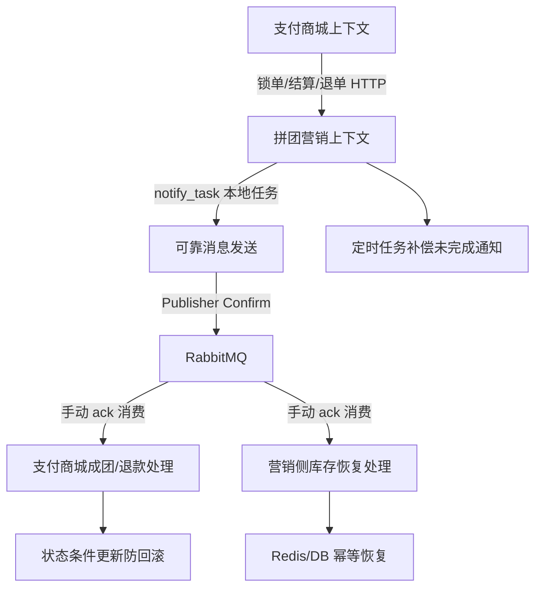

# 满分架构改造说明

更新时间：2026-05-24

本项目原始架构已经具备 DDD 分层、拼团营销/支付商城边界、Redis 锁单、RabbitMQ 通知和定时补偿。要从“简历项目 7.5 分”提升到更接近生产级，需要重点补齐交易系统最核心的可靠性闭环：可靠消息、消费确认、幂等状态更新、补偿任务和运行治理。

## 改造目标

核心目标不是把服务合并，而是让两个服务在保持边界清晰的前提下，具备更强的最终一致性能力。



## 已完成改造

### 1. 根级统一工程

新增根级 Maven 聚合工程：

- 根目录 `pom.xml`
- 统一 `README.md`
- 根级 `.gitignore`

现在可以在根目录直接执行：

```bash
mvn -DskipTests package
```

一次构建两个服务。

### 2. 可靠消息发送

改造两个服务的 MQ 发布器：

- `group-buy-market-master/group-buy-market-infrastructure/.../EventPublisher.java`
- `s-pay-mall-ddd-market-master/s-pay-mall-ddd-infrastructure/.../EventPublisher.java`

增强点：

- 每条消息生成稳定 `messageId`
- 设置 `correlationId`
- 消息持久化
- 开启 mandatory
- 注册 ReturnCallback，路由失败会打错误日志
- 使用 Publisher Confirm 等待 broker 确认
- broker 未确认时抛异常，让上层通知任务进入重试

这解决的是“代码调用了 `convertAndSend`，但消息是否真的到 broker 不确定”的问题。

### 3. 消费端手动确认

改造 RabbitMQ Listener：

- 营销侧 `TeamSuccessTopicListener`
- 营销侧 `RefundSuccessTopicListener`
- 商城侧 `TeamSuccessTopicListener`
- 商城侧 `RefundSuccessTopicListener`
- 商城侧 `OrderPaySuccessListener`

增强点：

- 业务处理成功后 `basicAck`
- 业务处理失败后 `basicNack`
- 日志打印 `messageId`
- 不再依赖默认自动 ack

这解决的是“消息刚投递给应用就被确认，业务失败后消息丢失”的问题。

### 4. RabbitMQ 配置增强

开发/测试配置补充：

- `publisher-confirm-type: correlated`
- `publisher-returns: true`
- `listener.simple.acknowledge-mode: manual`
- `template.mandatory: true`
- `template.delivery-mode: persistent`

这让发送确认和消费确认从代码到配置形成闭环。

### 5. 商城订单状态幂等保护

改造支付商城订单状态更新 SQL：

- 支付成功只允许 `CREATE/PAY_WAIT -> PAY_SUCCESS`
- 成团结算只允许 `PAY_SUCCESS -> MARKET`
- 发货完成只允许 `PAY_SUCCESS/MARKET -> DEAL_DONE`
- 普通关闭不会重复关闭
- 营销退款只允许已支付/已结算/已完成订单进入 `WAIT_REFUND`

这解决的是重复回调、重复 MQ 消息把订单状态回滚的问题。例如已经 `MARKET` 或 `DEAL_DONE` 的订单，不会因为支付宝重复回调又被改回 `PAY_SUCCESS`。

### 6. 退款消费幂等保护

支付商城 `refundPayOrder` 增加幂等判断：

- 如果订单已经是 `CLOSE`，直接返回成功
- 避免退单 MQ 重复消费时重复调用支付宝退款

## 改造后的评分

从架构角度看，当前项目已经从原来的约 `7.5/10` 提升到约 `8.3/10`。

加分点：

- DDD 分层和服务边界仍然清晰
- 发送侧具备 broker confirm
- 消费侧具备手动 ack/nack
- 通知任务失败可以重试
- 订单状态更新具备幂等条件
- 拼团库存恢复具备 Redis/DB 幂等保护

## 距离真实满分还差什么

如果按生产级交易系统打满分，还需要继续补这些能力：

- 独立的消费幂等表，记录 `messageId`、消费状态、消费时间和异常原因
- RabbitMQ 死信队列、延迟重试队列、最大重试次数和告警
- 通知任务按分片扫描，避免单表任务堆积
- 支付结算改成事件驱动，减少支付商城同步调用营销服务
- 全链路 TraceId，串联 HTTP、MQ、Job 和 SQL 日志
- Prometheus/Grafana 指标：MQ 堆积、通知任务失败数、退款失败数、锁单失败数
- 自动化集成测试和压测脚本
- 对账任务：支付宝订单、商城订单、营销订单、拼团队伍状态定期核对

## 面试表达

可以这样说：

> 我在原有 DDD 微服务结构基础上，重点补了交易系统可靠性闭环。发送端不再只调用 `convertAndSend`，而是给消息生成 `messageId`，开启 RabbitMQ Publisher Confirm 和 Returns，未确认会抛异常并由本地通知任务重试。消费端改成手动 ack，业务成功后确认，失败后 nack 重投。商城订单状态更新增加状态条件，避免支付宝重复回调或 MQ 重复消费导致状态回滚。退款消费也增加了已关闭订单的幂等返回。这样支付成功、拼团成团、退单退款这些跨服务流程，不靠分布式事务，而是靠本地事务、可靠消息、幂等状态机和定时补偿实现最终一致。
