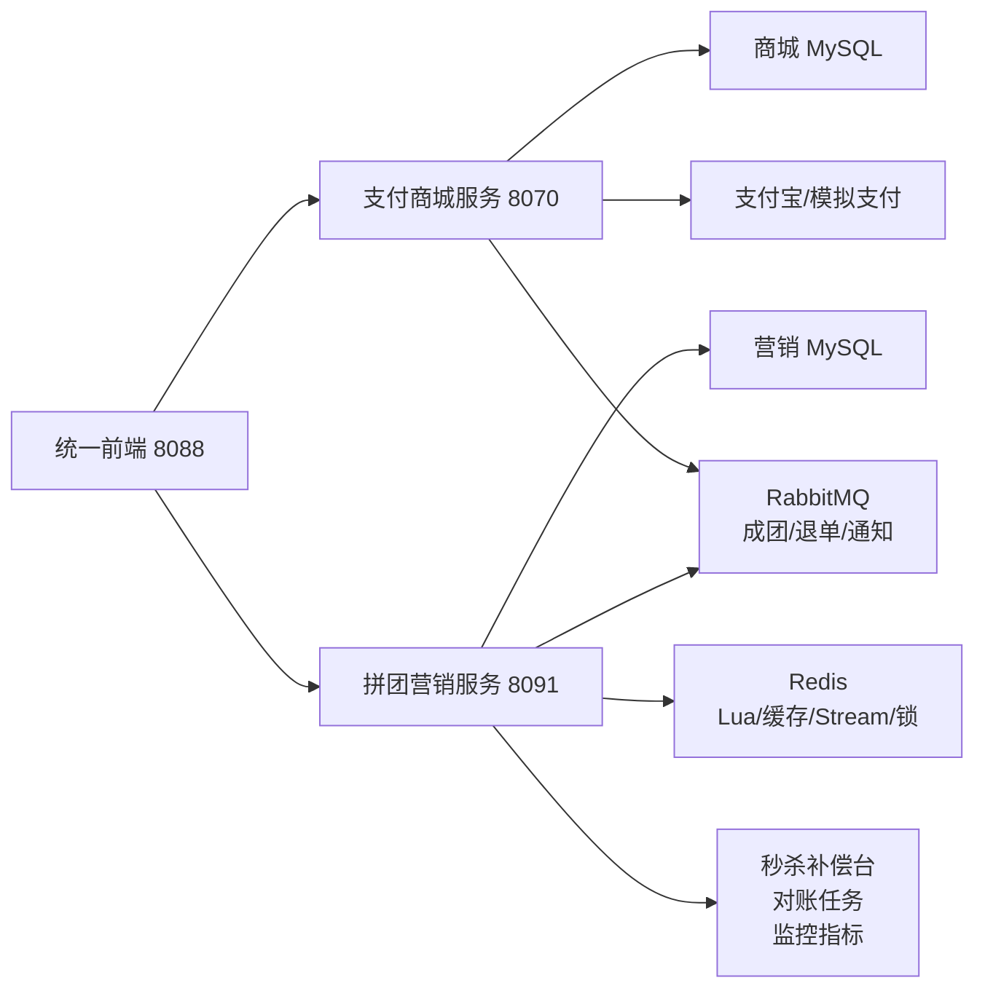
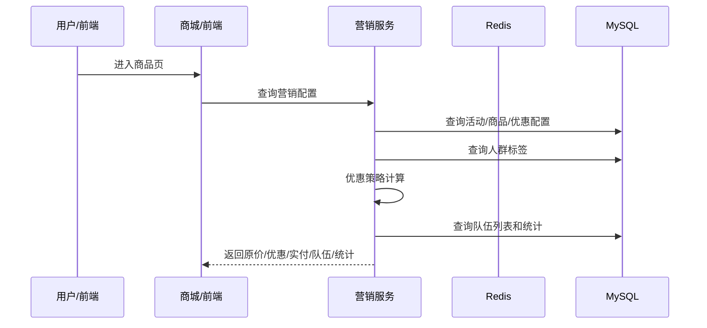
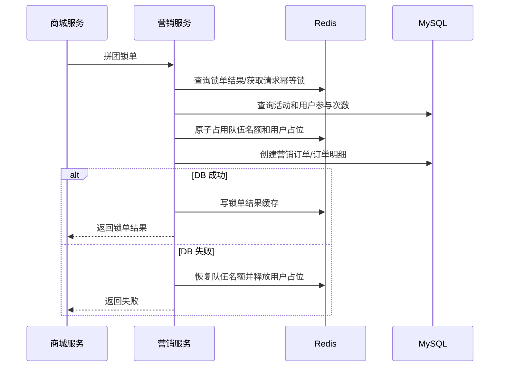
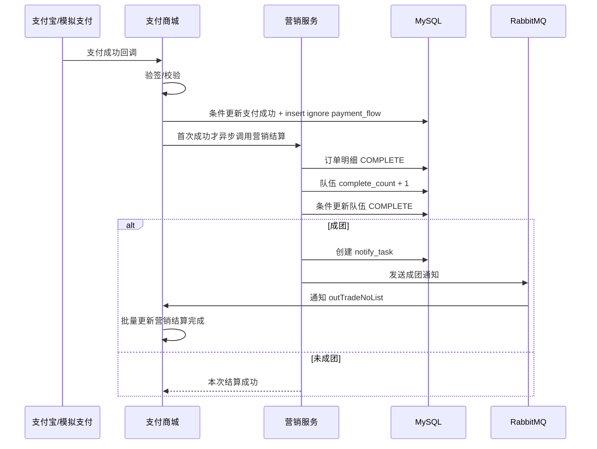
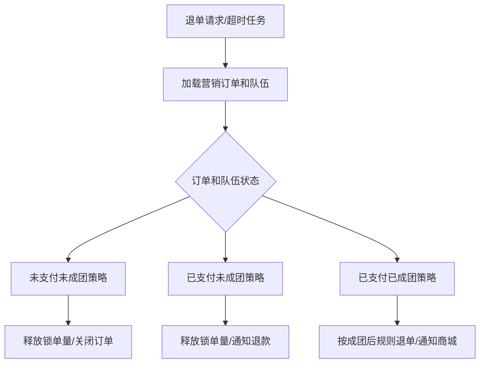
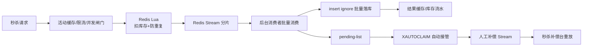

# 拼团交易平台面试八股文

更新时间：2026-05-26

适用项目：

- `group-buy-market-master`：拼团营销服务，负责首页试算、拼团锁单、秒杀锁单、支付结算、退单恢复、成团通知、秒杀异步落库、补偿和监控。
- `s-pay-mall-ddd-market-master`：支付商城服务，负责商品订单、支付单、支付宝/模拟支付、支付回调、退款入口、支付/退款流水和对账中心。

面试使用方式：

- 先用“一句话项目介绍”讲清业务价值和边界。
- 再用“DDD 架构”讲清模块分层和限界上下文。
- 然后讲“四条核心业务链路”：首页试算、拼团锁单、支付结算、退单退款。
- 如果面试官追问高并发，重点讲“秒杀 Redis Lua + Redis Stream 分片 + pending-list + 人工补偿 Stream + 批量落库”。
- 最后主动说明项目仍然存在的生产边界，不要说已经满分。

## 一、项目总览

### 1. 一句话介绍

这是一个交易营销类项目，模拟美团、拼多多、京东这类平台里的拼团和秒杀交易场景。系统拆成支付商城和拼团营销两个限界上下文：商城负责商品下单、支付和退款；营销服务负责拼团、秒杀、优惠试算、队伍和库存状态。项目重点不是页面展示，而是交易系统里的高并发、防超卖、幂等、最终一致性、补偿和可观测性。

面试可以这样说：

> 我做的是一个拼团交易平台，采用 DDD 分层和微服务边界拆分。支付商城负责商品订单、支付单、支付宝/模拟支付回调和退款入口；营销服务负责拼团、秒杀、优惠试算、队伍名额、库存锁定、成团结算和通知补偿。核心难点是高并发锁单、防超卖、防重复参与、支付回调幂等、MQ 可靠消费和跨服务最终一致性。

### 2. 当前架构图



### 3. 限界上下文

支付商城上下文：

- 商品展示和商城订单。
- 支付单创建。
- 支付宝和模拟支付。
- 支付成功回调。
- 退款入口。
- 支付流水、退款流水、三方账单导入。
- 对账差错单和人工处理台账。

拼团营销上下文：

- 活动配置。
- 优惠规则。
- 人群标签。
- 首页营销试算。
- 拼团队伍。
- 拼团锁单。
- 支付结算。
- 退单恢复。
- 秒杀库存。
- 秒杀异步落单。
- 通知任务、MQ、DLQ、人工补偿 Stream。

边界说明：

- 商城不直接理解拼团和秒杀规则，只调用营销服务。
- 营销服务不直接修改商城订单，只通过 HTTP、MQ、通知任务推动状态变化。
- 支付成功和拼团成团是两个领域事件，不能靠一个本地事务包住。

### 4. DDD 分层

两个服务整体按 DDD 分层组织：

```text
api             接口契约、DTO、Response
app             Spring Boot 启动类、配置类、Bean 装配
trigger         HTTP Controller、MQ Listener、Job
domain          领域服务、聚合、实体、值对象、规则链、策略
infrastructure  MySQL、Redis、RabbitMQ、HTTP 适配器、Repository 实现
types           异常、枚举、常量、通用类型
```

当前重要改造：

- 商城和营销的 domain 包已经去 Spring 注解。
- 领域服务、规则链、试算节点、折扣策略都由 app 层配置类装配。
- 新增 `scripts/check-domain-purity.ps1`，用于检查 domain 包不能重新引入 Spring 注解、`@Resource`、`@Autowired`。
- 状态迁移已抽成 `OrderStateMachine`、`OrderStateTransitionEntity` 和 `IOrderStateFlowPort`，Repository 不再直接拼接状态流水 PO。

面试可以这样说：

> 我没有让 Controller 直接写业务逻辑，而是让 HTTP、MQ、Job 都作为触发入口，最终收敛到 domain 层。domain 层表达业务规则，infrastructure 层适配 MySQL、Redis、RabbitMQ 和外部接口。现在 domain 包已经去 Spring 注解，Spring 装配统一放到 app 层配置类，状态机和状态迁移也通过领域对象表达，Repository 只调用端口记录业务迁移，不直接感知状态流水表结构。

### 5. 核心代码路径

营销服务：

- 首页入口：`group-buy-market-trigger/.../MarketIndexController.java`
- 首页试算配置：`group-buy-market-app/.../ActivityDomainConfig.java`
- 试算领域：`group-buy-market-domain/.../activity/service/trial`
- 优惠策略：`group-buy-market-domain/.../activity/service/discount`
- 拼团锁单：`group-buy-market-domain/.../trade/service/lock`
- 拼团结算：`group-buy-market-domain/.../trade/service/settlement`
- 退单策略：`group-buy-market-domain/.../trade/service/refund`
- 交易规则配置：`group-buy-market-app/.../TradeRuleConfig.java`
- 秒杀领域：`group-buy-market-domain/.../seckill`
- 秒杀仓储：`group-buy-market-infrastructure/.../SeckillRepository.java`
- 秒杀 Stream：`group-buy-market-infrastructure/.../SeckillOrderCreateBuffer.java`
- 秒杀补偿口：`group-buy-market-trigger/.../SeckillOpsController.java`

商城服务：

- 下单和支付：`s-pay-mall-ddd-domain/.../order`
- 支付适配：`s-pay-mall-ddd-infrastructure/.../port/PayPort.java`
- 对账中心：`s-pay-mall-ddd-trigger/.../ReconcileCaseController.java`
- 对账页面：`s-pay-mall-ddd-market-master/docs/dev-ops/nginx/html/reconcile-admin.html`

## 二、核心业务链路

### 1. 首页试算流程

自然语言说明：

用户进入商品页后，前端或支付商城会调用拼团营销服务查询营销配置。营销服务根据用户、渠道、商品和活动配置加载活动信息、商品信息、人群标签和优惠规则，计算原价、优惠金额、实付金额，并查询可参与队伍和拼团统计。这个流程只做“能不能买、优惠多少、有哪些队伍”，不会创建订单。



领域重点：

- 首页试算是读模型和规则计算，不是交易落单。
- 活动可见性、人群标签、优惠规则由试算链处理。
- 优惠策略包括直减、满减、折扣、N 元购。
- 返回给前端的是展示和决策数据，不是交易最终状态。

面试说法：

> 首页试算是用户进入商品页后的营销查询链路，不创建订单。它通过试算节点加载活动、商品、人群标签和优惠规则，再用策略模式计算优惠金额，并补充可参与队伍和拼团统计。这样前端可以展示“是否可参与、优惠多少、能加入哪个队伍”。

### 2. 拼团锁单流程

自然语言说明：

用户发起拼团或参与已有队伍时，商城先调用营销服务锁定拼团优惠。营销服务先按 `userId + outTradeNo` 查询锁单结果缓存和 DB，避免重复请求重新进入交易链路；未命中时再获取短 TTL 请求幂等锁。随后责任链校验活动状态、用户参与次数、队伍是否已满和重复订单。参团时 Redis Lua 同时判断队伍容量、名额序号锁和用户维度占位，校验通过后创建拼团订单和订单明细。锁单不是简单插入订单，而是围绕“队伍”这个聚合进行状态变更。



领域重点：

- 锁单是聚合行为，不是普通 insert。
- 责任链校验活动可用性、用户参与上限、队伍库存。
- Redis 快速挡高并发，MySQL 的 `user_id + out_trade_no`、`biz_id` 唯一索引兜底。
- Redis 成功但 DB 失败时要恢复或补偿。
- 锁单结果缓存只服务锁单入口，结算和退单仍查 DB，避免缓存状态滞后影响状态机。

面试说法：

> 拼团锁单先用 `userId + outTradeNo` 做结果缓存和短 TTL 请求幂等锁，避免重复请求重复占位。真正参团时通过责任链校验活动可用性、用户参与次数和队伍库存，再用 Redis Lua 一次性完成队伍容量判断、名额序号锁和用户维度占位，最后落 MySQL 订单。MySQL 通过 `user_id + out_trade_no` 和 `biz_id` 唯一索引兜底，Redis 负责高并发下快速失败，DB 是最终准源。

### 3. 支付结算流程

自然语言说明：

商城创建支付单后，用户可以通过支付宝或模拟支付完成支付。支付回调先进入商城服务，商城验签或校验模拟支付参数，然后条件更新本地订单为支付成功，并用 `payment_flow` 记录 `PAY:{orderId}` 幂等流水。只有订单首次从待支付变成支付成功时，普通订单才发送支付成功 MQ，拼团订单才异步调用营销结算；重复回调只返回幂等成功，不重复触发后续动作。营销服务把营销订单明细更新为完成，增加队伍完成数，如果达到目标人数则推进队伍为成团，并创建通知任务或发送 MQ 通知商城批量更新订单。



领域重点：

- 支付成功是商城上下文事件。
- 拼团成团是营销上下文事件。
- 跨服务不能用一个本地事务保证一致。
- 要靠幂等接口、通知任务、MQ、对账任务补偿。
- 支付回调用 `payment_flow` 做独立幂等流水，订单状态影响行数决定是否触发后续事件。

面试说法：

> 支付回调先验签或校验模拟支付参数，然后条件更新商城订单，并写入 `payment_flow` 幂等流水。只有订单首次从待支付变成支付成功时，普通订单才发支付成功 MQ，拼团订单才异步推进营销结算。营销服务本地事务更新订单明细、队伍完成数、队伍状态和通知任务。成团通知失败不会直接丢，因为有通知任务和对账任务兜底，重复结算也要通过幂等键防止重复增加完成数。

### 4. 退单退款流程

自然语言说明：

退单退款不是一个统一动作，而是状态驱动的逆向交易流程。未支付订单超时要释放锁定名额；已支付未成团退单要释放锁定名额和完成数，并通知商城退款；已支付已成团退单不能简单回滚整个队伍，要按成团后的交易规则处理。项目用策略模式区分不同退单场景，并通过定时任务扫描超时未支付订单。



领域重点：

- 退单是状态机行为。
- 不同状态使用不同策略，避免大量 if else。
- 超时任务需要分布式锁，避免多实例重复执行。
- 退款和库存恢复要幂等。

面试说法：

> 退单退款我没有写成一个大 if else，而是按订单状态和队伍状态映射到不同退单策略。未支付、已支付未成团、已支付已成团的库存恢复、队伍状态和通知逻辑都不同。定时任务扫描超时未支付订单，并用锁避免多实例重复补偿。

## 三、秒杀高并发架构

### 1. 秒杀为什么单独设计

秒杀和拼团都属于营销服务，但秒杀的并发模型更极端：瞬时请求量高、库存有限、用户不能重复抢、失败要快速返回。如果直接打 MySQL，连接池、行锁和唯一索引会很快成为瓶颈。

当前秒杀链路：



### 2. 秒杀入口链路

入口做的事：

- 活动配置本地短 TTL 缓存，减少 DB 查询。
- 活动预热任务提前加载即将开始和正在进行的活动配置、商品信息和 Redis 库存桶。
- 售罄本地短路，库存卖完后快速失败。
- 活动、用户、IP 三维 Redis 固定窗口限流，防止热点活动和异常来源打穿服务。
- 活动维度并发闸门，避免单活动打满整个服务。
- Redis Lua 原子执行库存扣减和用户防重。
- 抢到资格后写 Redis Stream，快速返回 `PROCESSING`。

面试说法：

> 秒杀入口不直接写 DB。活动开始前先预热活动配置和库存桶，请求进来后通过活动、用户、IP 三维限流、售罄短路和活动并发闸门挡掉无效流量，再用 Redis Lua 原子扣库存和防重复。抢到资格后写 Redis Stream 分片，返回 PROCESSING，真实订单由后台消费者批量落库。

### 3. Redis Lua 的作用

Redis Lua 把以下动作放在一个原子脚本里：

- 判断活动库存是否充足。
- 判断用户是否已经抢过。
- 扣减库存。
- 记录用户占用。
- 返回抢资格结果。

为什么不用分布式锁包住整个流程：

- 锁粒度太粗，吞吐会很低。
- 秒杀请求要尽快成功或失败。
- Redis Lua 更适合单 key 或少量 key 的原子扣减。
- MySQL 仍通过唯一索引和消费幂等兜底。

### 4. Redis Stream 分片

Stream 分片是把一个大队列拆成多个小队列。

```text
seckill:order:create:stream:0
seckill:order:create:stream:1
seckill:order:create:stream:2
seckill:order:create:stream:3
```

项目按 `activityId + userId + outTradeNo` 做 CRC32 hash，然后取模路由到不同 Stream。

为什么要分片：

- 降低单 Stream key 热点。
- 分散 `XADD`、`XREADGROUP`、`XACK`、`XDEL` 压力。
- 分散 pending-list 压力。
- 方便后续按活动或 hash 扩展消费者。

面试说法：

> 秒杀不是把所有订单创建消息写入一个 Redis Stream，而是按活动、用户和外部单号 hash 到多个 Stream 分片。这样可以把写入、消费、ACK、pending-list 的压力拆散，降低单 key 热点。

### 5. pending-list 和 XAUTOCLAIM

Redis Stream consumer group 中，消费者读到消息后如果还没 ACK，这条消息会进入 pending-list。

如果消费者宕机：

- 消息不会丢。
- 消息留在 pending-list。
- 超过空闲时间后，其他消费者通过 `XAUTOCLAIM` 接管。
- 接管后重新消费。

面试说法：

> pending-list 解决的是消费者读到消息但还没处理完就宕机的问题。消息不会被认为成功，其他 worker 可以通过 XAUTOCLAIM 把空闲太久的 pending 消息接管，再通过唯一索引和 insert ignore 保证重复消费幂等。

### 6. 人工补偿 Stream

人工补偿 Stream 是失败隔离区。

主 Stream 自动重试失败超过阈值后，消息会转入：

```text
seckill:order:create:manual
```

里面保存：

- 原始消息体。
- 原 Stream。
- 原消息 ID。
- 失败次数。
- 错误信息。

作用：

- 隔离毒消息，不阻塞主消费链路。
- 保留失败现场，方便排查。
- 修复问题后可以人工重放。

面试说法：

> 人工补偿 Stream 是秒杀异步落库链路里的失败隔离区。pending 消息会先自动重试，超过最大重试次数后转入人工补偿 Stream。补偿台支持查询失败消息并按消息 ID 重放回主 Stream，让消息重新走正常消费链路，而不是手工改库。

### 7. 秒杀补偿台

秒杀补偿台是人工处理补偿 Stream 的前端页面：

```text
http://127.0.0.1:8088/seckill-ops.html
```

后端入口：

```text
/api/v1/gbm/seckill/ops/manual_messages
/api/v1/gbm/seckill/ops/replay_manual
```

设计点：

- trigger 只依赖 domain port：`ISeckillManualCompensationPort`。
- infrastructure 实现 Redis Stream 查询和重放。
- 前端需要运维口令。
- 支持按消息 ID 重放或重放前 N 条。

### 8. 秒杀消费幂等

消费者批量落库使用：

- MySQL 唯一索引。
- `insert ignore`。
- 结果缓存。
- 库存流水 `seckill_stock_flow`。

重复消费不会重复生成订单，因为：

- 同一用户同一活动唯一。
- 同一用户同一外部单号唯一。
- 同一订单号唯一。
- 库存流水用 `flow_no` 幂等。

### 9. 秒杀超时释放

秒杀抢到资格但长时间未支付时，需要释放库存。

项目已补：

- 超时未支付扫描任务。
- 关闭超时秒杀订单。
- 恢复 Redis/DB 库存。
- 记录 `ROLLBACK_TIMEOUT` 库存流水。

### 10. 压测结果怎么说

本机压测要诚实表达：

- Windows + Docker Desktop 只能看趋势，不能代表生产容量。
- 本机验证过秒杀入口、Stream 分片、pending、ACK 失败补偿、批量落库。
- 曾验证 1200 请求、200 并发约 306 QPS，4 个 Stream 分布接近均匀。
- 更早的本机极限模式 local queue 能到更高 QPS，但可靠性不如 Redis Stream。

面试说法：

> 我不会把本机压测包装成生产容量。本机压测只能证明链路有效、削峰和幂等机制可用。生产压测要在独立 Linux 压测机、多服务多实例、独立 Redis/MySQL/RabbitMQ 下重新测，并记录 CPU、网络、磁盘、连接池、慢 SQL、Stream lag、pending 和错误率。

## 四、项目亮点

### 1. DDD 边界清晰

- 商城和营销职责分离。
- domain 已去 Spring 注解。
- app 层统一装配领域对象。
- 状态机和状态迁移对象沉在 domain 层。
- 状态流水落库通过领域端口适配。
- 拼团通知任务 Outbox 和库存流水审计已从 `TradeRepository` 拆成端口适配。
- trigger 只做入口适配。
- infrastructure 负责技术实现。

### 2. 拼团锁单防超卖

- 责任链校验活动、用户次数、队伍库存。
- Redis Lua 原子占用队伍名额和用户维度占位。
- `userId + outTradeNo` 请求幂等锁和锁单结果缓存。
- MySQL 唯一索引和条件更新兜底。
- DB 失败时恢复 Redis 预占并释放用户占位。

### 3. 秒杀高并发削峰

- 本地缓存。
- 售罄短路。
- 限流和并发闸门。
- Redis Lua 抢资格。
- Redis Stream 分片削峰。
- 批量落库。

### 4. 异步可靠消费

- RabbitMQ 手动 ACK。
- 消费幂等表。
- DLQ。
- Redis Stream pending-list。
- 人工补偿 Stream。
- 秒杀补偿台重放。

### 5. 最终一致性

- 支付回调先落商城本地状态。
- 营销结算幂等。
- 成团通知任务。
- MQ 通知商城。
- 对账任务扫描异常中间态。
- 差错单人工处理。

### 6. 可观测性和演练

- Prometheus rules。
- Grafana dashboard 示例。
- Alertmanager 路由示例。
- Redis/MQ/MySQL/HTTP 超时/慢消费故障演练脚本。
- `run-chaos-report.ps1` 可生成本机演练报告。

## 五、八股问答

### 1. DDD 是什么？这个项目怎么用？

DDD 是用业务领域模型组织复杂业务的设计方法。这个项目里，商城和营销是两个限界上下文。商城关注订单、支付、退款；营销关注活动、优惠、拼团、秒杀、队伍和库存。Controller、MQ、Job 都是触发入口，核心规则沉到 domain 层，技术实现放 infrastructure。

### 2. DDD 是否过度设计？

如果只是 CRUD 项目，DDD 会显得重。但这个项目有拼团、秒杀、支付、退款、对账、MQ、补偿、状态机和高并发，业务规则复杂且会持续扩展。DDD 的价值是把业务规则集中在领域层，避免 Controller 和 Repository 变成大杂烩。

### 3. 为什么 domain 要去 Spring 注解？

领域层应该表达业务，而不是依赖容器。去掉 `@Service`、`@Resource` 后，领域对象可以通过构造器显式声明依赖，更容易单元测试，也更能保持架构边界。Spring 装配放 app 层配置类。状态机、状态迁移和端口接口留在 domain，DAO、PO、MyBatis 只留在 infrastructure。

### 4. Spring 事务应该加在哪里？

事务应该加在一次本地状态变更边界上，比如营销结算时更新订单明细、队伍完成数、队伍状态、通知任务，这些属于营销服务的本地事务。事务里不要做长时间远程调用。跨服务一致性靠本地事务、幂等、MQ、通知任务和补偿。

### 5. 为什么不用分布式事务？

支付商城和营销服务是两个上下文，强行用分布式事务会增加锁持有时间、降低可用性，也不适合支付回调这类外部事件。项目采用最终一致性：每个服务先完成本地事务，再通过幂等接口、MQ、对账任务和差错单补偿。

### 6. 幂等怎么做？

幂等分多层：

- HTTP 接口用 `userId + outTradeNo`。
- 订单表用唯一索引防重复。
- MQ 消费用 `queueName + messageId`。
- 通知任务用唯一 key。
- 秒杀落库用唯一索引和 `insert ignore`。
- 库存流水用 `flow_no`。

### 7. Redis 在项目里用来做什么？

- 秒杀库存预扣减。
- 拼团队伍名额预占。
- 活动配置缓存。
- 售罄短路。
- 用户防重。
- Redis Stream 秒杀削峰。
- pending-list 和人工补偿。
- 分布式锁和动态配置。

### 8. Redis 和 MySQL 的关系是什么？

Redis 是高并发入口的削峰和快速失败层，MySQL 是最终准源。不能因为 Redis 扣成功就认为交易最终成功，DB 失败时必须恢复或补偿。最终状态以 MySQL 订单、队伍、库存流水为准。

### 9. Redis Lua 为什么适合秒杀？

秒杀是“判断库存 + 判断用户 + 扣库存 + 记录占用”的并发操作。如果拆成多条 Redis 命令，中间会被其他请求插入。Lua 脚本在 Redis 内单线程执行，可以保证这些动作原子完成。

### 10. RabbitMQ 怎么保证可靠？

- 生产者确认。
- 消息持久化。
- 消费者手动 ACK。
- 失败 NACK。
- DLQ。
- 消费幂等表。
- 通知任务兜底。
- 对账任务扫描异常状态。

### 11. DLQ 是什么？

DLQ 是死信队列，用于接收无法正常消费的消息。它不是补偿终点，而是失败隔离区。进入 DLQ 后还要有告警、排查、重放或补偿任务，否则只是把问题换了个地方存。

### 12. Redis Stream、RabbitMQ 和 RocketMQ 怎么取舍？

Redis Stream 适合当前本地演示和课程项目规模，因为它贴近 Redis 库存扣减链路，有 pending-list，能快速接入异步落库。RabbitMQ 更适合跨服务业务通知，比如成团通知商城、退单通知商城。真正生产大促下，秒杀订单创建消息更适合迁移到 RocketMQ：Redis 只做资格预扣和防重，MySQL Outbox 做可靠投递兜底，RocketMQ 承担订单消息的分区路由、堆积恢复、重试和 DLQ。

### 13. 为什么秒杀不用本机队列？

本机队列吞吐高，但进程宕机会丢消息，不适合作为可靠方案。Redis Stream 有持久化和 pending-list，worker 宕机后消息仍可被接管，更适合生产化链路。本机队列可以作为极限压测模式，不作为最终可靠方案。

### 14. MySQL 唯一索引有哪些作用？

唯一索引是幂等和防重复的最后防线。比如同一用户同一活动不能重复参与，同一用户同一外部单号不能重复下单，同一通知任务不能重复创建。即使 Redis 或 MQ 重复投递，DB 也能兜底。

### 15. MySQL 条件更新有什么用？

条件更新可以防止状态被乱推进。例如只有队伍完成数达到目标人数、且状态仍是进行中时，才能更新为成团。这样可以防止并发结算重复推进队伍状态。

### 16. 支付回调为什么必须幂等？

支付宝可能重复回调，网络重试也可能导致重复请求。商城必须用支付单号或外部交易号做幂等，已支付订单重复回调应直接返回成功，不能重复推进营销结算或重复发 MQ。

### 17. 支付成功但营销结算失败怎么办？

商城先把本地订单更新为支付成功，然后异步调用营销结算。如果营销服务不可用或超时，异常会被日志和对账任务捕获。`OrderReconciliationJob` 扫描支付成功但营销未结算的订单，重新调用营销结算接口。营销接口本身必须幂等。

### 18. 拼团成团通知失败怎么办？

营销服务成团后创建通知任务并发送 MQ。如果 MQ 失败或商城消费失败，通知任务会保留，定时任务继续补偿。消费者也有幂等记录，重复通知不会重复更新商城订单。

### 19. 退单为什么用策略模式？

未支付、已支付未成团、已支付已成团三种状态下，订单、队伍、库存和通知处理都不同。策略模式可以把不同场景拆成独立类，避免一个大 if else，让新增退单场景更容易。

### 20. 对账中心解决什么问题？

对账中心解决跨服务、跨渠道状态不一致问题。它扫描商城订单、营销订单、支付流水、退款流水、三方账单和 MQ 消费状态，生成差错单。人工可以在后台处理、忽略或重放补偿。

### 21. 监控告警关注什么？

- 支付回调失败。
- RabbitMQ 堆积。
- 通知任务积压。
- MQ 消费失败。
- 对账差错单数量。
- 秒杀 Stream lag。
- 秒杀 pending 数。
- 秒杀 DLQ/人工补偿增长。
- 批量落库耗时。
- 订单中间态异常。

### 22. 如何提高 QPS？

先减少无效请求进入核心链路：

- CDN/网关限流。
- 活动、用户、IP 分层限流。
- 活动级并发闸门。
- 活动预热，把 DB 查询和 Redis 库存初始化从第一波请求前移。
- 本地缓存。
- 售罄短路。
- Redis Lua 预扣减。
- 异步队列削峰。
- 批量落库。
- 分片 Stream。
- DB 索引优化和分库分表。

但不能只追 QPS，还要保证消息不丢、幂等、补偿和可观测性。

## 六、当前已修复的问题

已完成：

- JDK 1.8 + Maven 3.8.x 构建。
- 支付商城和拼团营销服务跑通。
- 支付宝/模拟支付双通道。
- 商城前端、拼团前端、秒杀前端跳转整合。
- 秒杀功能。
- 秒杀 Redis Lua 抢资格。
- 秒杀活动预热任务。
- 秒杀活动、用户、IP 三维入口限流。
- 秒杀 Redis Stream 分片。
- pending-list 自动接管。
- 人工补偿 Stream。
- 秒杀补偿台。
- 批量落库和消费幂等。
- 秒杀库存流水。
- 秒杀超时未支付释放。
- RabbitMQ DLQ。
- RabbitMQ 死信台账、DLQ 指标和人工标记处理接口。
- RabbitMQ 生产者 confirm 失败台账和定时重试补偿。
- MQ 消费幂等表。
- 对账中心、差错单、操作审计。
- 支付流水、退款流水、三方账单导入。
- Prometheus、Grafana、Alertmanager 示例。
- 秒杀锁单耗时、库存不足、重复请求、Stream lag、pending、DLQ 指标。
- 故障演练脚本。
- domain 去 Spring 注解。
- domain 纯净化守护脚本。
- 拼团试算、拼团锁单、秒杀、支付回调压测脚本。
- 秒杀 100/500/1000 并发阶梯压测和压测后库存不变量自动校验。
- 拼团队伍统计不变量自动校验。
- 秒杀分片订单表下的库存同步口径修复。

## 七、仍需诚实说明的边界

面试不要说“已经满分”。应该这样说：

- 本地 Windows + Docker Desktop 压测只能看趋势，不能代表生产容量。
- 生产容量必须在独立 Linux 压测环境、多服务多实例、独立 Redis/MySQL/RabbitMQ 下重测。
- 分库分表当前是应用侧表分片，不等同于完整 ShardingSphere/TDDL 级别治理。
- 秒杀已覆盖超时未支付库存释放，但已支付后的秒杀退款库存闭环还可以继续补。
- 秒杀补偿台已有查询和重放，但生产上还需要审批流、SLA、权限分级和补偿结果回写。
- 支付/退款流水已经落表，三方账单支持 CSV 导入；生产还要对接支付宝正式账单下载、签名校验和文件归档。
- Grafana、Prometheus、Alertmanager 已有配置样例；真实接收人、告警抑制、升级策略和值班排班要按部署环境配置。
- 现在已有 traceId 过滤器和业务指标，但还没有接入 OpenTelemetry/Jaeger 级别的跨进程 Trace，结构化 JSON 日志也只是标准已定义、未完全替换文本日志。
- 领域层已经去 Spring 注解，但还需要补更多领域单元测试和架构测试。
- 当前本机压测已经有自动不变量校验，但缺 CPU、内存、GC、Redis、MySQL、RabbitMQ 水位曲线联动报告。

## 八、面试官追问清单

拼团锁单：

- 同一个队伍最后一个名额被多人抢怎么办？
- 用户重复点击下单怎么办？
- Redis 扣成功但 DB 失败怎么办？
- 为什么锁单时还要重新试算？
- 未支付订单超时后如何释放名额？

秒杀：

- 秒杀为什么不能直接打 DB？
- Redis Lua 怎么保证原子性？
- Stream 分片是什么意思？
- pending-list 怎么处理消费者宕机？
- 人工补偿 Stream 是什么？
- 秒杀补偿台解决什么问题？
- 为什么批量落库要用 `insert ignore`？
- 秒杀成功但未支付怎么恢复库存？

支付：

- 支付宝为什么会重复回调？
- 模拟支付和真实支付的边界是什么？
- 支付成功但营销服务不可用怎么办？
- 支付成功和退单并发怎么办？

MQ：

- 生产者确认怎么做？
- 消费失败为什么不能无限重试？
- DLQ 后如何补偿？
- 如何避免重复消费？

数据库：

- 哪些字段需要唯一索引？
- 为什么状态更新要加条件？
- 什么情况下需要分库分表？
- 如何排查慢 SQL 和锁等待？

架构：

- DDD 是否过度设计？
- domain 为什么去 Spring 注解？
- 如果 QPS 提高 10 倍先改哪里？
- 如果接入优惠券怎么扩展？
- 如果接入微信支付怎么扩展？

## 九、两分钟面试稿

可以直接背这一版：

> 我做的是一个拼团交易平台，拆成支付商城和拼团营销两个限界上下文。商城负责商品订单、支付单、支付宝和模拟支付回调、退款入口、支付流水和对账中心；营销服务负责拼团、秒杀、优惠试算、队伍和库存锁定、成团结算、通知任务和 MQ 可靠消费。项目采用 DDD 分层，HTTP、MQ、Job 都作为触发入口，核心业务规则沉到 domain 层，MySQL、Redis、RabbitMQ 放在 infrastructure 层。现在 domain 包已经去 Spring 注解，由 app 层配置类统一装配。
>
> 核心链路是：用户进入商品页先做营销试算，营销服务根据活动、商品、人群标签和优惠规则返回实付金额、可参与队伍和拼团统计；用户发起拼团时，营销服务先用 `userId + outTradeNo` 做幂等查询和请求锁，再通过责任链校验活动、用户参与次数和队伍库存，用 Redis Lua 原子占用队伍名额和用户占位，最后落 MySQL 订单并写锁单结果缓存。支付成功后，商城先更新本地支付状态，再异步调用营销结算；营销服务更新订单明细和队伍完成数，成团后创建通知任务并通过 MQ 通知商城。
>
> 秒杀是项目里的高并发重点。入口通过本地缓存、售罄短路、限流和活动并发闸门挡无效请求，再用 Redis Lua 原子扣库存和防重复。抢到资格后写 Redis Stream 分片，后台 consumer group 批量消费和批量落库。pending-list 用于消费者宕机后的自动接管，失败超过阈值后进入人工补偿 Stream，秒杀补偿台可以查询并按消息 ID 重放。消费幂等靠 MySQL 唯一索引、insert ignore 和库存流水。支付回调用 `payment_flow` 记录独立幂等流水，只有订单状态首次更新成功才发 MQ 或触发营销结算。跨服务一致性靠本地事务、幂等接口、MQ、通知任务、对账任务和差错单台账。

## 十、回答模板

### 技术题模板

回答顺序：

1. 先解释概念。
2. 再说项目里怎么用。
3. 最后说风险和改进。

例子：

> Redis Lua 在这个项目里主要解决秒杀库存和拼团队伍名额的原子占用问题。秒杀和拼团都是先判断再写入的并发场景，如果拆成多次 Redis 命令，中间会有并发穿透风险。项目把库存判断、用户防重和扣减合并到 Lua 脚本里一次执行；拼团参团还会同时写用户队伍占位 Key。Redis 负责高并发快速失败，MySQL 唯一索引和条件更新负责最终兜底。风险是 Lua 脚本必须保持短小，不能做复杂循环；如果 Redis 成功但 DB 失败，还需要库存恢复和补偿任务。

### 项目题模板

回答顺序：

1. 业务场景是什么。
2. 遇到什么技术问题。
3. 设计了什么方案。
4. 代码里怎么落地。
5. 还有什么不足。

例子：

> 拼团锁单的业务场景是用户开团或参团，需要先锁定队伍名额和营销优惠。问题是最后一个名额可能被多人同时抢，还要防止同一用户重复参与和同一外部单号重复重试。我的方案是先用锁单结果缓存和短 TTL 请求锁保证 `userId + outTradeNo` 幂等，再用责任链校验活动、人群和队伍状态，参团时用 Redis Lua 原子占用队伍名额和用户队伍占位，最后用 MySQL 条件更新、`user_id + out_trade_no` 唯一索引和 `biz_id` 唯一索引兜底。代码上 Controller 只作为入口，核心流程在领域服务和 TradeRepository 中完成。不足是生产压测还需要独立 Linux 环境和多实例验证。

## 十一、维护记录

- 2026-05-30：补齐拼团锁单强幂等和用户维度 Redis 占位，新增请求幂等锁、锁单结果缓存、队伍用户占位 Key、DB 唯一索引迁移和 SDD 文档 `docs/sdd/2026-05-30-group-buy-lock-idempotency.md`。
- 2026-05-30：补齐支付回调独立幂等流水，普通订单 MQ 和拼团营销结算只在订单首次支付成功时触发，并记录 SDD 文档 `docs/sdd/2026-05-30-payment-callback-idempotency.md`。
- 2026-05-30：继续拆分 `TradeRepository`，新增 `ITradeNotifyTaskPort` 和 `IGroupBuyStockFlowPort`，把通知任务 Outbox、拼团库存流水审计从仓储中移到端口适配器，并记录 SDD 文档 `docs/sdd/2026-05-30-trade-repository-split.md`。
- 2026-05-30：补充 DDD 边界治理，抽取 `OrderStateTransitionEntity` 和 `IOrderStateFlowPort`，移除 Repository 内重复状态流水拼接，并新增 SDD 审核记录 `docs/sdd/2026-05-30-ddd-boundary-audit.md`。
- 2026-05-30：补齐秒杀活动预热、活动/用户/IP 三维 Redis 限流和入口业务指标，新增 SDD 记录 `docs/sdd/2026-05-30-seckill-prewarm-rate-limit.md`。
- 2026-05-30：补齐 RabbitMQ DLQ 指标和人工处理入口，死信消息落 `mq_message_record` 失败台账，新增 SDD 记录 `docs/sdd/2026-05-30-rabbitmq-dlq-ops.md`。
- 2026-05-30：补齐 MQ 生产者 confirm 失败补偿，发送失败记录 `routing:{routingKey}` 台账并由定时任务重试，新增 SDD 记录 `docs/sdd/2026-05-30-mq-producer-outbox-retry.md`。
- 2026-05-30：补齐本机压测矩阵和自动不变量校验，新增 `scripts/pressure/run-local-pressure-matrix.ps1`、`scripts/pressure/check-invariants.ps1` 和 SDD 记录 `docs/sdd/2026-05-30-pressure-invariant-validation.md`；完成秒杀 100/500/1000 并发阶梯、拼团试算、拼团锁单压测，并修复秒杀分片表库存同步口径。
- 2026-05-26：整体重写面试八股文档，按当前最新架构同步 DDD、拼团、秒杀、Redis Stream、人工补偿、对账中心、领域纯净化和生产边界。
- 2026-05-26：补齐秒杀人工补偿后台和运维端口；trigger 依赖 domain port，infrastructure 实现 Redis Stream 查询和重放。
- 2026-05-26：营销 domain 包完成去 Spring 注解；领域服务、交易规则链、退单策略、首页试算节点和优惠策略迁到 app 层配置类装配。
- 2026-05-26：新增 `scripts/check-domain-purity.ps1`，用于防止 domain 包重新混入 Spring 容器注解。
- 2026-05-25：落地 Redis Stream 分片、pending 失败隔离、订单表分片配置、库存流水、秒杀指标告警和故障注入开关。
- 2026-05-25：补齐对账中心后台页、批量处理、支付/退款流水、三方账单导入、Grafana dashboard、Alertmanager 路由、故障演练脚本。
- 2026-05-24：补充秒杀 Redis Lua、拼团队伍 Redis Lua、MQ 消费幂等表、手动 ACK、DLQ、模拟支付和 SDD 文档化交付。
