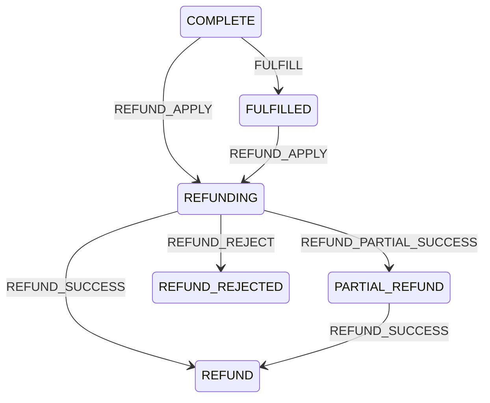

# 2026-05-30 售后状态机扩展 SDD 记录

## 背景

项目已经覆盖了基础退款链路：秒杀订单 `COMPLETE -> REFUND`，拼团明细 `COMPLETE -> CLOSE`，拼团队伍已成团后部分或全部退单。但这只表达“退款成功”结果，不足以描述更完整的售后过程。

TODO list 要求补齐售后状态机，覆盖：

- 部分退款。
- 拒绝退款。
- 履约后退款。
- 重复退款拦截。

本次先补领域状态机和测试，不强行改现有退款业务流程，避免在没有完整售后页面、审批和三方退款账单的情况下扩大运行时行为。

## 规格

新增售后状态：

- `REFUNDING`：退款处理中。
- `PARTIAL_REFUND`：部分退款成功。
- `REFUND_REJECTED`：退款被拒绝。
- `FULFILLED`：已履约。

新增售后事件：

- `FULFILL`：履约完成。
- `REFUND_APPLY`：发起退款申请。
- `REFUND_PARTIAL_SUCCESS`：部分退款成功。
- `REFUND_REJECT`：拒绝退款。

保留已有事件：

- `REFUND_SUCCESS`：全额退款成功。

## 状态迁移

秒杀订单和拼团订单明细统一扩展：

兼容当前链路：

- 秒杀仍保留 `COMPLETE -> REFUND`。
- 拼团明细仍保留 `COMPLETE -> CLOSE`。

非法迁移：

- 未支付 `CREATE` 不能走售后退款申请。
- 已关闭 `CLOSE` 不能走售后退款申请。
- 已全额退款 `REFUND` 不能重复 `REFUND_SUCCESS`。
- 已拒绝 `REFUND_REJECTED` 不能直接 `REFUND_SUCCESS`。

## 代码变更

- `OrderStateMachine` 增加售后状态和事件。
- `OrderStateMachine` 增加秒杀订单、拼团订单明细的售后合法迁移。
- `OrderStateTransitionEntity` 增加售后工厂方法：
  - `seckillOrderFulfilled`
  - `seckillRefundApplied`
  - `seckillPartialRefunded`
  - `seckillRefundRejected`
  - `groupBuyOrderFulfilled`
  - `groupBuyRefundApplied`
  - `groupBuyPartialRefunded`
  - `groupBuyRefundRejected`
- `OrderStateMachineTest` 增加售后合法迁移、非法迁移和审计 flowNo 测试。

## 验收标准

- 部分退款迁移可表达：`REFUNDING -> PARTIAL_REFUND`。
- 拒绝退款迁移可表达：`REFUNDING -> REFUND_REJECTED`。
- 履约后退款可表达：`FULFILLED -> REFUNDING -> REFUND`。
- 重复退款会被拦截：`REFUND -> REFUND` with `REFUND_SUCCESS` 不合法。
- `OrderStateTransitionEntity.of(...)` 对非法售后迁移抛出异常。
- JDK 1.8 编译通过。
- domain purity 脚本通过。
- 架构测试和状态机测试通过。

## 边界

本次完成的是领域状态机扩展，不等于完整售后系统。后续还需要：

- 商城侧退款申请单或售后单模型。
- 支付流水和退款流水独立建模。
- 拒绝退款审批原因、操作人和证据。
- 部分退款金额校验。
- 三方退款账单对账。
