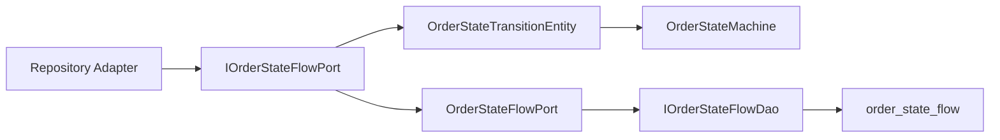

# 2026-05-30 DDD 边界治理与 SDD 审核记录

## 背景

本次调整目标是解决代码继续堆功能后出现的“仓储层变厚、状态流水写入散落、基础设施对象泄漏到业务编排代码”的问题。秒杀和拼团已经具备库存预扣、异步落库、状态流水和补偿能力，如果继续在 Repository 内直接拼接状态机字段和 DAO/PO，会让后续维护成本快速上升。

## 本次 SDD 输入文档

- `docs/sdd/README.md`：确认 SDD 工作流，先写规格、架构和验收，再做实现。
- `docs/sdd/architecture.md`：确认 DDD 分层和限界上下文，避免领域层依赖基础设施。
- `docs/sdd/order-state-machine.md`：确认拼团队伍、拼团明细、秒杀订单的合法状态迁移。
- `docs/sdd/mq-evolution.md`：确认 Redis Stream、RabbitMQ、RocketMQ 的职责边界。
- `docs/sdd/capacity-validation.md`：确认本机容量验证边界和后续生产压测要求。
- `docs/interview-baguwen.md`：同步面试口径，诚实说明当前能力和长期建设边界。

## 规格

本次只治理 DDD 边界，不改变现有业务行为。

- Repository 可以调用领域端口，但不能直接拼接 `order_state_flow` 的基础设施 PO。
- 状态迁移必须先通过领域状态机校验，再落库为审计流水。
- 状态迁移表达要使用业务语言，比如“秒杀订单异步创建成功”“拼团队伍成团”“已支付订单退单”，而不是在仓储中散落 `bizType/fromStatus/toStatus/event`。
- 基础设施层负责把领域对象转换为 MyBatis PO 并写入数据库。

## 设计

领域层：

- `OrderStateMachine`：统一定义状态、事件和合法迁移。
- `OrderStateTransitionEntity`：用领域语言创建合法迁移，并生成稳定 `flowNo`。
- `IOrderStateFlowPort`：领域端口，只暴露 `record(OrderStateTransitionEntity)`。

基础设施层：

- `OrderStateFlowPort`：把领域状态迁移对象转换为 `OrderStateFlow` PO。
- `IOrderStateFlowDao` 和 `order_state_flow_mapper.xml`：只负责落库。

## 代码变更

- 秒杀仓储 `SeckillRepository`：
  - 移除私有 `recordStateFlow(...)`。
  - 秒杀异步落库成功改为 `OrderStateTransitionEntity.seckillOrderCreated(...)`。
  - 秒杀超时关闭改为 `OrderStateTransitionEntity.seckillTimeoutClosed(...)`。

- 拼团仓储 `TradeRepository`：
  - 移除私有 `recordStateFlow(...)`。
  - 开团、锁单、支付成功、成团、未支付退单、已支付退单、成团后退单均改为领域状态迁移方法。
  - Repository 不再直接依赖 `IOrderStateFlowDao` 和 `OrderStateFlow`。

- 应用启动 `Application`：
  - 修复 `SpringApplication.run(Application.class)` 未传入 `args` 的问题。
  - 支持通过 `--server.port=8091/8092/8093` 启动多实例，避免所有实例被 `application-dev.yml` 固定端口覆盖。

## 审核结论

- 领域层纯净性：通过 `scripts/check-domain-purity.ps1`，domain 未依赖 Spring、MyBatis、DAO 或 PO。
- 编译验证：通过 `E:\java\group_buy_market\.tools\apache-maven-3.8.8\bin\mvn.cmd -q -DskipTests compile`。
- 打包验证：通过 `E:\java\group_buy_market\.tools\apache-maven-3.8.8\bin\mvn.cmd -q -DskipTests package`。
- 运行验证：8091、8092、8093 三个实例均监听成功，Nginx 8080 入口 `/actuator/health` 返回 `UP`。
- 秒杀烟测：通过 Nginx 入口完成一次 `lock_seckill_order` 和 `query_seckill_order_result`，订单结果为 `SUCCESS`，`order_state_flow` 和 `seckill_stock_flow` 均各落 1 条。
- 边界扫描：Repository 中不再存在私有 `recordStateFlow(...)`，状态流水 DAO/PO 只保留在基础设施端口适配器内。

## 后续治理

本次只是先把状态流水的技术细节从 Repository 中移走。后续如果继续收敛代码，需要把 `TradeRepository` 中的退单、通知任务、库存流水构建进一步拆成更小的基础设施适配器或领域服务，避免一个仓储类同时承担太多流程编排职责。
