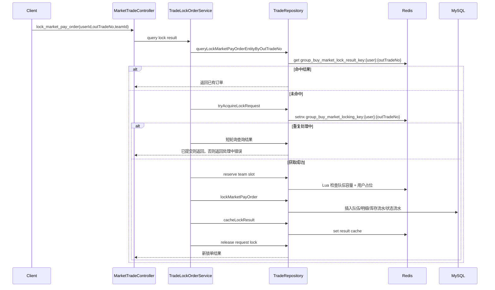

# 拼团锁单幂等与用户占位加固

## 背景

拼团参团已经通过 Redis Lua 原子占用队伍名额，并通过 MySQL 条件更新防止队伍超卖。但原实现的 Redis 占位只绑定队伍名额序号，没有绑定用户和外部单号，存在两个工程缺口：

- 同一 `userId + outTradeNo` 并发重试时，可能在首个请求提交前重复进入试算和队伍占位流程。
- 同一用户用不同外部单号并发参团同一队伍时，缓存层不能提前拦截，只能依赖 DB 唯一索引和用户参与次数兜底。

## 目标

- 锁单请求增加短 TTL 幂等锁，保护 `userId + outTradeNo` 的同步锁单临界区。
- 成功锁单后写入锁单结果缓存，重复请求优先返回稳定结果。
- 参团队伍名额占位增加用户维度 Key，Lua 内同时判断队伍容量、名额序号锁和用户占位。
- 任何落库失败都释放用户占位并恢复队伍名额恢复量，避免缓存占位泄漏。

## 设计

## Key 规范

- 请求幂等锁：`group_buy_market_locking_key_{userId}_{outTradeNo}`
- 锁单结果缓存：`group_buy_market_lock_result_key_{userId}_{outTradeNo}`
- 队伍名额计数：`group_buy_market_team_stock_key_{activityId}_{teamId}`
- 队伍恢复量：`group_buy_market_team_stock_key_{activityId}_{teamId}_recovery`
- 队伍用户占位：`group_buy_market_team_user_key_{activityId}_{teamId}_{userId}`

## 边界

- 新开团没有现有 `teamId`，不走队伍名额占位；首单由 DB 插入新队伍表达。
- 用户维度占位约束的是“同一用户同一队伍”，不是全活动全局禁入；全活动参与次数仍由用户参与次数规则和 DB 约束兜底。
- 结果缓存只用于锁单入口幂等查询，结算和退单继续查 DB，避免缓存状态滞后影响状态机判断。

## 验收记录

- `mvn -q -DskipTests compile`：通过。
- `mvn -q -DskipTests package`：通过。
- `scripts/check-domain-purity.ps1`：通过。
- SQL 迁移 `docs/sql/2026-05-30-group-buy-lock-idempotency.sql` 已执行到本地 Docker MySQL。
- 本地三实例 8091 / 8092 / 8093 + Nginx 8080 健康检查：`UP`。

冒烟结果：

- 新开团成功，重复提交同一 `userId + outTradeNo` 返回同一个 `orderId`。
- DB 中同一 `userId + outTradeNo` 只有 1 条订单明细。
- 参团成功后 Redis 写入 `group_buy_market_team_user_key_{activityId}_{teamId}_{userId}`，值为本次 `outTradeNo`。
- 同一用户使用不同 `outTradeNo` 重复参团同一队伍返回 `E0009`，DB 未新增第二条订单明细，队伍 `lock_count` 未被重复扣减。
