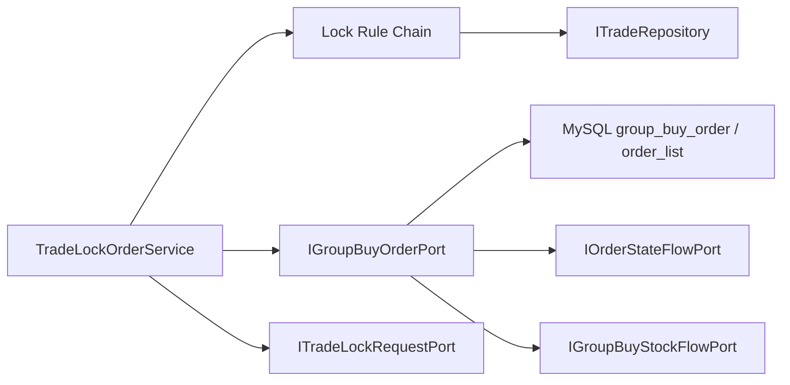

# 2026-05-30 拼团锁单落库端口拆分 SDD 记录

## 背景

前序治理已经把 `TradeRepository` 中的通知任务、队伍库存、锁单结果缓存、拼团结算和退单写操作拆出，但 `TradeRepository` 仍然承担拼团锁单落库。锁单落库是一个典型聚合写行为：可能创建新队伍、更新老队伍锁单量、插入订单明细、写状态流水和库存流水。如果继续留在查询仓储中，`ITradeRepository` 会继续混合读模型和写模型。

## 规格

本次只拆拼团锁单落库能力，不改变业务语义。

- `ITradeRepository` 不再暴露 `lockMarketPayOrder(...)`。
- 拼团锁单落库移到 `IGroupBuyOrderPort`。
- `TradeLockOrderService` 仍负责请求幂等锁、规则链、失败恢复和结果缓存。
- `IGroupBuyOrderPort` 只负责聚合写入：开团/参团落库、状态流水、库存流水。
- `TradeRepository` 继续保留活动、订单、队伍、进度、超时未支付等查询能力。

## 设计

## 代码变更

- 新增 `IGroupBuyOrderPort`。
- 新增 `GroupBuyOrderPort` 基础设施适配器。
- `TradeLockOrderService` 改为通过 `IGroupBuyOrderPort` 执行锁单落库。
- `ITradeRepository` 删除 `lockMarketPayOrder(...)`。
- `TradeRepository` 删除锁单落库大段写逻辑。
- `DomainPurityTest` 增加 `lockMarketPayOrder` 回流守护。

## 验收标准

- `ITradeRepository` 不再暴露 `lockMarketPayOrder(...)`。
- `TradeRepository` 不再包含拼团锁单落库方法。
- 拼团锁单仍能通过 `TradeLockOrderService` 完成规则链、请求锁、落库和结果缓存。
- JDK 1.8 编译通过。
- domain purity 脚本通过。
- 架构测试和状态机测试通过。

## 后续

本次完成后 `TradeRepository` 主要剩余读模型职责：订单查询、活动查询、队伍查询、拼团进度查询、超时未支付扫描。后续 `2026-05-30-group-buy-query-timeout-port-split.md` 已继续删除通用仓储，并按读模型、超时扫描和渠道策略拆分：

- `GroupBuyQueryPort`：活动、队伍、进度、订单查询。
- `GroupBuyTimeoutOrderPort`：超时未支付补偿扫描。
