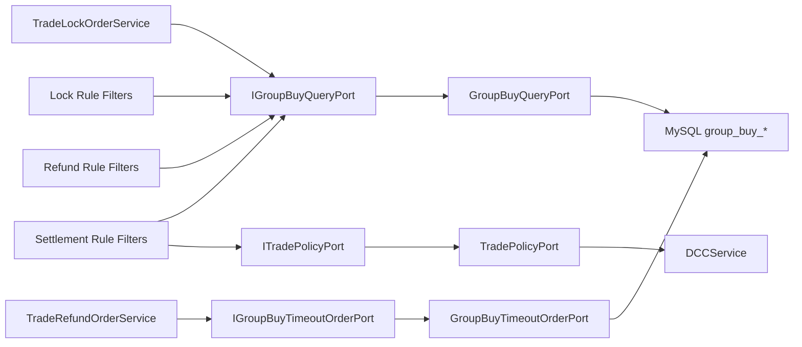

# 2026-05-30 拼团查询与超时扫描端口拆分 SDD 记录

## 背景

前序治理已经把 `TradeRepository` 中的通知任务、队伍库存、锁单请求缓存、库存流水、锁单落库、支付结算和退单写操作逐步拆出。此时 `TradeRepository` 只剩活动查询、订单查询、队伍查询、拼团进度查询、渠道黑名单策略和超时未支付扫描。

这些能力虽然都是“读”或“扫描”，但仍然混在一个通用仓储里，会继续给后续功能留下腐化入口：规则链、退单策略、锁单服务和补偿任务都能看见同一组方法。为了让端口语义更窄，本次继续删除通用 `ITradeRepository` / `TradeRepository`，拆成业务语义端口。

## 规格

本次只调整端口边界，不改变业务语义。

- `IGroupBuyQueryPort`：只暴露拼团读模型查询，包括订单、活动、队伍、进度、用户参与次数。
- `IGroupBuyTimeoutOrderPort`：只暴露超时未支付订单扫描，供退单补偿服务使用。
- `ITradePolicyPort`：只暴露交易策略查询，目前承接 DCC 渠道黑名单。
- 删除 `ITradeRepository` 和 `TradeRepository`，不再保留通用交易仓储门面。
- `DomainPurityTest` 增加删除守护，防止通用交易仓储回流。

## 设计

## 代码变更

- 新增 `IGroupBuyQueryPort` / `GroupBuyQueryPort`。
- 新增 `IGroupBuyTimeoutOrderPort` / `GroupBuyTimeoutOrderPort`。
- 新增 `ITradePolicyPort` / `TradePolicyPort`。
- 删除 `ITradeRepository` / `TradeRepository`。
- `TradeLockOrderService`、锁单规则、结算规则、退单规则改依赖 `IGroupBuyQueryPort`。
- `SCRuleFilter` 改依赖 `ITradePolicyPort`。
- `TradeRefundOrderService` 改依赖 `IGroupBuyTimeoutOrderPort`。
- 退单策略基类移除无用的通用仓储依赖，只有已成团退单策略保留 `IGroupBuyQueryPort` 查询队伍完成量。

## 验收标准

- 主代码中不存在 `ITradeRepository` / `TradeRepository`。
- `IGroupBuyQueryPort` 不暴露写操作、补偿任务、Redis 锁或渠道策略。
- JDK 1.8 编译通过。
- domain purity 脚本通过。
- 架构测试和状态机测试通过。

## 后续

拼团侧通用交易仓储已经删除。后续 DDD 治理重点转向：

- 后续已继续治理秒杀侧，订单命令、查询、库存可用性、锁单预扣和维护任务都已拆到独立端口，通用 `ISeckillRepository` / `SeckillRepository` 已删除。
- 补拼团锁单、退单策略、秒杀库存和对账重放的纯单元测试/契约测试。
- 后续已新增 `ISeckillOrderMessagePort`，避免秒杀锁单主流程长期绑定 Redis Stream；专业 MQ 演进方案仍需继续沉淀选型和迁移文档。
