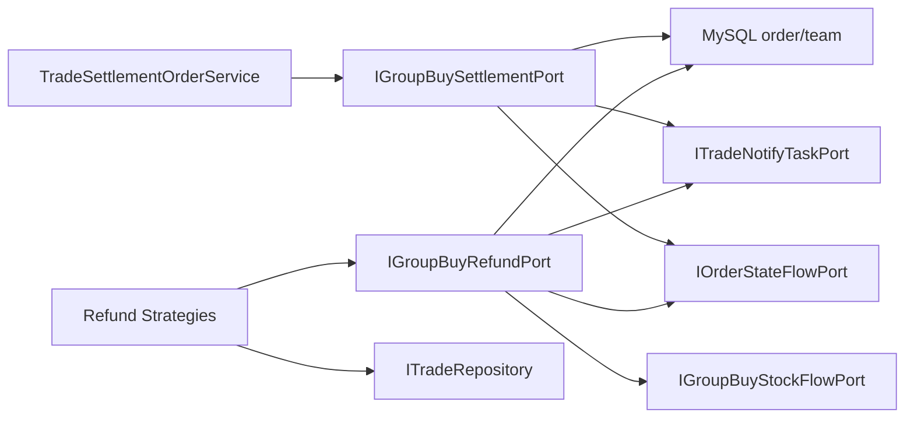

# 2026-05-30 拼团结算与退单端口拆分 SDD 记录

## 背景

`TradeRepository` 在前序治理中已经拆出了通知任务、队伍库存、锁单请求缓存和库存流水，但它仍然直接承担拼团支付结算和三类退单写操作。这样会让交易主仓储同时处理锁单落库、支付完成、成团判断、退款状态更新、通知任务和状态流水，继续发展会形成一个大事务脚本类。

## 规格

本次只拆拼团结算和退单写能力，不改变业务语义。

- `ITradeRepository` 保留交易查询、活动查询、锁单落库和超时未支付查询。本条是本次拆分时的阶段边界，后续锁单落库已继续拆到 `IGroupBuyOrderPort`。
- 拼团支付结算写操作移到 `IGroupBuySettlementPort`。
- 拼团三类退单写操作移到 `IGroupBuyRefundPort`。
- 结算和退单端口仍负责本地事务、状态流水、锁单结果缓存清理、通知任务创建和库存流水记录。
- 领域服务和退单策略依赖业务语义端口，不再通过 `ITradeRepository` 执行结算/退单写操作。

## 设计

## 代码变更

- 新增 `IGroupBuySettlementPort`。
- 新增 `IGroupBuyRefundPort`。
- 新增 `GroupBuySettlementPort` 基础设施适配器。
- 新增 `GroupBuyRefundPort` 基础设施适配器。
- `TradeSettlementOrderService` 改为通过 `IGroupBuySettlementPort` 结算。
- 退单策略改为通过 `IGroupBuyRefundPort` 执行退单写操作。
- `ITradeRepository` 删除 `settlementMarketPayOrder`、`unpaid2Refund`、`paid2Refund`、`paidTeam2Refund`。
- `DomainPurityTest` 增加回流守护。

## 验收标准

- `ITradeRepository` 不再暴露拼团结算和退单写方法。
- `TradeRepository` 不再包含拼团结算和三类退单写方法。
- 结算服务仍能生成成团通知任务。
- 退单策略仍能生成退款通知任务并记录库存流水。
- JDK 1.8 编译通过。
- domain purity 脚本通过。
- 架构测试和状态机测试通过。

## 后续

`TradeRepository` 在本次之后主要剩余职责是拼团锁单落库、活动/队伍/订单查询、超时未支付查询。后续 `2026-05-30-group-buy-order-port-split.md` 已继续把拼团锁单落库拆到 `IGroupBuyOrderPort`，因此当前剩余重点变为读模型和超时扫描拆分。下一步可以继续拆：

- `GroupBuyOrderPort`：专注拼团锁单落库。
- `GroupBuyQueryPort`：专注活动、队伍、订单查询读模型。
- `GroupBuyTimeoutOrderPort`：专注超时未支付补偿扫描。
