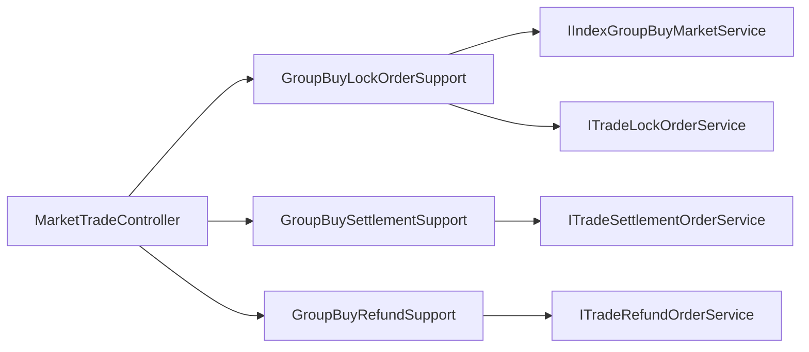

# 2026-05-30 拼团交易 HTTP 用例支撑拆分 SDD 记录

## 背景

`MarketTradeController` 已经拆出请求校验、领域命令组装和响应 DTO 组装，但仍然直接编排拼团锁单、试算、人群可见性、队伍满员判断、结算、退单和结构化业务日志。入口层继续持有这些用例流程，会让 HTTP Controller 重新变成大类，也会让后续新增风控、灰度、降级或多端 API 时继续堆代码。

## 目标

- Controller 只保留 HTTP 路由和接口实现。
- 拼团锁单、支付结算、退单退款各自有独立 usecase support。
- 锁单中的幂等查询、队伍满员判断、首页试算、人群可见性校验、领域服务调用和结构化日志从 Controller 移出。
- 架构测试防止领域服务、领域实体、结构化日志、请求校验器、命令组装器和响应组装器重新回流到 Controller。

## 拆分设计

- `GroupBuyLockOrderSupport`：拼团锁单用例。
- `GroupBuySettlementSupport`：拼团支付结算用例。
- `GroupBuyRefundSupport`：拼团退单用例。

## 验收

- `MarketTradeController` 不再直接依赖拼团交易领域服务、首页试算服务、结构化日志、请求校验器、命令组装器、响应组装器和领域实体。
- `MarketTradeController` 不再出现 `JSON.toJSONString`、`indexMarketTrial`、`queryNoPayMarketPayOrderByOutTradeNo`、`queryGroupBuyProgress`、`lockMarketPayOrder`、`settlementMarketPayOrder`、`refundOrder` 等用例编排细节。
- 新增 3 个 usecase support 类。
- JDK 1.8 编译、domain purity、`DomainPurityTest` 和拼团相关单元测试通过。
