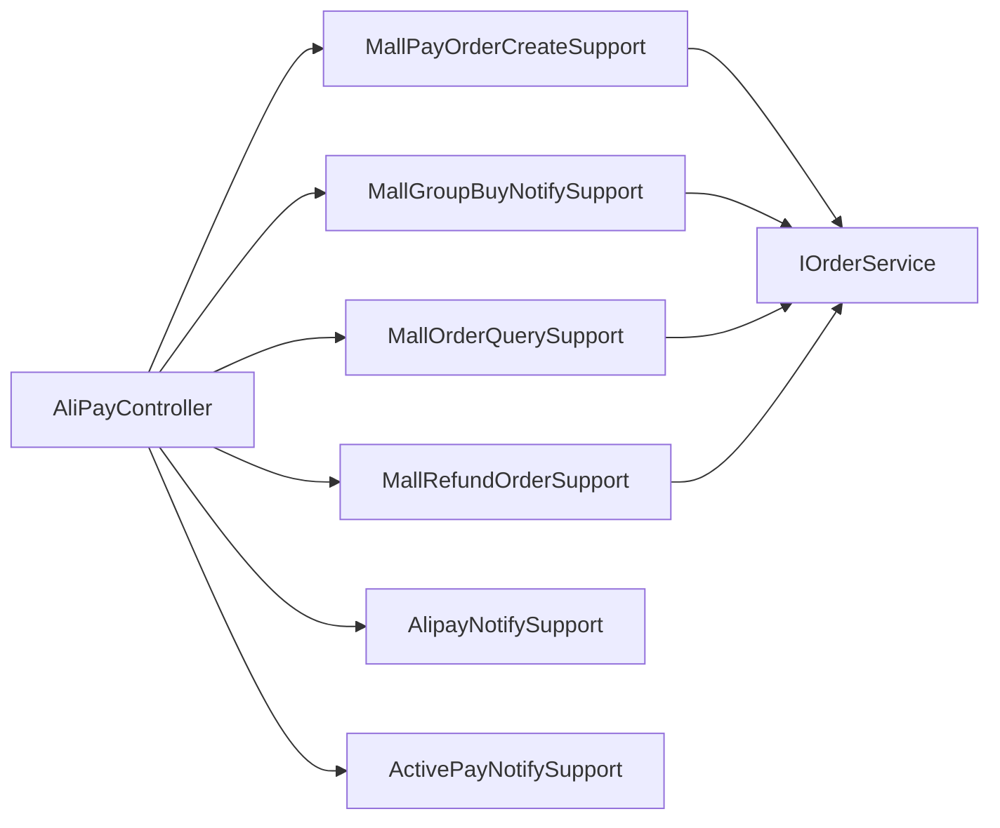

# 商城 AliPayController 用例支撑拆分

## 背景

`AliPayController` 已经拆出了支付宝回调、主动查询和订单列表 DTO 组装细节，但它仍然直接编排创建支付单、拼团成团通知、用户订单分页查询和营销退单。HTTP 入口继续持有 `IOrderService`、领域实体构建、结构化业务日志和响应组装，会让支付入口重新膨胀成业务脚本类。

## 规格

- Controller 只保留 HTTP 路由、接口实现和参数转交。
- 创建支付单编排下沉到 `MallPayOrderCreateSupport`。
- 拼团成团通知下沉到 `MallGroupBuyNotifySupport`。
- 用户订单列表分页查询下沉到 `MallOrderQuerySupport`。
- 营销退单下沉到 `MallRefundOrderSupport`。
- 支付宝异步回调异常兜底由 `AlipayNotifySupport` 自己处理，Controller 不再持有日志和业务字段。
- `DomainPurityTest` 增加守护，防止 `IOrderService`、领域实体构建、结构化日志和响应组装回流到 `AliPayController`。

## 设计

## 验收

- `AliPayController` 不再直接依赖 `IOrderService`、`ShopCartEntity`、`PayOrderEntity`、`OrderEntity`、`MarketTypeVO`、`StructuredBusinessLogger`、`Constants.ResponseCode` 和 FastJSON。
- 创建支付单、拼团通知、订单查询、退单接口语义保持不变。
- 商城和营销两个工程 JDK 1.8 编译通过。
- `DomainPurityTest`、对账契约测试和 domain purity 脚本通过。
