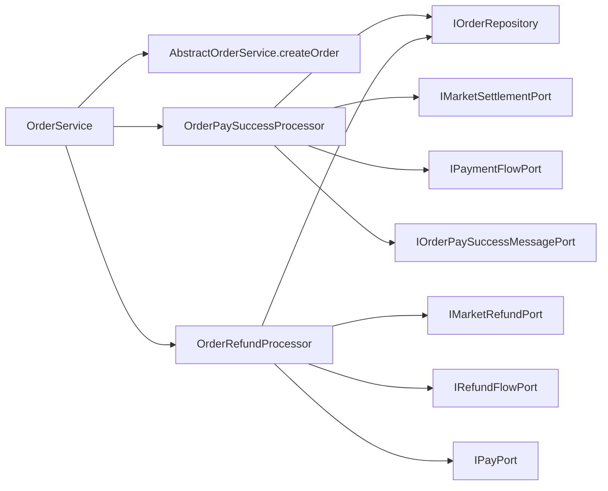

# 商城 OrderService 用例处理器拆分

## 背景

商城侧已经把对账职责从 `OrderService` 拆到 `OrderReconcileService`，但 `OrderService` 仍然直接承担支付成功分发、普通订单支付成功消息、拼团/秒杀营销结算、支付流水、营销退单、真实退款和退款流水。它已经没有 Spring/DAO 污染，但领域服务职责仍然偏宽，后续继续加退款审批、支付渠道、支付失败补偿时容易重新变成大服务类。

## 规格

- 保持 `IOrderService` 对外接口不变，避免触发 Controller、Listener、Job 大面积改造。
- 支付成功相关流程下沉到 `OrderPaySuccessProcessor`：
  - 普通订单条件支付成功。
  - 拼团/秒杀营销订单条件支付成功。
  - 支付流水补录。
  - 普通订单支付成功消息。
  - 拼团/秒杀营销结算异步触发。
  - 营销结算完成后商城订单批量完成和支付成功消息发布。
- 退款相关流程下沉到 `OrderRefundProcessor`：
  - 订单归属校验。
  - 不同营销类型调用营销退款端口。
  - 未支付关闭、已支付退款申请、真实支付退款。
  - 退款流水记录。
- `OrderService` 只保留下单、预支付、简单查询和对处理器的委托。
- 架构测试防止支付成功、退款、支付流水、退款流水、营销结算/退款细节回流到 `OrderService`。

## 设计



## 验收

- `OrderService` 不再直接依赖 `IMarketSettlementPort`、`IMarketRefundPort`、`IPaymentFlowPort`、`IRefundFlowPort`、`IOrderPaySuccessMessagePort`、`IDomainTaskExecutor`。
- `OrderService` 不再直接包含 `asyncSettlement*`、`recordPaySuccess`、`recordRefund`、`refundGroupBuyMarketPayOrder`、`refundSeckillPayOrder`、`publishAll` 等流程细节。
- `DomainServiceConfig` 以 Bean 方式组装两个 processor 和 `OrderService`，domain 层仍不加 Spring 注解。
- 商城和营销工程 JDK 1.8 编译通过，domain purity、架构测试和对账契约测试通过。

## 实现记录

- 新增 `OrderPaySuccessProcessor`，承接普通订单支付成功消息、拼团/秒杀营销结算异步触发、支付流水补录和营销结算完成后的商城订单批量完成。
- 新增 `OrderRefundProcessor`，承接订单归属校验、营销侧退单、未支付关闭、已支付退款申请、真实退款和退款流水。
- `OrderService` 保留下单、预支付、简单查询、关闭订单，以及对支付成功/退款处理器的委托。
- `DomainServiceConfig` 新增两个 processor Bean，并用处理器组装 `OrderService`。
- `DomainPurityTest` 新增 `mallOrderServiceShouldDelegatePaySuccessAndRefundUsecases`，防止支付成功、退款、支付/退款流水、营销结算/退款细节回流到 `OrderService`。

## 验证结果

```powershell
$env:JAVA_HOME='C:\Program Files\Eclipse Adoptium\jdk-8.0.492.9-hotspot'
.\.tools\apache-maven-3.8.8\bin\mvn.cmd -q -pl s-pay-mall-ddd-market-master/s-pay-mall-ddd-app -am -DskipTests compile
```

结果：通过，使用 `openjdk version "1.8.0_492"`。

```powershell
..\.tools\apache-maven-3.8.8\bin\mvn.cmd -q -pl group-buy-market-app -am -DskipTests=false -DfailIfNoTests=false "-Dtest=DomainPurityTest" test
```

结果：`DomainPurityTest` 28 个测试通过。

```powershell
..\.tools\apache-maven-3.8.8\bin\mvn.cmd -q -pl s-pay-mall-ddd-app -am -DskipTests=false -DfailIfNoTests=false "-Dtest=OrderServiceTest" test
```

结果：`OrderServiceTest` 2 个测试通过。
