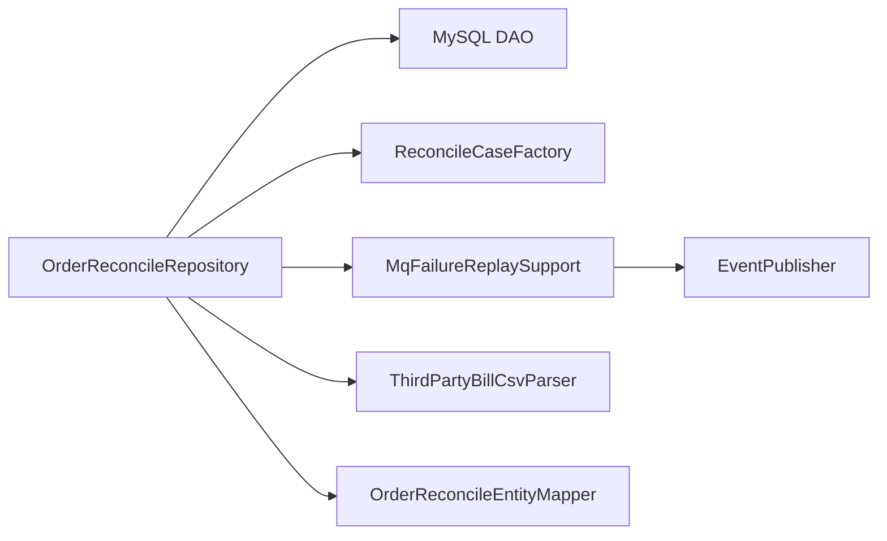

# 商城对账仓储内部职责拆分记录

日期：2026-05-30

## 背景

`OrderReconcileRepository` 已经从 `OrderRepository` 中拆出，专门承接对账扫描、差错单查询、人工处理、MQ 失败重放和三方账单导入。但继续审计发现它内部仍混合了四类技术细节：

- 差错单构建：支付订单、MQ 失败、支付流水缺账单、退款流水缺账单、三方账单缺本地流水。
- MQ 重放：根据队列名解析 routing key，调用 `EventPublisher`，更新 MQ 消费台账。
- 三方账单 CSV 解析：CSV 行解析、金额转换、账单时间解析。
- 实体映射：MyBatis PO 到 domain entity 的转换。

这些逻辑继续留在仓储适配器里，会让仓储再次变厚，不符合“Repository Adapter 只做持久化适配”的 DDD 约束。

## 设计

本次只拆 infrastructure 内部职责，不改变 domain 端口和接口契约。

- `OrderReconcileRepository`：保留 DAO 查询、upsert、导入落库和接口适配。
- `ReconcileCaseFactory`：集中构建各类 `ReconcileCase`。
- `MqFailureReplaySupport`：集中处理 MQ 失败消息重放、routing key 解析和消息状态更新。
- `ThirdPartyBillCsvParser`：集中解析三方账单 CSV。
- `OrderReconcileEntityMapper`：集中处理 `PayOrder`、`ReconcileCase`、`ReconcileOperationLog` 到 domain entity 的映射。

## 验收

- `OrderReconcileRepository` 不再直接依赖 `EventPublisher`、routing key 解析、CSV 字段解析、`BigDecimal` 金额转换、`SimpleDateFormat` 时间解析和 PO/Entity builder 映射。
- `DomainPurityTest.mallOrderReconcileRepositoryShouldDelegateCaseReplayCsvAndMappingDetails` 防止这些职责回流。
- 商城服务在 JDK 1.8 下编译通过。

## 边界

本次解决的是本机可完成的代码边界问题，不等于完整生产对账平台。生产上仍需要正式三方账单下载、签名校验、账单文件归档、权限审批、SLA 和告警升级策略。
