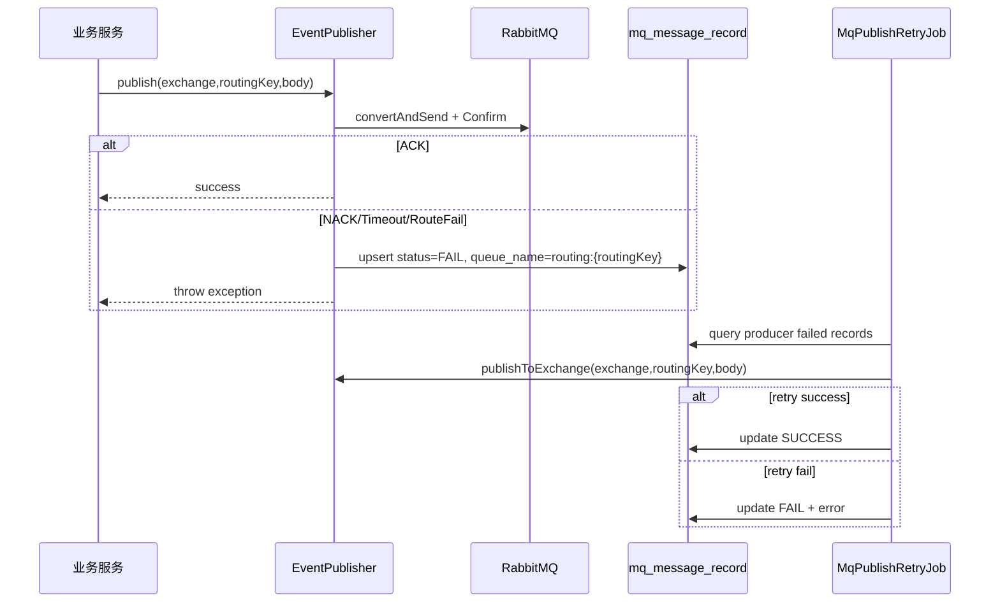

# MQ 生产者失败台账与重试补偿

## 背景

RabbitMQ 生产者已开启 publisher confirm 和 returns，但失败时主要依赖日志、调用方异常和个别业务任务重试。对于普通支付成功消息、秒杀 MQ 模式消息、成团通知等场景，发布失败需要有统一台账和自动补偿入口，不能只停留在日志。

## 目标

- MQ 发送失败时写入 `mq_message_record`，状态为失败。
- 通过 `queue_name = routing:{routingKey}` 区分生产者发送失败和消费者消费失败。
- 定时任务扫描生产者失败消息，按原 `exchange + routingKey + body` 重新发送。
- 运维接口支持手动触发生产者失败消息重试。
- 成功重发后把消息记录标记为成功，避免反复补偿。

## 设计

## 实现范围

- `group-buy-market`：成团/退单通知、秒杀 MQ 模式发送失败统一落台账并自动重试。
- `s-pay-mall-ddd-market`：普通订单支付成功消息、商城侧事件发送失败统一落台账并自动重试。

## 边界

- 当前复用 `mq_message_record` 作为失败台账，适合本项目规模；生产中可以独立拆出 `mq_publish_outbox` 表并增加状态、下次重试时间、最大重试次数和人工审批字段。
- RabbitMQ routing 失败仍会先触发 returns/confirm 逻辑；记录失败后由补偿任务重试。若路由配置本身错误，重试会持续失败，需要人工修正配置后再补偿。
- 消费者业务失败仍按原 DLQ 和消费幂等表处理；生产者失败记录用 `routing:` 前缀单独筛选，避免和消费失败混在一起自动重发。
