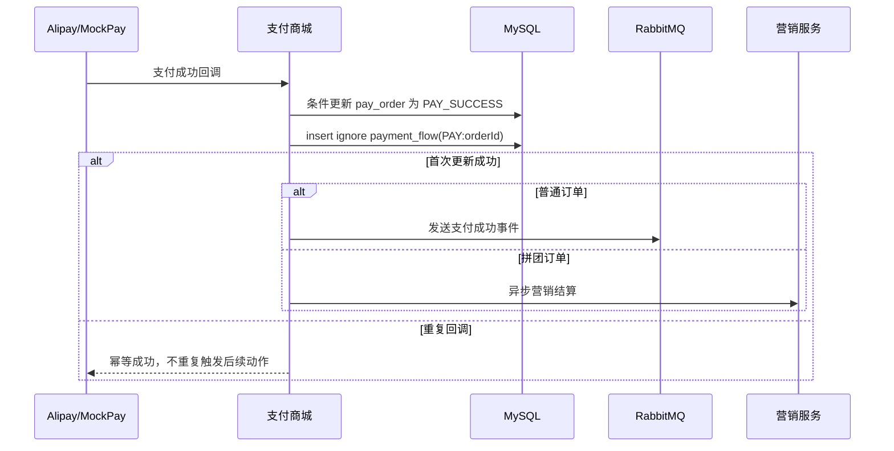

# 支付回调幂等流水加固

## 背景

商城侧已经有 `payment_flow` 表和订单状态条件更新，但支付回调处理还存在一个容易被追问的问题：重复回调时，订单状态更新虽然会被 `status in ('CREATE','PAY_WAIT')` 拦住，但后续 MQ 发货事件或拼团营销结算仍可能被重复触发。

## 目标

- 支付成功回调写入独立支付流水 `payment_flow`，用 `flow_no = PAY:{orderId}` 做幂等。
- 订单状态更新返回影响行数，只有第一次从待支付变成支付成功时才触发后续事件。
- 普通订单只在首次支付成功时发送支付成功 MQ。
- 拼团订单只在首次支付成功时异步调用营销结算。
- 支付流水保留支付渠道、三方流水号和原始回调报文，支持后续对账。

## 设计

## 关键点

- `IOrderDao.changeOrderPaySuccess` 改成返回更新行数。
- `OrderRepository.changeOrderPaySuccess` 和 `changeMarketOrderPaySuccess` 返回 `boolean changed`。
- `OrderService` 只在 `changed=true` 时触发拼团结算。
- 普通订单 MQ 发送只在 `changed=true` 时执行。
- 支付宝、主动查询、模拟支付均传入 `payChannel`、`channelTradeNo` 和 `rawMessage`。

## 验收标准

- 同一订单重复模拟支付确认，`payment_flow` 只有 1 条 `PAY:{orderId}`。
- `pay_order` 状态保持 `PAY_SUCCESS`，重复回调不再二次触发拼团结算或普通订单支付成功 MQ。
- Maven 编译通过。

## 验收记录

- `mvn -q -DskipTests compile`：通过。
- `mvn -q -DskipTests package`：通过。
- 支付商城 8070 健康检查：`UP`。
- 本地模拟支付重复确认订单 `129329479488`：
  - `payment_flow`：`PAY:129329479488` 只有 1 条，`pay_channel=mock`，`channel_trade_no=MOCK:129329479488`，`pay_status=SUCCESS`。
  - `pay_order`：最终状态 `DEAL_DONE`，说明首次支付成功事件被消费完成。
  - 日志中该订单 `receive pay success message` 命中 1 次，重复确认未重复发送支付成功 MQ。
