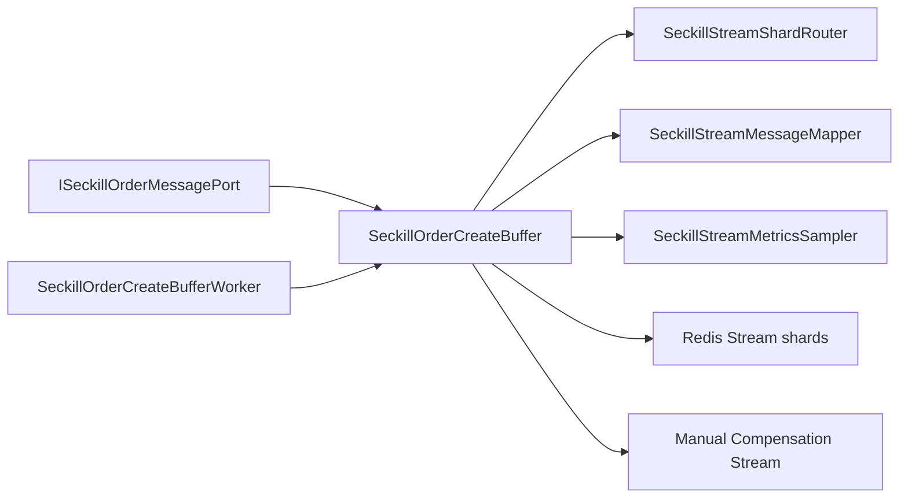

# 秒杀缓冲队列内部拆分记录

日期：2026-05-30

## 背景

`SeckillOrderCreateBuffer` 已经承接秒杀异步下单的本地队列、Redis Queue、Redis Stream、pending-list 接管、失败隔离、人工补偿 Stream 和指标采样。功能可用，但类本身偏大，继续扩展 RocketMQ/Kafka 适配、更多补偿规则或指标采样时，容易重新变成基础设施大类。

本次只处理 infrastructure 内部拆分，不改变 domain 端口和业务语义：

- 抢资格成功后仍通过 `ISeckillOrderMessagePort` 投递秒杀订单创建消息。
- Redis Stream 模式仍按 `activityId + userId + outTradeNo` hash 分片。
- pending 消息仍由 worker 接管，超过阈值后进入人工补偿 Stream。
- 人工补偿查询和重放接口保持不变。

## 设计

拆分后的职责如下：

- `SeckillOrderCreateBuffer`：保留队列模式选择、poll、ack、fail、人工补偿端口实现和 worker 交互编排。
- `SeckillOrderBufferMessage`：表达一条缓冲消息，统一本地队列、Redis Queue 和 Redis Stream 的消息结构。
- `SeckillStreamShardRouter`：负责 Stream 基础 key、分片数、hash 路由和 pending retry key。
- `SeckillStreamMessageMapper`：负责 Stream body、DLQ payload、人工补偿消息解析和 StreamMessageId 解析。
- `SeckillStreamMetricsSampler`：负责 Stream pending/lag Lua 采样和指标解析。

## 验收

- `SeckillOrderCreateBuffer` 不再直接持有 `CRC32`、`StandardCharsets`、`StreamAddArgs`、`TrimStrategy`、`JSON` 映射、`STREAM_FIELD_BODY`、`STREAM_METRICS_LUA`、`parseLong` 和内部 `BufferMessage`。
- `DomainPurityTest.seckillOrderCreateBufferShouldDelegateStreamRoutingAndMapping` 防止上述职责回流。
- JDK 1.8 下营销服务编译通过。

## 边界

这次是“内部技术职责拆分”，不是 MQ 方案切换。当前本机仍以 Redis Stream 作为轻量可靠削峰方案；真正生产大促订单消息仍建议按 `docs/sdd/mq-evolution.md` 演进到 RocketMQ/Kafka/Pulsar，并补消息 Adapter 契约测试。
