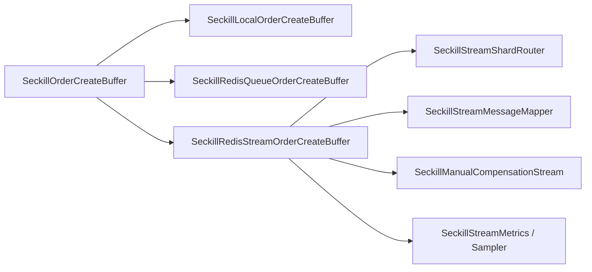

# 秒杀缓冲队列策略拆分

## 背景

`SeckillOrderCreateBuffer` 前序已经拆出了 Stream 分片路由、消息映射、指标采样和人工补偿 Stream，但主类仍然同时承担本地队列、Redis Queue、Redis Stream、ACK、pending 回收、失败隔离和消费者游标管理。这个类位于基础设施事件适配层，如果继续膨胀，会让后续接 RocketMQ/Kafka 或替换 Redis Stream 时继续牵动主门面。

## 规格

- `SeckillOrderCreateBuffer` 只负责模式选择、对外 API 和生命周期初始化。
- 本地内存队列逻辑拆到 `SeckillLocalOrderCreateBuffer`。
- Redis BlockingQueue 逻辑拆到 `SeckillRedisQueueOrderCreateBuffer`。
- Redis Stream 投递、读取、ACK、pending 回收、失败隔离和指标采样拆到 `SeckillRedisStreamOrderCreateBuffer`。
- Worker、订单消息端口和人工补偿端口保持调用 `SeckillOrderCreateBuffer`，外部契约不变。
- 架构测试增加守护，防止 Redis Stream API、BlockingQueue 和 Redis Queue 细节回流到主门面。

## 设计

## 验收

- `SeckillOrderCreateBuffer` 不再直接依赖 `IRedisService`、`RedissonClient`、`RStream`、`StreamReadGroupArgs`、`AutoClaimResult`、`BlockingQueue`、`ArrayBlockingQueue` 和 pending retry 细节。
- `SeckillOrderCreateBuffer` 行数明显下降，只保留模式判断和委托。
- 秒杀本地队列、Redis Queue、Redis Stream 的投递/消费/ACK/失败隔离语义保持不变。
- 两个工程 JDK 1.8 编译通过，domain purity、架构测试和相关契约测试通过。
