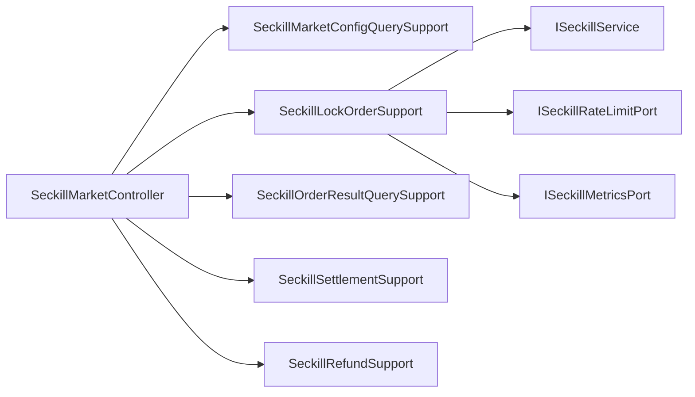

# 2026-05-30 秒杀 HTTP 用例支撑拆分 SDD 记录

## 背景

`SeckillMarketController` 已经拆出请求校验、客户端 IP 解析和响应 DTO 组装，但 Controller 仍然直接编排秒杀活动查询、锁单幂等、限流、指标采样、结算、退款和结构化业务日志。入口类继续膨胀会让 HTTP 协议层和用例编排耦在一起，后续增加灰度、风控、降级或多端 API 时容易继续堆代码。

## 目标

- Controller 只保留 HTTP 路由、接口实现和限流注解。
- 每个秒杀 HTTP 用例有独立支撑组件，承载校验、调用领域服务、业务日志、响应封装和异常转换。
- 高并发锁单里的幂等查询、限流、指标和日志从 Controller 移出。
- 架构测试防止领域服务、指标端口、结构化日志和 DTO 组装重新回流到 Controller。

## 拆分设计

- `SeckillMarketConfigQuerySupport`：活动配置查询。
- `SeckillLockOrderSupport`：锁单、幂等命中、限流、指标和 fallback。
- `SeckillOrderResultQuerySupport`：秒杀结果查询。
- `SeckillSettlementSupport`：支付结算。
- `SeckillRefundSupport`：退款和库存释放结果判断。

## 验收

- `SeckillMarketController` 不再直接依赖 `ISeckillService`、`ISeckillRateLimitPort`、`ISeckillMetricsPort`、`StructuredBusinessLogger`、`SeckillRequestValidator`、`SeckillResponseAssembler`。
- `SeckillMarketController` 不再出现 `JSON.toJSONString`、`querySeckillOrderByOutTradeNo`、`tryAcquire`、`recordLock` 等用例编排细节。
- 新增 5 个 usecase support 类。
- JDK 1.8 编译、domain purity、`DomainPurityTest` 和秒杀相关单测通过。
