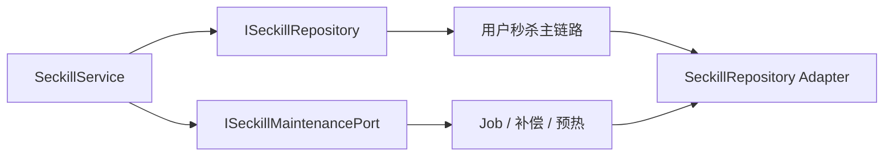

# 2026-05-30 秒杀维护任务端口拆分

## 背景

秒杀主仓储 `ISeckillRepository` 同时暴露了用户查询、锁单、异步落库、支付结算、退款，以及库存同步、超时未支付释放、活动预热等维护任务方法。

这些维护任务由 Job 触发，属于补偿和运维编排能力，不应该污染秒杀用户下单主链路仓储端口。继续混在一起会让领域服务和测试很难区分“交易主链路”和“后台维护链路”。

## 设计

- 新增 `ISeckillMaintenancePort`。
- `ISeckillRepository` 只保留：
  - 活动查询。
  - 库存查询。
  - 订单查询。
  - 秒杀锁单。
  - 异步创建订单。
  - 支付结算。
  - 退款。
- `ISeckillMaintenancePort` 承接：
  - `syncSeckillActivityStock()`。
  - `releaseTimeoutUnpaidOrders()`。
  - `prewarmUpcomingActivities(...)`。
- 当前基础设施实现仍由 `SeckillRepository` 同时适配两个端口，先完成 domain 端口隔离，避免一次性搬动过多实现代码。
- `DomainPurityTest` 增加回归用例，防止维护任务方法回流到 `ISeckillRepository`。



## 验收

```powershell
$env:JAVA_HOME='C:\Program Files\Eclipse Adoptium\jdk-8.0.492.9-hotspot'
$env:Path="$env:JAVA_HOME\bin;E:\java\qsyy-ecommerce-platform\.tools\apache-maven-3.8.8\bin;$env:Path"

cd E:\java\qsyy-ecommerce-platform\qsyy-commerce-market
mvn -q -DskipTests compile
mvn -pl group-buy-market-app -am -DskipTests=false -DfailIfNoTests=false "-Dtest=cn.bugstack.test.architecture.DomainPurityTest,cn.bugstack.test.domain.shared.OrderStateMachineTest" test

cd E:\java\qsyy-ecommerce-platform
powershell -NoProfile -ExecutionPolicy Bypass -File scripts\check-domain-purity.ps1
```

## 面试表达

> 秒杀领域里我先把用户下单主链路和后台维护链路分开，`ISeckillMaintenancePort` 面向库存同步、活动预热、超时未支付释放这类 Job。后续又继续拆掉通用 `ISeckillRepository` / `SeckillRepository`，把查询、库存可用性、锁单预扣、订单命令都拆成独立端口。这样面试官追问“秒杀主链路为什么不被补偿任务污染”时，可以明确说明端口边界，而不是一个大 Repository 暴露所有能力。

## 后续更新

后续 SDD 记录 `2026-05-30-seckill-repository-delete-port-split.md` 已完成通用秒杀仓储删除，并把基础设施侧维护实现迁到独立 `SeckillMaintenancePort`。
