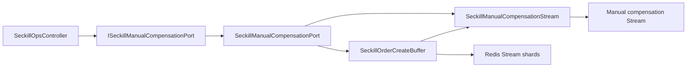

# 2026-05-30 秒杀人工补偿端口拆分 SDD 记录

## 背景

`SeckillOrderCreateBuffer` 已经拆出 Stream 分片路由、消息映射和指标采样，但仍然同时承担队列缓冲、pending 失败隔离、人工补偿 Stream 查询和重放。继续把补偿台能力挂在缓冲队列类上，会让后续接 RocketMQ/Kafka 或扩展人工补偿审批时重新形成基础设施大类。

## 目标

- `SeckillOrderCreateBuffer` 只保留缓冲队列模式选择、投递、拉取、ACK 和失败隔离编排。
- 人工补偿 Stream 的查询、单条定位、删除和隔离写入抽到独立支撑组件。
- 领域端口 `ISeckillManualCompensationPort` 由专门 Adapter 实现，不再由缓冲队列类直接实现。
- 架构测试守住边界，防止补偿查询/重放逻辑回流到缓冲队列。

## 设计

## 验收

- `SeckillOrderCreateBuffer` 不再 `implements ISeckillManualCompensationPort`。
- `SeckillOrderCreateBuffer` 不再暴露 `queryManualMessages`、`replayManualMessages`、`manualStreamKey`。
- 新增 `SeckillManualCompensationStream` 负责人工补偿 Stream 读写和删除。
- 新增 `SeckillManualCompensationPort` 负责领域端口适配和重放编排。
- `DomainPurityTest` 增加补偿职责拆分守护。
