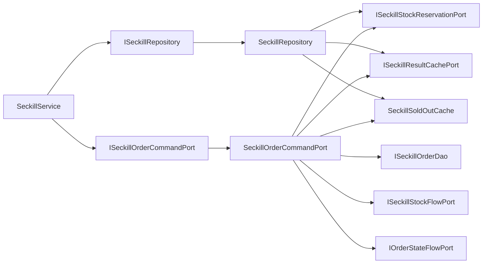

# 2026-05-30 秒杀订单命令端口拆分 SDD 记录

## 背景

前序治理已经把秒杀库存预扣、库存流水、结果缓存、订单表分片路由和维护任务从 `SeckillRepository` 中拆出。但 `ISeckillRepository` 仍然同时暴露查询、锁单、异步落库、批量落库、支付结算、退款状态更新。这样会让秒杀仓储继续承担用户主链路、MQ 消费落库、支付回调和售后逆向的多种命令职责。

本次继续按 DDD 端口语义拆分：查询和预扣仍保留在当前仓储端口，订单创建、支付结算和退款这些状态变更移到独立命令端口。

## 规格

- 新增 `ISeckillOrderCommandPort`，承接秒杀订单创建、批量创建、支付结算和退款。
- `ISeckillRepository` 不再暴露 `createSeckillOrder`、`createSeckillOrders`、`settlementSeckillOrder`、`refundSeckillOrder`。
- `SeckillService` 通过 `ISeckillOrderCommandPort` 执行订单命令。
- 订单命令适配器继续负责本地事务、分片表写入、状态流水、结果缓存、库存流水和库存回滚。
- 本地售罄短缓存抽成 `SeckillSoldOutCache`，避免退款/取消迁移后无法清理售罄缓存。
- `DomainPurityTest` 增加回流守护，防止秒杀订单命令重新塞回仓储。

## 设计

## 代码变更

- 新增 `ISeckillOrderCommandPort`。
- 新增 `SeckillOrderCommandPort`。
- 新增 `SeckillSoldOutCache`，共享本地售罄短缓存。
- `SeckillService` 构造器注入 `ISeckillOrderCommandPort`。
- `ISeckillRepository` 删除订单命令方法。
- `SeckillRepository` 删除订单创建、批量创建、支付结算、退款状态更新相关代码。
- `DomainPurityTest` 增加 `seckillRepositoryShouldNotExposeOrderLifecycleCommands`。

## 验收标准

- `ISeckillRepository` 不再暴露秒杀订单命令方法。
- `SeckillRepository` 不再包含批量插入、支付成功、退款状态更新、关闭未支付订单等命令细节。
- 退款/取消仍会清理本地售罄短缓存。
- JDK 1.8 编译通过。
- domain purity 脚本通过。
- 架构测试和状态机测试通过。

## 后续

秒杀侧下一步可继续拆：

- `ISeckillQueryPort`：活动查询、订单查询、结果查询。
- `ISeckillStockAvailabilityPort`：库存初始化、库存查询、本地售罄短缓存协调。
- `ISeckillOrderMessagePort`：把 Redis Stream / RabbitMQ / RocketMQ 的消息投递从仓储主流程中解耦。
