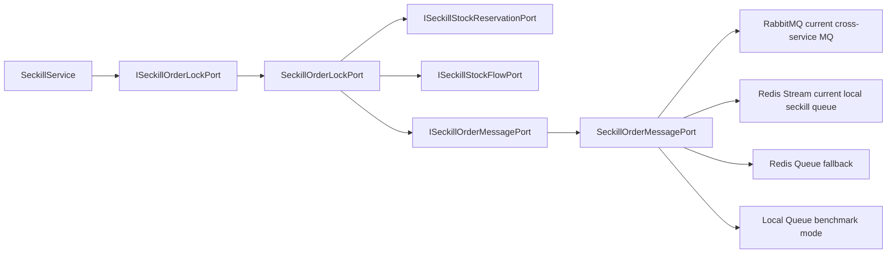

# 2026-05-30 秒杀订单消息端口 SDD 记录

## 背景

上一轮已经删除通用 `ISeckillRepository` / `SeckillRepository`，秒杀锁单主链路收敛到 `ISeckillOrderLockPort`。但基础设施适配器 `SeckillOrderLockPort` 仍然直接感知 `EventPublisher`、`SeckillOrderCreateBuffer`、RabbitMQ routing key、Redis Stream/local queue 选择和 JSON 序列化。

这会让“锁单预扣”职责继续和“消息中间件路由”耦合：后续如果把本机 Redis Stream 演进为 RocketMQ、Kafka 或 Pulsar，需要改锁单适配器。这个方向不符合 DDD 端口隔离，也不利于 SDD 维护。

## 规格

- 新增 `ISeckillOrderMessagePort`，表达“发布秒杀订单创建消息”。
- 新增 `SeckillOrderMessagePort` 适配器，承接 RabbitMQ、Redis Stream、Redis Queue、本地队列的实际投递选择。
- `SeckillOrderLockPort` 只负责资格预扣、失败回滚和调用消息端口，不再感知具体中间件。
- `DomainPurityTest` 增加守护，防止 `SeckillOrderLockPort` 重新直接依赖 `EventPublisher`、`SeckillOrderCreateBuffer`、routing key、JSON 序列化和队列 offer。

## 设计

## 代码变更

- 新增 `group-buy-market-domain/.../ISeckillOrderMessagePort.java`。
- 新增 `group-buy-market-infrastructure/.../SeckillOrderMessagePort.java`。
- `SeckillOrderLockPort` 删除 `EventPublisher`、`SeckillOrderCreateBuffer`、`topicSeckillOrderCreate`、`JSON.toJSONString(...)` 和消息路由逻辑。
- `SeckillOrderLockPort` 改调用 `ISeckillOrderMessagePort.publishOrderCreate(...)`，返回 false 时按限流失败处理并回滚库存资格。
- `DomainPurityTest` 增加 `seckillOrderLockPortShouldNotOwnMessageMiddlewareRouting`。

## 验收标准

- `SeckillOrderLockPort` 不出现 `EventPublisher`、`SeckillOrderCreateBuffer`、`topicSeckillOrderCreate`、`publishWithoutConfirm`、`JSON.toJSONString`、`useMq()`、`.offer(`。
- JDK 1.8 编译通过。
- domain purity 脚本通过。
- 架构测试和状态机测试通过。

## 后续

当前只是把消息投递中间件选择收敛到一个端口。真正从 Redis Stream 演进到 RocketMQ/Kafka/Pulsar 时，需要新增对应 Adapter，并补充消息模型、分区键、顺序性、幂等、重试、DLQ 和回滚方案文档。
