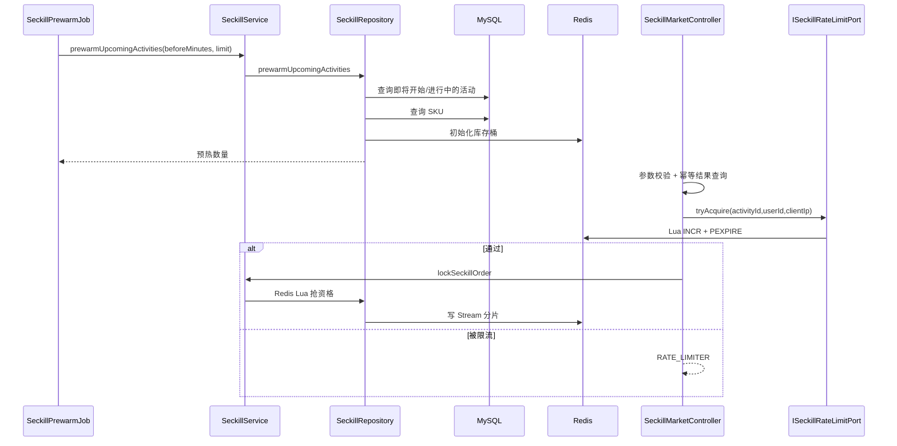

# 秒杀活动预热与分层限流

## 背景

秒杀入口已经具备 Redis Lua 抢资格、Redis Stream 分片削峰、pending-list 回收、人工补偿 Stream、批量落库和库存流水。但活动配置与库存桶仍主要依赖首个请求触发加载，入口限流也主要是用户维度注解限流。高并发活动开始时，第一波请求可能同时触发 DB 查询、Redis 初始化锁和库存桶创建，导致热路径抖动。

## 目标

- 活动开始前周期性加载即将开始和正在进行的秒杀活动。
- 预热活动本地缓存、商品信息和 Redis 库存桶。
- 锁单入口增加活动、用户、IP 三个维度的 Redis 原子计数限流。
- 限流细节通过 domain port 暴露，Controller 不感知 Redis Lua 实现。
- 保留原有活动并发闸门、Redis Lua 库存预扣和 Stream 削峰链路。

## 设计

## 限流维度

- 活动维度：保护单个热点活动，避免全部请求穿透到库存 Lua。
- 用户维度：防止同一用户重复刷接口。
- IP 维度：防止本机或代理出口异常放大请求。

三个维度都使用 Redis Lua 保证 `INCR + TTL + 阈值判断` 原子完成。限流 Key 按时间窗口拆分，窗口结束后自动过期，避免长时间堆积。

## 配置

- `app.seckill.prewarm.enabled`
- `app.seckill.prewarm.before-minutes`
- `app.seckill.prewarm.limit`
- `app.seckill.prewarm.fixed-delay-millis`
- `app.seckill.rate-limit.enabled`
- `app.seckill.rate-limit.activity-max`
- `app.seckill.rate-limit.user-max`
- `app.seckill.rate-limit.ip-max`

## 边界

- 本地预热缓存是单实例内存缓存，多实例下每个实例各自预热；Redis 库存桶由分布式锁保证只初始化一次。
- 限流是固定窗口模型，简单可靠；生产上可进一步演进为滑动窗口或令牌桶，并接入配置中心动态调整。
- 预热不能替代容量验证，只是把 DB 查询和库存初始化从第一波请求前移。
