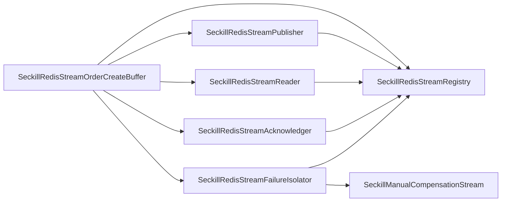

# 秒杀 Redis Stream 生命周期拆分

## 背景

`SeckillOrderCreateBuffer` 已经拆成本地队列、Redis Queue、Redis Stream 三种策略，但 `SeckillRedisStreamOrderCreateBuffer` 仍然同时承担 Stream 初始化、消息投递、pending 回收、未投递消息读取、ACK、失败重试、人工补偿隔离和指标采样。这个类如果继续增长，会让 Redis Stream 方案内部重新形成大基础设施类。

## 规格

- `SeckillRedisStreamOrderCreateBuffer` 只保留 Redis Stream 策略门面。
- Stream 分片初始化、consumer group 创建和 retry key 访问下沉到 `SeckillRedisStreamRegistry`。
- 消息投递下沉到 `SeckillRedisStreamPublisher`。
- pending 回收和未投递消息读取下沉到 `SeckillRedisStreamReader`。
- ACK 和 retry key 清理下沉到 `SeckillRedisStreamAcknowledger`。
- 失败重试计数、人工补偿隔离和死消息删除下沉到 `SeckillRedisStreamFailureIsolator`。
- 架构测试继续防止 Redis Stream 生命周期细节回流到 `SeckillRedisStreamOrderCreateBuffer`。

## 设计

## 验收

- `SeckillRedisStreamOrderCreateBuffer` 不再直接依赖 `RedissonClient`、`RStream`、`AutoClaimResult`、`StreamReadGroupArgs`、`StreamCreateGroupArgs`、`RedisException`、`StringCodec`、`ConcurrentHashMap`、`AtomicInteger`、`SeckillPendingRetryPolicy`。
- `SeckillRedisStreamOrderCreateBuffer` 不再包含 `claimPending`、`readNeverDelivered`、`ack` 内部分组、`removeDeadMessages`、`createGroupIfAbsent`、`nextShardCursor` 等生命周期细节。
- 秒杀 Redis Stream 投递、消费、ACK、pending 接管和人工补偿语义保持不变。
- 两个工程 JDK 1.8 编译通过，domain purity、架构测试、秒杀锁单单测和对账契约测试通过。
