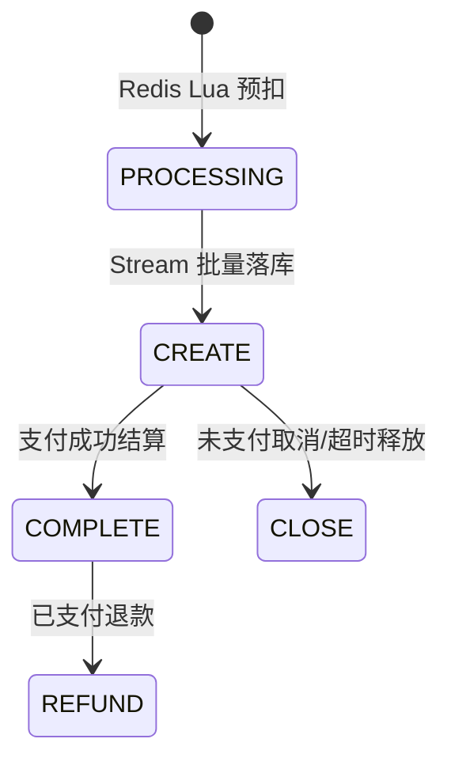

# 2026-05-30 秒杀支付结算与退款库存闭环

## 背景

秒杀链路已经具备 Redis Lua 资格预扣、Redis Stream 分片、异步批量落库、pending 补偿、超时未支付释放和库存流水。但已支付后的秒杀订单还存在两个缺口：

- 商城支付成功后，商城订单会变为 `PAY_SUCCESS`，但营销侧秒杀订单没有稳定推进到 `COMPLETE`。
- 用户对已支付秒杀订单发起退款后，营销侧缺少 `COMPLETE -> REFUND` 状态迁移、库存恢复和 `ROLLBACK_REFUND` 流水。

这会导致面试时被追问“秒杀支付后退款是否恢复库存”时只能说后续增强。本次改造把这个本机可解决的问题闭环。

## 设计

新增秒杀营销接口：

- `POST /api/v1/gbm/seckill/settlement_seckill_order`
  - 商城支付回调首次成功后调用。
  - 营销侧将秒杀订单从 `CREATE` 推进到 `COMPLETE`。
  - 重复调用时，如果订单已是 `COMPLETE`，按幂等成功返回。
- `POST /api/v1/gbm/seckill/refund_seckill_order`
  - 商城用户退单时按 `marketType=SECKILL` 调用。
  - `CREATE -> CLOSE`：未支付取消，恢复库存，写 `ROLLBACK_CANCEL`。
  - `COMPLETE -> REFUND`：已支付退款，恢复库存，写 `ROLLBACK_REFUND`。
  - `CLOSE/REFUND`：幂等成功返回，不重复恢复库存。

商城侧按营销类型路由：

- 拼团订单仍调用拼团结算和拼团退单接口。
- 秒杀订单支付成功后调用秒杀结算接口，并把商城订单推进到 `MARKET`。
- 秒杀订单退款时先调用秒杀退单接口恢复营销库存，再调用本地模拟/支付宝退款并关闭商城订单。
- 对账任务扫描 `market_type in (1, 2)` 的 `PAY_SUCCESS` 订单；秒杀订单补偿成功后同步推进商城状态。

## 状态迁移



## 数据与幂等

- 秒杀订单状态仍复用 `seckill_order.status`：
  - `0 CREATE`
  - `1 COMPLETE`
  - `2 CLOSE`
  - `3 REFUND`
- 库存流水新增语义：
  - `ROLLBACK_CANCEL`：用户未支付取消。
  - `ROLLBACK_REFUND`：用户已支付退款。
- `seckill_stock_flow.flow_no = activityId:userId:outTradeNo:changeType`，重复退款不会重复写流水。
- Redis 用户占位 Key 会在取消/退款后删除，Redis 库存桶会自增恢复。
- MySQL `seckill_activity.updateReleaseStock` 恢复 `available_count` 和 `lock_count`，后续 `SeckillStockSyncJob` 仍会用订单表状态做兜底同步。

## 验收

已执行：

```powershell
$env:JAVA_HOME='C:\Program Files\Eclipse Adoptium\jdk-8.0.492.9-hotspot'
$env:Path="$env:JAVA_HOME\bin;E:\java\qsyy-ecommerce-platform\.tools\apache-maven-3.8.8\bin;$env:Path"
cd E:\java\qsyy-ecommerce-platform\group-buy-market-master
mvn -q -DskipTests compile
cd E:\java\qsyy-ecommerce-platform\s-pay-mall-ddd-market-master
mvn -q -DskipTests compile
cd E:\java\qsyy-ecommerce-platform
powershell -NoProfile -ExecutionPolicy Bypass -File scripts\check-domain-purity.ps1
```

结果：

- 营销服务编译通过。
- 商城服务编译通过。
- domain 纯净化检查通过。
- 本机服务重启后健康检查通过：
  - `http://127.0.0.1:8091/actuator/health`
  - `http://127.0.0.1:8070/actuator/health`
- 直接调用营销秒杀链路验证通过：
  - `lock_seckill_order` 返回 `PROCESSING`。
  - `query_seckill_order_result` 返回 `SUCCESS`。
  - `settlement_seckill_order` 返回状态 `1`。
  - `refund_seckill_order` 返回状态 `3` 且 `stockReleased=true`。
- 商城完整链路验证通过：
  - 商城创建 `marketType=2` 秒杀支付单成功。
  - 模拟支付后营销侧记录 `CREATE -> COMPLETE`。
  - 商城退款后商城订单状态为 `CLOSE`，营销秒杀订单状态为 `REFUND`。
  - `seckill_stock_flow` 出现 `RESERVE` 和 `ROLLBACK_REFUND`。
  - `order_state_flow` 出现 `ASYNC_ORDER_CREATED`、`PAY_SUCCESS`、`REFUND_SUCCESS`。

## 边界

本次解决的是秒杀交易库存闭环，不等同于完整售后系统。生产售后还可能继续补：

- 已发货/已履约后的退款是否重新开放库存的策略配置。
- 部分退款、拒绝退款、退款审批。
- 正式三方退款回调和三方退款账单复核。
