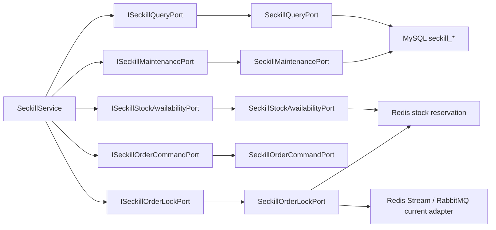

# 2026-05-30 秒杀通用仓储删除 SDD 记录

## 背景

前序治理已经先后拆出秒杀维护任务、库存流水、结果缓存、订单分片路由、Redis 库存预扣和订单命令端口。但在上一次拆分后，`ISeckillRepository` 仍然作为兼容门面存在，暴露活动查询、库存查询、订单查询、结果查询和锁单预扣，基础设施侧也仍保留 `SeckillRepository`。

这会留下一个长期腐化点：后续功能很容易继续塞回通用仓储，而不是按业务语义选择查询端口、库存端口、锁单端口或维护端口。本次继续完成秒杀侧端口收敛，删除通用仓储。

## 规格

- 删除 `ISeckillRepository`。
- 删除 `SeckillRepository`。
- 新增 `ISeckillQueryPort` / `SeckillQueryPort`，只负责活动查询、订单查询和秒杀结果查询。
- 新增 `ISeckillStockAvailabilityPort` / `SeckillStockAvailabilityPort`，只负责库存初始化、库存查询和本地售罄短缓存协调。
- 新增 `ISeckillOrderLockPort` / `SeckillOrderLockPort`，只负责锁单预扣、重复参与判断和下单消息投递。
- 新增 `SeckillMaintenancePort`，基础设施侧独立适配 `ISeckillMaintenancePort`。
- `SeckillService` 改为依赖明确端口，不再依赖通用仓储。
- `DomainPurityTest` 增加旧仓储删除守护和端口职责守护。

## 设计

## 代码变更

- 新增 `ISeckillQueryPort`、`ISeckillStockAvailabilityPort`、`ISeckillOrderLockPort`。
- 新增 `SeckillQueryPort`、`SeckillStockAvailabilityPort`、`SeckillOrderLockPort`、`SeckillMaintenancePort`。
- 删除 `ISeckillRepository`、`SeckillRepository`。
- `SeckillService` 构造器改为注入五个明确端口。
- 架构测试改为检查通用秒杀仓储必须保持删除，查询端口不能暴露库存/锁单/命令/维护操作，锁单和库存可用性适配器不能承载订单生命周期命令。

## 验收标准

- 主代码中不存在 `ISeckillRepository` / `SeckillRepository`。
- `ISeckillQueryPort` 只暴露查询方法。
- `ISeckillStockAvailabilityPort` 只暴露库存可用性查询。
- `ISeckillOrderLockPort` 只暴露锁单方法。
- JDK 1.8 编译通过。
- domain purity 脚本通过。
- 架构测试和状态机测试通过。

## 后续

秒杀通用仓储已删除。后续 DDD 治理重点转向：

- 后续 SDD 记录 `2026-05-30-seckill-order-message-port.md` 已新增 `ISeckillOrderMessagePort`，把 Redis Stream / RabbitMQ / Redis Queue / 本地队列投递选择从锁单适配器中解耦。
- 领域用例测试：秒杀库存不足、重复参与、异步落库失败、pending 重放、支付结算、退款恢复库存。
- 更完整的 MQ 演进方案：明确 Redis Stream 在本机项目中的边界，以及 RocketMQ/Kafka 的生产迁移方案。
