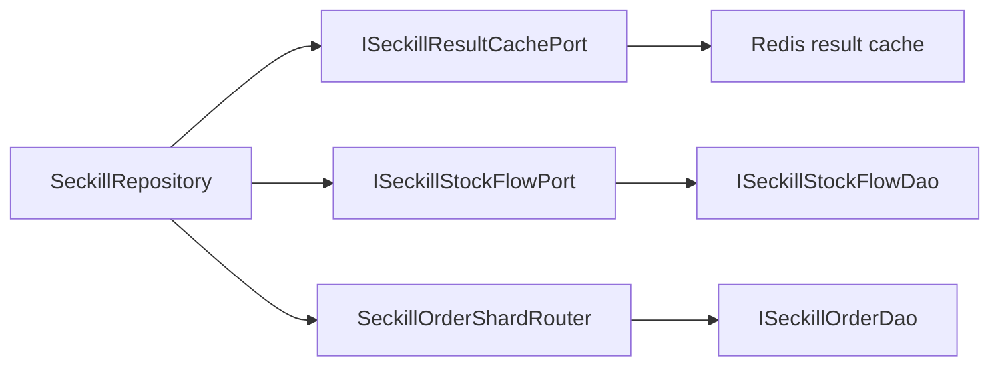

# 2026-05-30 秒杀仓储拆分 SDD 记录

## 背景

`SeckillRepository` 在前序高并发改造后承担了过多职责：秒杀主链路落库、库存流水构建、结果缓存读写、订单表分片路由、维护任务和退款库存恢复都集中在一个类里。虽然领域层已经不直接依赖 Spring、Redis、MyBatis，但基础设施适配器继续膨胀会导致后续代码变成流程脚本堆叠，不利于 DDD 边界治理。

## 规格

本次只拆基础设施职责，不改变秒杀业务语义。

- 秒杀库存流水要用领域对象表达，再由基础设施端口转换为 MyBatis PO。
- 秒杀结果缓存要封装到独立端口，主仓储不再直接拼接 `seckill:result` key，也不直接对结果缓存做 `get/set/remove`。
- 秒杀订单分片表路由要抽成独立组件，主仓储不再持有分片数、表名前缀和分片表名拼接逻辑。
- 编译和架构测试必须证明 domain 仍然纯净，且拆出去的技术细节不会回流到 `SeckillRepository`。

## 设计

### 端口拆分

- `ISeckillStockFlowPort`
  - `record(...)`
  - `recordBatch(...)`
  - 基础设施实现 `SeckillStockFlowPort` 负责把 `SeckillStockFlowEntity` 转成 `SeckillStockFlow` PO。

- `ISeckillResultCachePort`
  - `query(...)`
  - `cache(...)`
  - `remove(...)`
  - `resultKey(...)`
  - 当前 `resultKey(...)` 仍用于 Redis Lua 原子预扣，下一步拆 `ISeckillStockReservationPort` 后可以继续收敛。

- `SeckillOrderShardRouter`
  - `useSharding()`
  - `shardCount()`
  - `tableName(userId, outTradeNo)`
  - `tableName(shardIndex)`
  - `groupByTable(...)`

## 验收标准

- `SeckillRepository` 不再直接依赖 `ISeckillStockFlowDao`。
- `SeckillRepository` 不再直接构建 `SeckillStockFlow` PO。
- `SeckillRepository` 不再维护 `SECKILL_RESULT_KEY`。
- `SeckillRepository` 不再维护 `orderShardCount`、`orderTablePrefix` 和 `orderTableName(...)`。
- `DomainPurityTest` 增加回流守护。
- JDK 1.8 下营销服务编译通过。
- 两个服务均能 JDK 1.8 编译通过。

## 后续

本次还没有拆秒杀 Redis 库存桶、Lua 预扣和用户占位逻辑。下一步继续拆 `ISeckillStockReservationPort`，把 `stockBucketKey`、`userLockKey`、`reserveSeckillQualification(...)`、`rollbackReservation(...)` 继续移出主仓储。
