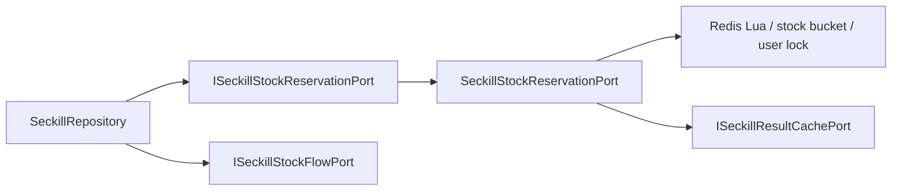

# 2026-05-30 秒杀库存预扣端口拆分 SDD 记录

## 背景

前一次已经把秒杀库存流水、结果缓存和订单分片路由从 `SeckillRepository` 拆出，但 `SeckillRepository` 仍然直接处理 Redis 库存桶、用户占位 Key、Lua 预扣、库存初始化锁、库存释放和回滚恢复。这会让仓储适配器继续承载热点并发细节，后续一旦替换 Redis 方案、调整桶路由或接入专业 MQ，就容易牵动主仓储。

## 规格

本次只拆 Redis 库存预扣技术细节，不改变秒杀业务语义。

- `SeckillRepository` 不再直接依赖 `IRedisService`。
- `SeckillRepository` 不再拼接 `seckill:stock:*`、`seckill:user:lock:*`、`seckill:stock:init:*`。
- Redis Lua 资格预扣、库存桶选择、用户占位、库存初始化锁、库存释放、预扣回滚都放入独立端口。
- 仓储只关心业务结果：抢资格成功、重复参与、库存不足、释放库存后的库存前后值。
- 库存流水仍由 `ISeckillStockFlowPort` 记录，避免库存端口同时负责审计落库。

## 设计

### 新增端口

- `ISeckillStockReservationPort`
  - `isStockInitialized(...)`
  - `tryAcquireInitializationLock(...)`
  - `releaseInitializationLock(...)`
  - `initializeStock(...)`
  - `queryStock(...)`
  - `reserve(...)`
  - `rollback(...)`
  - `release(...)`

### 新增领域结果对象

- `SeckillStockReservationEntity`
  - `SUCCESS`
  - `DUPLICATE`
  - `STOCK_NOT_ENOUGH`

### 基础设施实现

- `SeckillStockReservationPort`
  - 负责 Redis Key 拼接。
  - 负责库存桶 CRC32 路由。
  - 负责 `reserveSeckillQualification(...)` Lua 调用。
  - 负责库存初始化锁。
  - 负责回滚和释放用户占位。

## 验收标准

- `SeckillRepository` 不出现 `IRedisService`、`redisService`、`SECKILL_STOCK_KEY`、`SECKILL_USER_LOCK_KEY`、`reserveSeckillQualification`、`stockBucketKey`、`userLockKey`、`bucketOf`。
- `DomainPurityTest` 增加回流守护，防止 Redis 库存细节重新进入 `SeckillRepository`。
- JDK 1.8 编译通过。
- domain purity 脚本通过。
- 架构测试和状态机测试通过。

## 后续

秒杀主仓储已经拆出维护任务、库存流水、结果缓存、订单分片路由和 Redis 库存预扣。后续 DDD 治理重点转向：

- `TradeRepository` 的拼团结算/退单职责拆分。
- `SeckillRepository` 的秒杀订单创建、支付结算、退款状态更新继续按业务语义拆小。
- 为拼团锁单、秒杀库存、退款策略补更多纯单元测试和契约测试。
