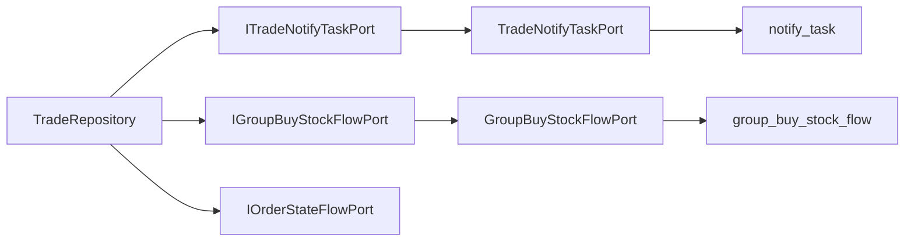

# 2026-05-30 TradeRepository 职责拆分 SDD 记录

## 背景

`TradeRepository` 已经承载拼团锁单、结算、退单、通知任务、库存流水和状态流水。状态流水已经通过 `IOrderStateFlowPort` 移出仓储，但通知任务构建和库存流水构建仍直接散落在仓储方法内，导致 Repository 偏厚。后续检查又发现 `TradeTaskService` 只是执行通知任务，却依赖整个 `ITradeRepository`，这会让任务编排看到锁单、结算、退款等无关能力。

本次目标不是增加新的中间件，而是在现有 DDD 架构下把职责边界拆清楚。拼团成团和退单通知继续使用 RabbitMQ，本地 `notify_task` 表作为 Outbox 和补偿台账；拼团库存流水继续落 MySQL，作为审计和异常恢复依据。

## 规格

- `TradeRepository` 不再直接依赖 `INotifyTaskDao`、`IGroupBuyStockFlowDao`、`NotifyTask`、`GroupBuyStockFlow`。
- 通知任务由 `ITradeNotifyTaskPort` 表达，基础设施适配器负责构建 `notify_task` PO 并落库。
- `TradeTaskService` 直接依赖 `ITradeNotifyTaskPort` 查询和更新通知任务状态，不再依赖 `ITradeRepository`。
- `ITradeRepository` 不再暴露通知任务查询和状态更新方法，只保留交易主链路需要的锁单、结算、退款和库存占位方法。
- 拼团库存流水由 `IGroupBuyStockFlowPort` 表达，领域实体 `GroupBuyStockFlowEntity` 负责承载业务语义。
- 结算和退单方法只保留交易状态更新、状态机流水调用、通知任务端口调用、库存审计端口调用。
- 不改变现有接口、表结构、MQ 路由和业务行为。

## 设计

端口职责：

- `ITradeNotifyTaskPort`
  - 创建成团结算通知任务。
  - 创建三类退单通知任务。
  - 查询和更新通知任务状态。

- `IGroupBuyStockFlowPort`
  - 记录锁单预占流水。
  - 记录未支付退单释放流水。
  - 记录已支付未成团退单释放流水。
  - 记录已支付已成团退单流水。

## 验收

- `TradeRepository` 中不能再出现 `NotifyTask` PO 和 `GroupBuyStockFlow` PO。
- `DomainPurityTest.tradeRepositoryShouldNotExposeNotifyTaskExecutionMethods` 能防止通知任务扫描和状态更新方法回流到 `ITradeRepository`。
- domain 不依赖 infrastructure。
- `scripts/check-domain-purity.ps1` 通过。
- `mvn -q -DskipTests compile` 通过。
- 本地 8091/8092/8093 可以重新启动，Nginx 8080 健康检查通过。

## 实现结果

- 新增 `GroupBuyStockFlowEntity`，用领域语义表达拼团锁单预占、未支付退单释放、已支付未成团退单释放、已支付已成团退单流水。
- 新增 `IGroupBuyStockFlowPort`，由 `GroupBuyStockFlowPort` 适配 `group_buy_stock_flow` 表。
- 新增 `ITradeNotifyTaskPort`，由 `TradeNotifyTaskPort` 适配 `notify_task` 本地消息表。
- `TradeRepository` 不再直接依赖 `INotifyTaskDao`、`IGroupBuyStockFlowDao`、`NotifyTask`、`GroupBuyStockFlow`。
- 通知任务查询和状态更新不再挂在 `ITradeRepository` 上，`TradeTaskService` 直接通过 `ITradeNotifyTaskPort` 完成任务扫描和状态推进。
- `DomainPurityTest` 增加回归用例，防止通知任务执行方法重新回流到 `ITradeRepository`。

## 当前验证

- `scripts/check-domain-purity.ps1`：通过。
- `E:\java\group_buy_market\.tools\apache-maven-3.8.8\bin\mvn.cmd -q -DskipTests compile`：通过。
- `E:\java\group_buy_market\.tools\apache-maven-3.8.8\bin\mvn.cmd -q -DskipTests package`：通过。
- 8091、8092、8093 三个实例重新启动成功。
- Nginx 8080 `/actuator/health` 返回 `UP`。
- 拼团烟测：通过 8080 完成 3 人开团、参团、结算，`group_buy_stock_flow` 写入 3 条，`notify_task` 写入 1 条 `trade_settlement`，`order_state_flow` 写入状态迁移记录。
