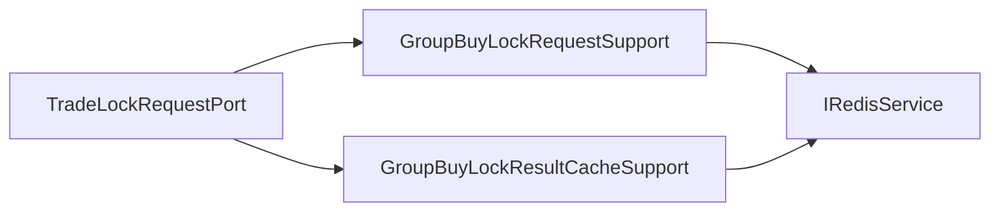

# 拼团锁单请求端口内部支撑拆分

## 背景

`ITradeLockRequestPort` 是拼团锁单幂等端口，包含请求占位锁和锁单结果缓存两个能力。它们都服务于同一个“锁单请求幂等”语义，因此不拆领域端口。但基础设施实现 `TradeLockRequestPort` 同时维护 Redis Key、TTL、JSON 序列化、请求锁、结果缓存、缓存移除和异常降级，后续容易变成 Redis 技术细节聚合类。

## 规格

- 保持 `ITradeLockRequestPort` 不变。
- `TradeLockRequestPort` 保留领域端口门面和 5 个接口方法委托。
- 拆出两个基础设施支撑组件：
  - `GroupBuyLockRequestSupport`：负责请求锁 Key、请求锁 TTL、获取和释放请求锁。
  - `GroupBuyLockResultCacheSupport`：负责锁单结果缓存 Key、结果缓存 TTL、JSON 序列化/反序列化和缓存移除。
- 不把 Redis Key 规则暴露到 domain。
- 增加架构测试，防止 Redis API、JSON、Key 前缀和 TTL 计算细节回流到 `TradeLockRequestPort`。
- 增加纯单元测试覆盖请求锁、结果缓存查询、结果缓存写入和释放。

## 设计



## 验收

- `TradeLockRequestPort` 不再直接依赖 `IRedisService`、`Constants`、`JSON`、`StringUtils`、`TimeUnit`。
- `TradeLockRequestPort` 不再直接出现 `LOCKING_KEY_PREFIX`、`LOCK_RESULT_KEY_PREFIX`、`setNx`、`setValue`、`getValue`、`remove`、`toJSONString`、`parseObject`。
- JDK 1.8 下营销 app 编译通过。
- `DomainPurityTest` 通过。
- `TradeLockRequestPortUnitTest` 通过。

## 实现记录

- 新增 `GroupBuyLockRequestSupport`，负责请求锁 Key、请求锁 TTL、获取和释放请求锁。
- 新增 `GroupBuyLockResultCacheSupport`，负责锁单结果缓存 Key、结果缓存 TTL、JSON 序列化/反序列化和缓存移除。
- `TradeLockRequestPort` 保留 `ITradeLockRequestPort` 门面，实现只做 5 个接口方法委托。
- 新增 `TradeLockRequestPortUnitTest`，覆盖请求锁 TTL、结果缓存 round-trip、请求锁释放、结果缓存移除和空参数跳过。
- `DomainPurityTest` 增加 `tradeLockRequestPortShouldDelegateRedisKeyAndJsonDetails`，防止 Redis Key、TTL 和 JSON 细节回流。

## 验证结果

```powershell
cd E:\java\group_buy_market\group-buy-market-master
$env:JAVA_HOME='C:\Program Files\Eclipse Adoptium\jdk-8.0.492.9-hotspot'
$env:Path="$env:JAVA_HOME\bin;E:\java\group_buy_market\.tools\apache-maven-3.8.8\bin;$env:Path"
..\.tools\apache-maven-3.8.8\bin\mvn.cmd -q -pl group-buy-market-app -am -DskipTests compile
..\.tools\apache-maven-3.8.8\bin\mvn.cmd -q -pl group-buy-market-app -am -DskipTests=false -DfailIfNoTests=false "-Dtest=DomainPurityTest,cn.bugstack.test.infrastructure.trade.TradeLockRequestPortUnitTest" test
```

- 编译：通过。
- `DomainPurityTest`：39 个测试通过。
- `TradeLockRequestPortUnitTest`：4 个测试通过。

## 面试表述

拼团锁单幂等没有拆领域端口，因为请求锁和锁单结果缓存都属于同一个锁单请求生命周期。但基础设施里我把请求锁和结果缓存拆成两个支撑组件，端口门面只负责委托。这样 Redis Key、TTL、JSON 和异常降级都被限制在基础设施内部，领域层只看到稳定的幂等端口。
