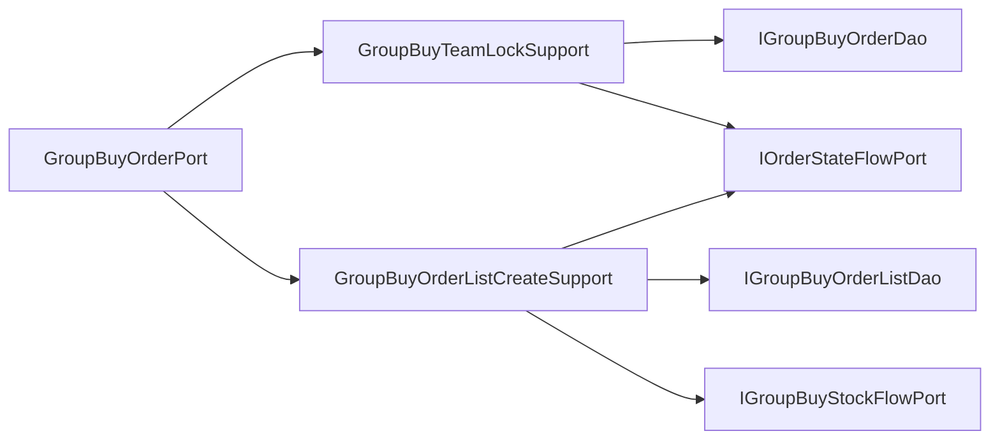

# 拼团锁单端口内部支撑拆分

## 背景

`IGroupBuyOrderPort` 的语义是清晰的：执行拼团锁单聚合落库，返回营销支付单。但基础设施实现 `GroupBuyOrderPort` 同时承担了：

- 开新团或参与已有队伍，维护 `group_buy_order.lock_count`。
- 构建并插入 `group_buy_order_list` 订单明细。
- 记录队伍打开、订单锁定、锁单库存流水。
- 生成 `teamId`、`orderId`、订单有效期、`bizId` 和返回支付单。

这些能力都在同一个事务内是合理的，但如果继续把队伍写入、订单明细写入、状态流水和库存流水都堆在端口实现里，后续增加团长权益、阶梯拼团、优惠券占用时，`GroupBuyOrderPort` 会变成新的交易写入大类。

## 规格

- 保持 `IGroupBuyOrderPort` 不变，不新增领域端口。
- `GroupBuyOrderPort` 继续作为事务门面，保留 `@Transactional`。
- 拆出两个基础设施支撑组件：
  - `GroupBuyTeamLockSupport`：负责新开团队伍创建、老队伍锁定人数递增、队伍打开状态流水。
  - `GroupBuyOrderListCreateSupport`：负责订单明细构建、插入、唯一索引异常转换、订单锁定状态流水和锁单库存流水。
- `GroupBuyOrderPort` 只负责从聚合中取值、调用支撑组件、组装 `MarketPayOrderEntity`。
- 增加架构守护测试，防止 DAO、PO builder、状态流水、库存流水和 ID/时间构造细节回流到 `GroupBuyOrderPort`。

## 设计



## 验收

- `GroupBuyOrderPort` 不再直接依赖 `IGroupBuyOrderDao`、`IGroupBuyOrderListDao`、`IOrderStateFlowPort`、`IGroupBuyStockFlowPort`。
- `GroupBuyOrderPort` 不再直接出现 `GroupBuyOrder.builder`、`GroupBuyOrderList.builder`、`RandomStringUtils`、`Calendar`、`DuplicateKeyException`、`GroupBuyStockFlowEntity.orderLocked`、`OrderStateTransitionEntity.groupBuyTeamOpened`、`OrderStateTransitionEntity.groupBuyOrderLocked`。
- JDK 1.8 下营销 app 编译通过。
- `DomainPurityTest` 通过。

## 实现记录

- 新增 `GroupBuyTeamLockSupport`，承接新开团队伍创建、老队伍锁定人数递增和队伍打开状态流水。
- 新增 `GroupBuyOrderListCreateSupport`，承接订单明细构建、唯一索引异常转换、订单锁定状态流水和锁单库存流水。
- `GroupBuyOrderPort` 保留 `@Transactional` 事务门面，只负责从聚合取值、调用支撑组件和组装 `MarketPayOrderEntity`。
- `DomainPurityTest` 新增 `groupBuyOrderPortAdapterShouldStayTransactionalFacade`，防止 DAO、PO builder、状态流水和库存流水细节回流。

## 验证结果

```powershell
$env:JAVA_HOME='C:\Program Files\Eclipse Adoptium\jdk-8.0.492.9-hotspot'
..\.tools\apache-maven-3.8.8\bin\mvn.cmd -q -pl group-buy-market-app -am -DskipTests compile
```

结果：通过。

```powershell
..\.tools\apache-maven-3.8.8\bin\mvn.cmd -q -pl group-buy-market-app -am -DskipTests=false -DfailIfNoTests=false "-Dtest=DomainPurityTest" test
```

结果：`DomainPurityTest` 31 个测试通过。

## 面试表述

拼团锁单是一个聚合行为，不是简单插入订单。所以领域端口仍然保持 `IGroupBuyOrderPort.lockMarketPayOrder`，事务门面不拆散；我只把基础设施内部的队伍锁定和订单明细写入拆成支撑组件，既保留事务一致性，也防止锁单端口继续膨胀。
