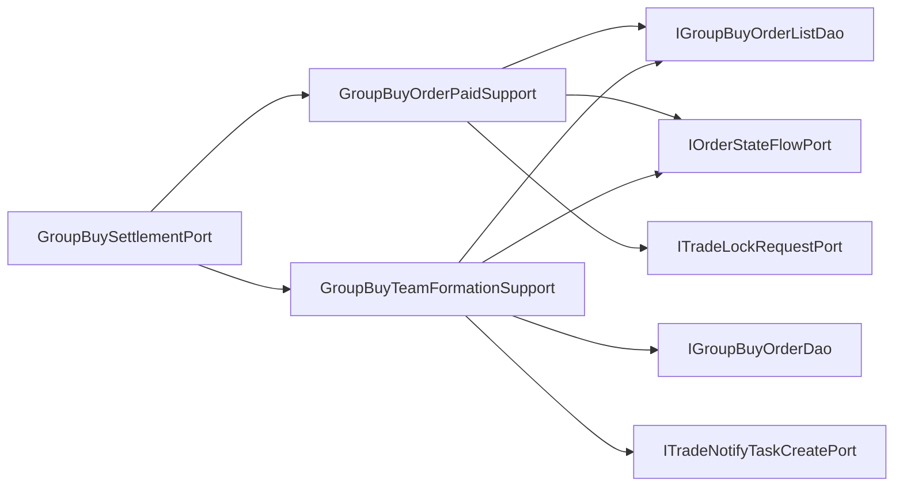

# 拼团结算端口内部支撑拆分

## 背景

`IGroupBuySettlementPort` 的领域语义是“支付成功后结算拼团队伍”，接口保持稳定。但基础设施实现 `GroupBuySettlementPort` 同时处理用户订单明细支付完成、锁单结果清理、队伍完成数量累加、成团状态更新、成团通知任务创建和状态流水记录，职责已经开始向结算大类聚集。

## 规格

- 保持 `IGroupBuySettlementPort` 不变。
- `GroupBuySettlementPort` 保留 `@Transactional` 事务门面和聚合对象解包。
- 拆出两个基础设施支撑组件：
  - `GroupBuyOrderPaidSupport`：负责用户订单明细 `LOCK -> COMPLETE`、状态流水和锁单结果清理。
  - `GroupBuyTeamFormationSupport`：负责队伍完成数量累加、条件成团、成团状态流水和通知任务创建。
- 不新增新的领域端口，避免过度拆分。
- 增加架构测试，防止 DAO、状态流水、锁单结果清理和通知任务创建细节回流到 `GroupBuySettlementPort`。

## 设计



## 验收

- `GroupBuySettlementPort` 不再直接依赖 `IGroupBuyOrderDao`、`IGroupBuyOrderListDao`、`IOrderStateFlowPort`、`ITradeNotifyTaskCreatePort`、`ITradeLockRequestPort`。
- `GroupBuySettlementPort` 不再直接出现 `GroupBuyOrderList`、`OrderStateTransitionEntity`、`MDC`、`updateOrderStatus2COMPLETE`、`updateAddCompleteCount`、`queryGroupBuyCompleteOrderOutTradeNoListByTeamId`、`removeLockResult`。
- JDK 1.8 下营销 app 编译通过。
- `DomainPurityTest` 通过。

## 实现记录

- 新增 `GroupBuyOrderPaidSupport`，负责订单明细支付完成、状态流水和锁单结果清理。
- 新增 `GroupBuyTeamFormationSupport`，负责队伍完成数量累加、条件成团、成团状态流水和通知任务创建。
- `GroupBuySettlementPort` 保留事务边界，只从结算聚合中解包用户、队伍和支付成功信息，并按顺序委托两个支撑组件。
- `DomainPurityTest` 增加 `groupBuySettlementPortShouldDelegateOrderAndTeamDetails`，防止 DAO、状态流水、通知任务和锁单结果清理细节回流。

## 验证结果

```powershell
cd E:\java\group_buy_market\group-buy-market-master
$env:JAVA_HOME='C:\Program Files\Eclipse Adoptium\jdk-8.0.492.9-hotspot'
$env:Path="$env:JAVA_HOME\bin;E:\java\group_buy_market\.tools\apache-maven-3.8.8\bin;$env:Path"
..\.tools\apache-maven-3.8.8\bin\mvn.cmd -q -pl group-buy-market-app -am -DskipTests compile
..\.tools\apache-maven-3.8.8\bin\mvn.cmd -q -pl group-buy-market-app -am -DskipTests=false -DfailIfNoTests=false "-Dtest=DomainPurityTest" test
..\.tools\apache-maven-3.8.8\bin\mvn.cmd -q -pl group-buy-market-app -am -DskipTests=false -DfailIfNoTests=false "-Dtest=cn.bugstack.test.domain.trade.TradeLockOrderServiceUnitTest,cn.bugstack.test.domain.trade.TradeRefundOrderServiceUnitTest" test
```

- 编译：通过。
- `DomainPurityTest`：34 个测试通过。
- 拼团锁单/退单纯单元测试：16 个测试通过。

## 面试表述

拼团结算端口没有继续拆领域接口，因为支付成功结算仍然是一个聚合行为；但基础设施里把“用户订单完成”和“队伍成团通知”拆成两个支撑组件。这样订单明细、队伍进度、通知任务三类表更新可以清晰隔离，事务边界仍由端口门面统一控制。
