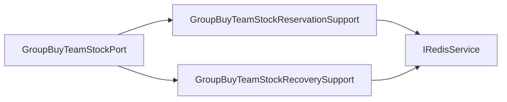

# 拼团队伍库存端口内部支撑拆分

## 背景

`IGroupBuyTeamStockPort` 是拼团队伍名额 Redis 适配端口，承担队伍名额预扣、用户占位释放和退单恢复。接口保持一个库存语义端口是合理的，不需要拆领域端口。但基础设施实现 `GroupBuyTeamStockPort` 同时维护 Redis Lua 预扣、用户占位释放、普通恢复、退单恢复幂等锁和异常回滚，后续容易把库存预扣和逆向补偿细节混在一起。

## 规格

- 保持 `IGroupBuyTeamStockPort` 不变。
- `GroupBuyTeamStockPort` 保留领域端口门面和 4 个接口方法委托。
- 拆出两个基础设施支撑组件：
  - `GroupBuyTeamStockReservationSupport`：负责队伍名额预扣和用户占位释放。
  - `GroupBuyTeamStockRecoverySupport`：负责库存恢复、退单恢复幂等锁和失败时释放幂等锁。
- Redis Key 前缀、Lua 预扣 API、幂等锁 TTL 不暴露到 domain。
- 增加架构测试，防止 Redis API、`refund_lock`、`TimeUnit` 和字符串判空细节回流到 `GroupBuyTeamStockPort`。
- 增加纯单元测试覆盖预扣、普通恢复、用户占位释放、退单恢复幂等。

## 设计



## 验收

- `GroupBuyTeamStockPort` 不再直接依赖 `IRedisService`、`Constants`、`StringUtils`、`TimeUnit`。
- `GroupBuyTeamStockPort` 不再直接出现 `reserveTeamStock`、`setNx`、`incr`、`remove`、`refund_lock_`。
- JDK 1.8 下营销 app 编译通过。
- `DomainPurityTest` 通过。
- `GroupBuyTeamStockPortUnitTest` 通过。

## 实现记录

- 新增 `GroupBuyTeamStockReservationSupport`，负责队伍名额 Redis Lua 预扣和用户占位释放。
- 新增 `GroupBuyTeamStockRecoverySupport`，负责普通库存恢复、退单恢复幂等锁和恢复失败时释放锁。
- `GroupBuyTeamStockPort` 保留 `IGroupBuyTeamStockPort` 门面，实现只做 4 个接口方法委托。
- 新增 `GroupBuyTeamStockPortUnitTest`，覆盖队伍名额预扣、普通恢复、用户占位释放、退单恢复幂等和重复退单跳过。
- `DomainPurityTest` 增加 `groupBuyTeamStockPortShouldDelegateReservationAndRecoveryDetails`，防止 Redis 预扣、恢复幂等锁和 TTL 细节回流。

## 验证结果

```powershell
cd E:\java\qsyy-ecommerce-platform\group-buy-market-master
$env:JAVA_HOME='C:\Program Files\Eclipse Adoptium\jdk-8.0.492.9-hotspot'
$env:Path="$env:JAVA_HOME\bin;E:\java\qsyy-ecommerce-platform\.tools\apache-maven-3.8.8\bin;$env:Path"
..\.tools\apache-maven-3.8.8\bin\mvn.cmd -q -pl group-buy-market-app -am -DskipTests compile
..\.tools\apache-maven-3.8.8\bin\mvn.cmd -q -pl group-buy-market-app -am -DskipTests=false -DfailIfNoTests=false "-Dtest=DomainPurityTest,cn.bugstack.test.infrastructure.trade.TradeLockRequestPortUnitTest,cn.bugstack.test.infrastructure.trade.GroupBuyTeamStockPortUnitTest" test
```

- 编译：通过。
- `DomainPurityTest`：40 个测试通过。
- `TradeLockRequestPortUnitTest`：4 个测试通过。
- `GroupBuyTeamStockPortUnitTest`：5 个测试通过。

## 面试表述

拼团队伍库存端口没有拆领域接口，因为预扣、释放和退单恢复都属于队伍库存能力。但基础设施里我把预扣路径和恢复路径拆开：预扣组件负责 Lua 占位和用户占位释放，恢复组件负责退单恢复和幂等锁。这样正向锁单和逆向补偿边界更清楚，也不会把 Redis 技术细节暴露给领域层。
