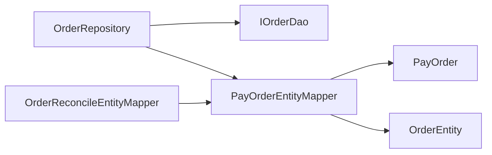

# 商城订单仓储映射支撑拆分

## 背景

商城 `OrderRepository` 已经从对账、支付流水、退款流水和支付成功消息中解耦，职责回到订单主链路持久化。但继续审计发现它内部仍重复承担 PO/Entity 映射：

- `CreateOrderAggregate -> PayOrder`。
- `ShopCartEntity -> PayOrder` 查询请求。
- `PayOrderEntity -> PayOrder` 支付信息更新请求。
- `PayOrder -> OrderEntity` 在未支付查询、订单详情、用户订单列表、用户订单校验中重复出现。

这些映射属于基础设施适配细节，不应该长期堆在仓储类中。`OrderReconcileEntityMapper` 也有一份 `PayOrder -> OrderEntity` 映射，后续字段扩展容易出现两边不一致。

## 规格

- 保持 `IOrderRepository` 不变。
- `OrderRepository` 继续只负责调用 `IOrderDao` 完成订单持久化。
- 新增 `PayOrderEntityMapper`：
  - 负责 `CreateOrderAggregate`、`ShopCartEntity`、`PayOrderEntity` 到 `PayOrder` 的请求映射。
  - 负责 `PayOrder` 到 `OrderEntity` 的领域实体映射。
  - 负责 `List<PayOrder>` 到 `List<OrderEntity>` 的列表映射。
- `OrderReconcileEntityMapper` 复用 `PayOrderEntityMapper.toOrderEntity`，避免对账仓储和订单仓储各维护一份订单字段映射。
- 增加架构测试，防止 `OrderRepository` 重新出现 `OrderEntity.builder`、`PayOrder.builder`、`new PayOrder` 等映射细节。

## 设计



## 验收

- `OrderRepository` 不再直接构建 `OrderEntity` 或 `PayOrder`。
- `OrderRepository` 不再直接依赖 `ProductEntity`、`MarketTypeVO`、`OrderStatusVO`、`BigDecimal`、`Collectors`。
- `OrderReconcileEntityMapper` 复用 `PayOrderEntityMapper` 处理订单实体映射。
- JDK 1.8 下商城 app 编译通过。
- `DomainPurityTest` 通过。

## 实现记录

- 新增 `PayOrderEntityMapper`，集中处理 `CreateOrderAggregate`、`ShopCartEntity`、`PayOrderEntity` 与 `PayOrder` 的转换，以及 `PayOrder -> OrderEntity` 映射。
- `OrderRepository` 改为只调用 `IOrderDao` 和 mapper，不再直接维护订单字段映射。
- `OrderReconcileEntityMapper` 复用 `PayOrderEntityMapper.toOrderEntity`，避免对账侧重复维护订单字段映射。
- `DomainPurityTest.mallOrderRepositoryShouldNotOwnReconcileOrFlowDetails` 增强仓储边界守护，禁止 `OrderRepository` 回流 PO/Entity builder、订单状态枚举映射和列表 stream 映射细节。

## 验证结果

```powershell
$env:JAVA_HOME='C:\Program Files\Eclipse Adoptium\jdk-8.0.492.9-hotspot'
..\.tools\apache-maven-3.8.8\bin\mvn.cmd -q -pl s-pay-mall-ddd-app -am -DskipTests compile
```

结果：通过。

```powershell
..\.tools\apache-maven-3.8.8\bin\mvn.cmd -q -pl group-buy-market-app -am -DskipTests=false -DfailIfNoTests=false "-Dtest=DomainPurityTest" test
```

结果：`DomainPurityTest` 31 个测试通过。

补充说明：本轮尝试执行 `OrderServiceTest`，普通下单用例通过，拼团下单用例因本地 MySQL 数据中测试用户已达到拼团参与上限而失败，属于环境数据状态限制，未作为本轮通过门禁。

## 面试表述

订单仓储我没有再拆成多个仓储端口，因为当前 `IOrderRepository` 仍然是订单主链路持久化语义。但我把 PO 和领域实体的映射抽成 mapper，仓储只负责 DAO 调用和状态更新。这样字段扩展、对账复用和订单列表查询不会在多个地方重复维护映射逻辑。
