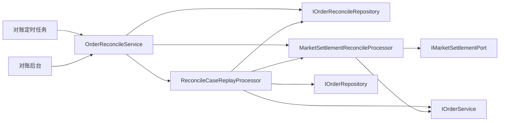

# 商城对账重放处理器拆分

## 背景

商城对账域已经拆出差错单、操作日志、账单导入和 HTTP 后台支撑，但 `OrderReconcileService` 仍然同时承担两类职责：

- 对账门面：扫描差错、查询差错、确认、忽略、关闭、备注和操作日志。
- 自动重放：营销结算补偿、超时待支付关单、退款重放、MQ 失败消息重放。

这些重放动作会触达订单仓储、营销结算端口、订单退款用例和 MQ 失败重投仓储，如果继续堆在对账服务门面中，后续新增差错类型时会把服务类变成新的编排大类。

## 规格

- `IOrderReconcileService` 对外契约不变，触发层、定时任务和前端不需要修改。
- `OrderReconcileService` 只保留对账查询、人工处理和操作日志门面职责。
- 差错单自动重放拆到 `ReconcileCaseReplayProcessor`。
- 营销结算补偿拆到 `MarketSettlementReconcileProcessor`，用于定时补偿和差错单重放复用。
- domain 层继续不依赖 Spring 注解，由 app 层 `DomainServiceConfig` 装配。

## 设计

### 职责边界

- `OrderReconcileService`：对账服务门面，只做差错单生命周期和查询入口。
- `ReconcileCaseReplayProcessor`：根据差错单类型选择重放策略，并负责 OPEN 状态校验、成功确认、失败备注。
- `MarketSettlementReconcileProcessor`：封装拼团/秒杀营销结算差异，秒杀结算成功后同步标记商城营销结算完成。

## 验收

- `OrderReconcileService` 不再依赖 `IOrderRepository`、`IMarketSettlementPort`、`IOrderService`。
- `OrderReconcileService` 不再包含 `MARKET_SETTLEMENT_TIMEOUT`、`PAY_WAIT_TIMEOUT`、`REFUND_TIMEOUT`、`MQ_CONSUME_FAIL` 四类重放分支。
- 对账重放契约测试继续覆盖拼团/秒杀营销结算重放、超时关单、退款重放、MQ 重放、非 OPEN 跳过和失败备注。
- `DomainPurityTest` 增加架构守护，防止重放分支回流到对账服务门面。

## 面试表达

可以说明：对账中心不是简单 CRUD，差错单重放属于补偿用例。项目中把“对账管理门面”和“补偿重放编排”拆开，既保留统一后台入口，又避免差错类型扩展时污染对账服务；营销结算重放再单独复用一个处理器，避免定时补偿和人工重放各写一份拼团/秒杀判断逻辑。
