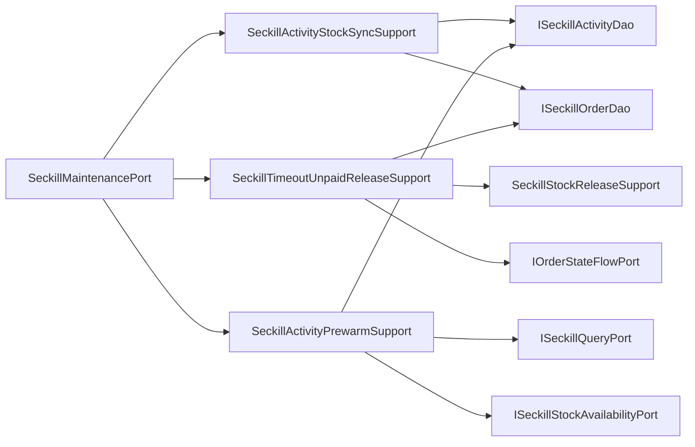

# 秒杀维护端口内部支撑拆分

## 背景

`SeckillMaintenancePort` 已经把秒杀维护任务从通用 `SeckillRepository` 中拆出，但它自身继续同时承担三类维护场景：

- 活动库存同步：按订单活跃数回写活动库存。
- 超时未支付释放：关闭超时订单、释放 Redis 资格、记录库存流水、记录状态流水、清理售罄缓存。
- 活动预热：扫描即将开始的活动并触发库存初始化。

这些能力都属于基础设施适配层，不需要再新增领域端口；但如果继续把 DAO、分片表循环、库存释放、状态流水和预热策略放在一个类里，后续增加死信补偿、按活动分片任务、灰度预热时会让维护端口变成新的大类。

## 规格

- 保持 `ISeckillMaintenancePort` 对外接口不变。
- `SeckillMaintenancePort` 只保留门面委托：
  - `syncSeckillActivityStock`
  - `releaseTimeoutUnpaidOrders`
  - `prewarmUpcomingActivities`
- 拆出三个基础设施支撑组件：
  - `SeckillActivityStockSyncSupport`：封装活动库存同步和分片表活跃订单统计。
  - `SeckillTimeoutUnpaidReleaseSupport`：封装超时未支付扫描、条件关闭、库存释放、状态流水。
  - `SeckillActivityPrewarmSupport`：封装预热参数收敛、活动查询和库存初始化触发。
- 复用已有 `SeckillStockReleaseSupport` 和 `SeckillOrderAssembler`，不复制 PO/Entity 映射和库存流水构建。
- 不新增新的 domain port，避免过度拆分。
- 增加架构守护测试，防止 DAO、分片循环、库存流水、状态流水细节回流到 `SeckillMaintenancePort`。

## 设计



## 验收

- `SeckillMaintenancePort` 不再直接依赖 `ISeckillActivityDao`、`ISeckillOrderDao`、`IOrderStateFlowPort`、`ISeckillStockFlowPort`、`ISeckillStockReservationPort`、`ISeckillQueryPort`、`ISeckillStockAvailabilityPort`、`SeckillOrderShardRouter`、`SeckillSoldOutCache`。
- `SeckillMaintenancePort` 不再直接出现 `countActiveOrdersFromTable`、`queryTimeoutUnpaidOrdersFromTable`、`closeTimeoutUnpaidOrder`、`SeckillStockFlowEntity.rollback`、`OrderStateTransitionEntity.seckillTimeoutClosed`、`queryPrewarmActivities`。
- JDK 1.8 下营销 app 编译通过。
- `DomainPurityTest` 通过。

## 实现记录

- 新增 `SeckillActivityStockSyncSupport`，负责活动库存同步和分片订单活跃数统计。
- 新增 `SeckillTimeoutUnpaidReleaseSupport`，负责超时未支付订单扫描、条件关闭、库存释放和状态流水记录。
- 新增 `SeckillActivityPrewarmSupport`，负责预热参数收敛、活动查询和库存初始化触发。
- `SeckillMaintenancePort` 改为仅委托三个支撑组件，对外 `ISeckillMaintenancePort` 接口不变。
- 复用 `SeckillStockReleaseSupport` 释放库存，避免在维护任务里重复构建库存流水和清理售罄缓存。
- `DomainPurityTest` 新增 `seckillMaintenancePortShouldDelegateScenarioDetails`，防止维护任务细节回流。

## 验证结果

```powershell
$env:JAVA_HOME='C:\Program Files\Eclipse Adoptium\jdk-8.0.492.9-hotspot'
..\.tools\apache-maven-3.8.8\bin\mvn.cmd -q -pl group-buy-market-app -am -DskipTests compile
```

结果：通过。

```powershell
..\.tools\apache-maven-3.8.8\bin\mvn.cmd -q -pl group-buy-market-app -am -DskipTests=false -DfailIfNoTests=false "-Dtest=DomainPurityTest" test
```

结果：`DomainPurityTest` 29 个测试通过。

## 面试表述

秒杀维护任务我没有继续拆成很多领域服务，因为库存同步、超时释放、活动预热都是运维/补偿侧能力，属于基础设施适配。我的处理方式是保留一个领域维护端口，但把端口实现拆成三个支撑组件，这样领域接口稳定，基础设施内部也不会因为任务越来越多变成新的大类。
