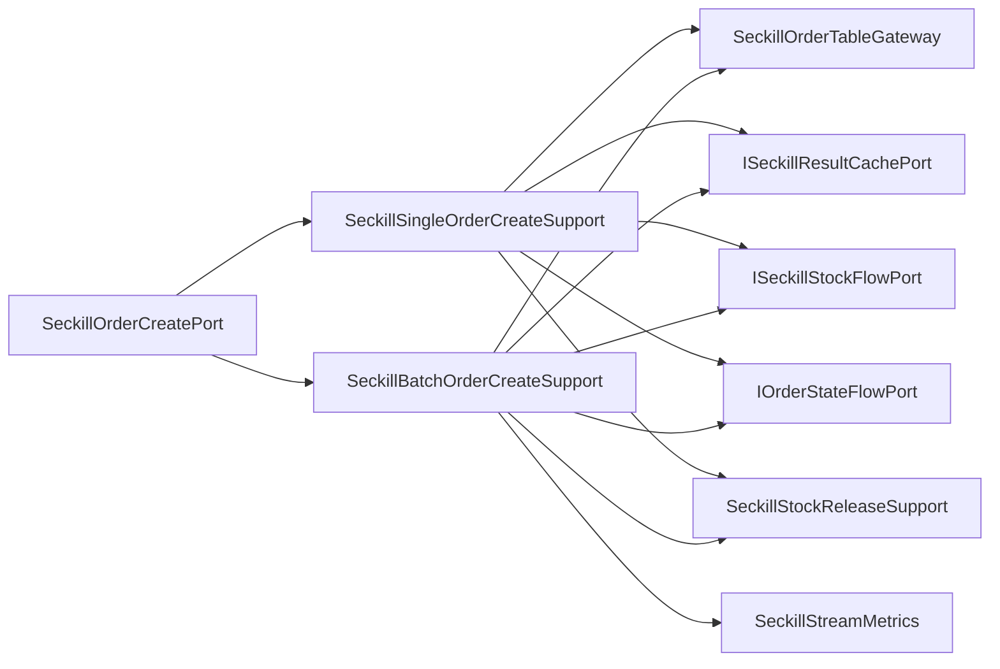

# 秒杀订单创建端口内部支撑拆分

## 背景

`ISeckillOrderCreatePort` 是秒杀异步落库链路的领域端口，接口只包含单条订单创建和批量订单创建，语义是合理的。但基础设施实现 `SeckillOrderCreatePort` 同时承担了：

- 单条订单创建：重复订单查询、唯一索引兜底、结果缓存、库存回滚。
- 批量订单创建：批量 PO 转换、批量插入耗时指标、逐条回查、失败回滚。
- 订单创建成功后的库存流水、状态流水和结果缓存补写。

这些都是订单创建端口的基础设施实现细节，不需要拆领域端口；但继续堆在一个类里，会让异步落库和批量消费链路难以维护。

## 规格

- 保持 `ISeckillOrderCreatePort` 不变。
- `SeckillOrderCreatePort` 保留 `@Transactional` 事务门面和两个对外方法。
- 拆出两个基础设施支撑组件：
  - `SeckillSingleOrderCreateSupport`：负责单条订单创建、重复订单兜底、结果缓存和异常回滚。
  - `SeckillBatchOrderCreateSupport`：负责批量订单创建、批量插入指标、逐条回查、库存流水批量记录和失败回滚。
- 不新增新的领域端口，避免过度拆分。
- 增加架构测试，防止状态流水、库存流水、结果缓存、批量插入和异常兜底细节回流到 `SeckillOrderCreatePort`。

## 设计



## 验收

- `SeckillOrderCreatePort` 不再直接依赖 `IOrderStateFlowPort`、`ISeckillStockFlowPort`、`ISeckillResultCachePort`、`SeckillOrderTableGateway`、`SeckillStockReleaseSupport`、`SeckillStreamMetrics`、`SeckillFaultInjector`。
- `SeckillOrderCreatePort` 不再直接出现 `DuplicateKeyException`、`SeckillStockFlowEntity`、`OrderStateTransitionEntity`、`insertIgnoreBatch`、`recordBatchInsert`、`rollbackReservation`、`new ArrayList`。
- JDK 1.8 下营销 app 编译通过。
- `DomainPurityTest` 通过。

## 实现记录

- 新增 `SeckillSingleOrderCreateSupport`，承接单条订单创建、重复订单兜底、库存流水、状态流水、结果缓存和异常回滚。
- 新增 `SeckillBatchOrderCreateSupport`，承接批量订单创建、批量插入指标、逐条回查、库存流水批量记录、结果缓存和失败回滚。
- `SeckillOrderCreatePort` 保留事务边界，只按单条/批量两个用例委托内部支撑组件。
- `DomainPurityTest` 增加 `seckillOrderCreatePortShouldDelegateSingleAndBatchDetails`，防止落库、流水、缓存、指标和回滚细节回流到端口门面。

## 验证结果

```powershell
cd E:\java\group_buy_market\group-buy-market-master
$env:JAVA_HOME='C:\Program Files\Eclipse Adoptium\jdk-8.0.492.9-hotspot'
$env:Path="$env:JAVA_HOME\bin;E:\java\group_buy_market\.tools\apache-maven-3.8.8\bin;$env:Path"
..\.tools\apache-maven-3.8.8\bin\mvn.cmd -q -pl group-buy-market-app -am -DskipTests compile
..\.tools\apache-maven-3.8.8\bin\mvn.cmd -q -pl group-buy-market-app -am -DskipTests=false -DfailIfNoTests=false "-Dtest=DomainPurityTest" test
..\.tools\apache-maven-3.8.8\bin\mvn.cmd -q -pl group-buy-market-app -am -DskipTests=false -DfailIfNoTests=false "-Dtest=cn.bugstack.test.infrastructure.seckill.SeckillOrderLockPortUnitTest" test
```

- 编译：通过。
- `DomainPurityTest`：32 个测试通过。
- `SeckillOrderLockPortUnitTest`：7 个测试通过。

## 面试表述

秒杀订单创建我没有把单条和批量拆成两个领域端口，因为它们都是“创建秒杀订单”的同一生命周期能力；但基础设施实现里把单条创建和批量创建拆成两个支撑组件。这样 Redis Stream 批量消费、DB 批量插入指标和单条兜底逻辑可以独立演进，领域服务仍然只依赖稳定的订单创建端口。
