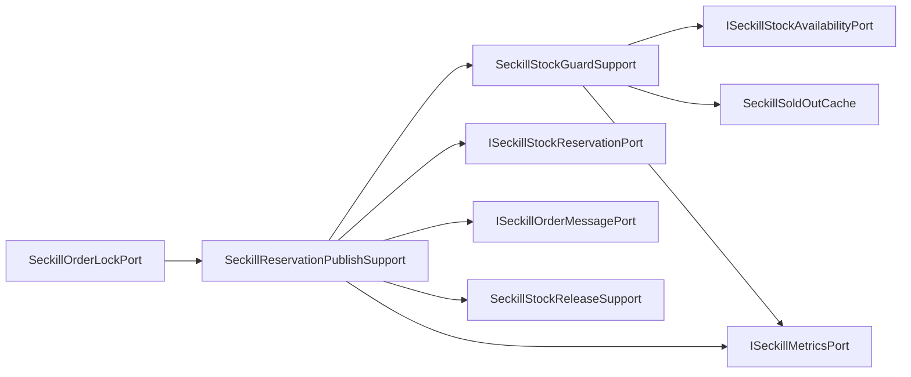

# 秒杀锁单端口内部支撑拆分

## 背景

`ISeckillOrderLockPort` 是秒杀高并发入口的领域端口，接口只暴露锁单能力，语义不需要继续拆。但基础设施实现 `SeckillOrderLockPort` 同时承担了售罄短路、库存初始化、资格预扣、重复参与处理、消息投递、投递失败回滚、库存不足指标和售罄缓存维护。

这些逻辑都属于秒杀入口主链路，不能随意拆成过多小类；但继续堆在端口实现中，会让锁单入口在后续接 RocketMQ/Kafka、扩展库存分片或调整售罄策略时变成新的高风险大类。

## 规格

- 保持 `ISeckillOrderLockPort` 不变。
- `SeckillOrderLockPort` 保留入口门面和 `stockBucketTryCount` 配置读取。
- 拆出两个基础设施支撑组件：
  - `SeckillStockGuardSupport`：负责售罄短路、库存初始化触发、库存不足后的售罄缓存和指标记录。
  - `SeckillReservationPublishSupport`：负责资格预扣结果分支、重复参与指标、订单创建消息投递和投递失败回滚。
- 复用既有 `SeckillStockReleaseSupport.rollbackReservation`，避免锁单入口继续直接构建库存回滚流水。
- 不新增新的领域端口，避免把一个锁单用例拆碎成多个领域接口。
- 增加架构测试，防止售罄缓存、库存初始化、消息投递失败回滚和库存流水细节回流到 `SeckillOrderLockPort`。

## 设计



## 验收

- `SeckillOrderLockPort` 不再直接依赖 `ISeckillStockAvailabilityPort`、`ISeckillStockReservationPort`、`ISeckillStockFlowPort`、`ISeckillOrderMessagePort`、`SeckillSoldOutCache`、`ISeckillMetricsPort`。
- `SeckillOrderLockPort` 不再直接出现 `SeckillStockReservationEntity`、`SeckillStockFlowEntity`、`MDC`、`isSoldOut`、`reserve`、`publishOrderCreate`、`rollbackReservation`、`markSoldOut`。
- JDK 1.8 下营销 app 编译通过。
- `DomainPurityTest` 通过。
- `SeckillOrderLockPortUnitTest` 通过，覆盖成功投递、重复参与、库存不足、售罄短路和投递失败回滚。

## 实现记录

- 新增 `SeckillStockGuardSupport`，负责售罄短路、库存初始化触发、库存不足时写入本地售罄短缓存和指标。
- 新增 `SeckillReservationPublishSupport`，负责资格预扣结果分支、重复参与指标、订单创建消息投递和投递失败回滚。
- `SeckillOrderLockPort` 保留入口门面和 `stockBucketTryCount` 配置，不再直接感知售罄缓存、库存预扣、消息投递和库存流水。
- `SeckillOrderLockPortUnitTest` 的 fixture 改为注入两个支撑组件，继续验证成功、重复、售罄、库存不足和投递失败回滚。
- `DomainPurityTest` 增加 `seckillOrderLockPortShouldDelegateStockGuardAndPublishDetails`，防止库存闸门和预扣发布细节回流。

## 验证结果

```powershell
cd E:\java\qsyy-ecommerce-platform\qsyy-commerce-market
$env:JAVA_HOME='C:\Program Files\Eclipse Adoptium\jdk-8.0.492.9-hotspot'
$env:Path="$env:JAVA_HOME\bin;E:\java\qsyy-ecommerce-platform\.tools\apache-maven-3.8.8\bin;$env:Path"
..\.tools\apache-maven-3.8.8\bin\mvn.cmd -q -pl group-buy-market-app -am -DskipTests compile
..\.tools\apache-maven-3.8.8\bin\mvn.cmd -q -pl group-buy-market-app -am -DskipTests=false -DfailIfNoTests=false "-Dtest=DomainPurityTest" test
..\.tools\apache-maven-3.8.8\bin\mvn.cmd -q -pl group-buy-market-app -am -DskipTests=false -DfailIfNoTests=false "-Dtest=cn.bugstack.test.infrastructure.seckill.SeckillOrderLockPortUnitTest" test
```

- 编译：通过。
- `DomainPurityTest`：35 个测试通过。
- `SeckillOrderLockPortUnitTest`：7 个测试通过。

## 面试表述

秒杀锁单入口没有拆领域端口，因为它对领域服务来说就是一个原子能力：预扣库存并进入异步下单队列。但基础设施里我把库存闸门和预扣发布拆成两个支撑组件。库存闸门负责售罄短路和初始化，预扣发布负责 Lua 预扣结果、消息投递和失败回滚。这样既能保持锁单用例完整，又能避免高并发入口变成技术细节大杂烩。
