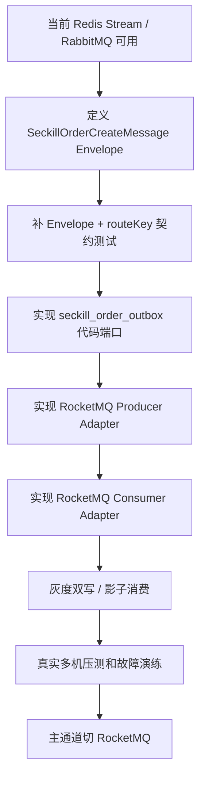

# 秒杀专业 MQ 最小可切换边界审计

## 背景

当前前 5 风险中，秒杀生产化消息链路和容量证明仍排第一。`mq-evolution.md` 已经明确推荐生产大促场景把秒杀订单创建消息从 Redis Stream 演进到 RocketMQ，但还需要基于当前代码确认：

- 现在是否真的已经有可替换 MQ 的端口边界。
- 是否需要本轮直接接入 RocketMQ/Kafka adapter。
- 如果暂不接入，剩余最小缺口是什么。

本轮只做边界审计，不修改业务代码。

## 当前代码证据

### 已具备的可切换基础

- `ISeckillOrderMessagePort` 只表达 `publishOrderCreate(SeckillOrderEntity)`，domain 不感知 Redis Stream、RabbitMQ 或 RocketMQ。
- `SeckillOrderLockPort` 只调用 `SeckillReservationPublishSupport`，不直接持有 MQ、Redis Stream、JSON 序列化或 routing key。
- `SeckillReservationPublishSupport` 在 Redis 资格预扣成功后调用 `ISeckillOrderMessagePort`，投递失败时会回滚库存资格。
- `SeckillOrderMessagePort` 当前集中承接 RabbitMQ、Redis Stream、Redis Queue、本地队列的投递选择。
- `SeckillOrderCreateBufferWorker` 负责 Redis Stream/Queue/local queue 消费并批量调用 `ISeckillService#createSeckillOrders(...)`。
- `DomainPurityTest` 已防止 `SeckillOrderLockPort` 重新直接依赖 `EventPublisher`、`SeckillOrderCreateBuffer`、routing key 和 JSON 序列化。

结论：锁单主流程已经和具体消息中间件解耦。后续新增 RocketMQ adapter 不应该改锁单主流程。

### 尚未具备的生产切换能力

当前仍不能说“已经接入专业 MQ”，原因是：

- 没有 RocketMQ/Kafka/Pulsar 客户端依赖，也没有对应 Producer/Consumer adapter。
- `SeckillOrderMessagePort` 当前直接把 `SeckillOrderEntity` 序列化为 JSON，缺少独立、稳定、版本化的消息 Envelope。
- RabbitMQ 分支使用 `publishWithoutConfirm(...)`，适合当前快速异步投递，但不是秒杀订单创建生产终局；切 RocketMQ 时需要 producer confirm、send result、异常分类和 outbox 重试。
- `docs/sql/2026-05-29-state-flow-stock-audit-rocketmq.sql` 里已准备 `seckill_order_outbox`，但当前代码还没有 outbox repository、投递任务、重试状态机和人工重放入口。
- 当前消费端有 RabbitMQ listener 和 Redis Stream worker，但没有 RocketMQ consumer group、批量消费、重试/DLQ、消费幂等契约测试。
- 当前本机 Docker 只有 RocketMQ compose 文件，不能证明生产容量、堆积恢复、broker 故障恢复或多副本能力。

## 本轮决策

不在本轮直接接入 RocketMQ adapter。

理由：

1. 当前目标是 DDD + SDD 审核，不是为了“看起来更高级”堆中间件。
2. 本机单机环境即使启动 RocketMQ，也只能证明进程能启动，不能证明生产吞吐和故障恢复。
3. 直接引入 RocketMQ 依赖但没有 outbox、Envelope、consumer 契约和监控，容易把文档里的生产边界包装成“已完成”。
4. 当前代码更需要先固化最小切换契约，再决定是否实现 adapter。

## 最小可切换边界

后续真正实现 RocketMQ/Kafka adapter 前，必须先满足这些边界：

1. 消息 Envelope 独立于 `SeckillOrderEntity`。
   - 必须包含 `schemaVersion`、`eventType`、`messageId`、`routeKey`、`activityId`、`userId`、`outTradeNo`、`orderId`、`source`、`channel`、`goodsId`、`traceId`、`occurredAt`。
   - `messageId` 使用 `activityId:userId:outTradeNo`，支撑 producer、consumer、outbox 和补偿幂等。

2. `ISeckillOrderMessagePort` 保持业务语义，不暴露 MQ 类型。
   - 锁单链路继续只关心“订单创建消息是否发布成功”。
   - MQ 选择放在基础设施 adapter 或 Spring profile 中，不回流到 domain。

3. Outbox 必须落到代码，而不只是 SQL。
   - 新增 outbox repository/port。
   - 支持 `INIT/SENT/CONFIRMED/FAILED/DEAD` 或等价状态。
   - 支持 `retry_count`、`next_retry_time`、`trace_id` 和人工重放。

4. 消费端必须复用订单创建端口。
   - RocketMQ consumer 不直接写 DAO。
   - 消费端继续调用 `ISeckillOrderCreatePort` 或 `ISeckillService#createSeckillOrders(...)`，保持批量落库和幂等逻辑一致。

5. 契约测试先于生产切换。
   - Envelope 序列化兼容测试。
   - messageId/routeKey 稳定性测试。
   - outbox 状态机测试。
   - consumer 幂等重放测试。

6. 监控和回滚必须同步设计。
   - 指标至少包括发送成功/失败、outbox 待投递、重试次数、DLQ、consumer lag、批量落库耗时。
   - 回滚路径必须能切回 Redis Stream，并保证重复消息不会重复落单。

## 推荐演进顺序

## Done List

- [x] 审计秒杀订单消息端口接入专业 MQ 的最小可切换边界。
  - 文件：`docs/sdd/2026-05-31-seckill-professional-mq-switch-boundary.md`
  - 验证：`powershell -NoProfile -ExecutionPolicy Bypass -File scripts\verify-current-baseline.ps1 -ProfileName docs-only`
  - 提交：本轮提交

- [x] 明确本轮不直接接入 RocketMQ adapter。
  - 文件：`docs/sdd/2026-05-31-seckill-professional-mq-switch-boundary.md`
  - 验证：当前代码无 RocketMQ/Kafka/Pulsar 依赖，`ISeckillOrderMessagePort` 已隔离锁单主流程。
  - 提交：本轮提交

## TODO List

- [ ] P0：定义秒杀订单创建消息 Envelope 和契约测试。
  - 原因：当前消息体仍直接序列化 `SeckillOrderEntity`，不利于后续 RocketMQ/Kafka adapter 稳定演进。
  - 范围：`docs/sdd`、秒杀消息适配器、消息映射测试。
  - 验收：形成稳定 Envelope schema，并验证 `messageId`、`routeKey`、schema 版本和 traceId 不随中间件切换变化。

## 所有未完成任务清单

| 任务名称 | 当前状态 | 所属类型 | 优先级 | 不完成的影响 | 当前为什么还没做 | 后续触发条件 |
| --- | --- | --- | --- | --- | --- | --- |
| 秒杀订单创建消息 Envelope | 未开始 | 代码风险 / 生产边界 | P0 | 后续切 RocketMQ/Kafka 时仍可能依赖 domain entity JSON，消息兼容性不稳定 | 本轮先审计切换边界，不改代码 | 开始实现专业 MQ adapter 或 outbox |
| 秒杀专业 MQ adapter | 暂不处理 | 生产边界 / 代码风险 | P0 | Redis Stream 仍不能包装成大促终局方案 | 缺真实 MQ 集群、多机压测和 outbox 代码闭环 | Envelope、outbox、consumer 契约测试完成后 |
| 真实多实例容量验证 | 已阻塞 | 生产边界 | P0 | 本机 QPS 不能证明生产容量 | 只有当前单机环境 | 有独立 Linux 压测机、多服务实例和独立中间件节点 |
| 拼团锁单等待策略重构 | 暂不处理 | 代码风险 | P1 | domain service 继续保留 `Thread.sleep` 技术等待 | 等待超时测试已补齐，但当前没有功能故障 | 压测暴露 RT 抖动，或继续增强锁单幂等策略 |
| Redis 通用接口拆分 | 暂不处理 | 代码风险 / 基础设施边界 | P0 | 公共 Redis 总线继续扩大 | 新增能力准入规则已补齐；直接拆改动面大，现有业务端口暂时守住边界 | 新增 Redis 能力或公共接口继续膨胀 |
| `SeckillService` 本地技术决策治理 | 暂不处理 | 代码风险 | P1 | 单机 `Semaphore` 和本地订单号生成容易被误解为生产能力 | 现阶段没有新增秒杀发布范围 | 要做秒杀生产化或订单号治理 |
| 商城 `AbstractOrderService` 营销类型分支治理 | 暂不处理 | 代码风险 / 业务边界 | P1 | 新增营销类型时 if/else 会继续增长 | 当前只有拼团和秒杀，拆分收益有限 | 新增第三种营销类型 |
| 对账后台权限、审批和 SLA | 未开始 | 业务边界 | P1 | 对账中心只能算最小闭环 | 属于新产品范围 | 明确建设运营后台 |
| 完整售后体系 | 未开始 | 业务边界 | P1 | 不能包装成完整电商售后 | 会引入部分退款、拒绝退款、履约后退款等新模型 | 明确建设售后子系统 |
| 完整支付中台能力 | 未开始 | 业务边界 | P2 | `mock/alipay` 适合演示，不等于支付中台 | 当前项目目标是交易营销，不是支付平台 | 接入更多支付渠道或账单文件 |
| `DomainPurityTest` 结构拆分 | 暂不处理 | 测试缺口 / 文档治理 | P2 | 架构守护可能继续变成大型文本快照测试 | 规则分层已评估，当前测试仍能有效挡回归，直接拆分收益不高 | 新增大量同类守护规则，或该测试继续显著膨胀 |
| 八股文档细粒度短板同步 | 进行中 | 面试口径 | P1 | 面试材料可能把“锁单主流程可替换”误讲成“专业 MQ 已落地” | 本轮同步细化口径 | 每次新增 MQ 边界或主链路结论 |

## 面试口径

可以这样说：

> 当前项目已经把秒杀下单消息抽成 `ISeckillOrderMessagePort`，所以锁单主流程不依赖 Redis Stream 或 RabbitMQ。生产大促下我不会说 Redis Stream 是最终方案，而是会先把消息 Envelope、Outbox、Producer/Consumer 契约和监控补齐，再把订单创建消息迁到 RocketMQ。现在项目具备“主流程可切换”的基础，但还没有真正落地专业 MQ adapter 和生产容量证明。
