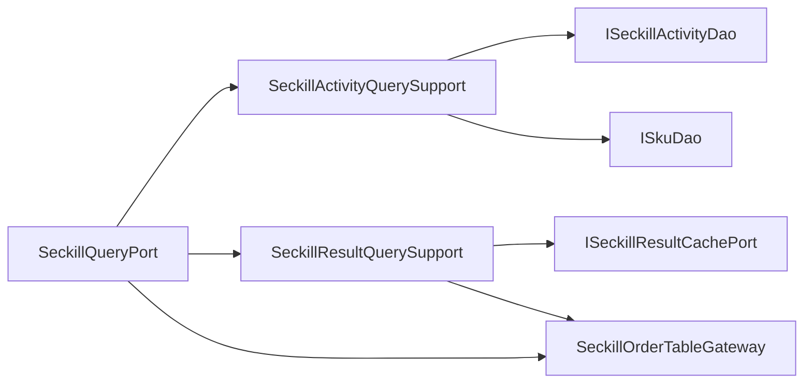

# 秒杀查询端口内部支撑拆分

## 背景

`ISeckillQueryPort` 的接口边界是合理的：活动查询、订单查询、结果查询都属于秒杀读模型。但基础设施实现 `SeckillQueryPort` 同时承担了：

- 活动查询本地短缓存、缓存 key、TTL 和活动/SKU 聚合映射。
- 秒杀订单分片表路由和 DAO 查询。
- 秒杀结果缓存查询、DB 回源和未找到结果构造。

这会让查询端口实现继续承载缓存策略、分片表访问、PO/Entity 映射和结果回源策略。继续增加查询字段、缓存失效、读写分离时，`SeckillQueryPort` 容易变成新的查询大类。

## 规格

- 保持 `ISeckillQueryPort` 不变，不新增领域端口。
- `SeckillQueryPort` 只保留读模型门面委托。
- 拆出两个基础设施支撑组件：
  - `SeckillActivityQuerySupport`：负责活动本地短缓存、活动/SKU 查询和活动实体映射。
  - `SeckillResultQuerySupport`：负责结果缓存查询、订单表回源、缓存补写和未找到结果构造。
- 订单查询复用已有 `SeckillOrderTableGateway` 和 `SeckillOrderAssembler`，不再在查询端口里直接处理分片表。
- 增加架构守护测试，防止 DAO、缓存 map、分片路由、结果缓存回源细节回流到 `SeckillQueryPort`。

## 设计



## 验收

- `SeckillQueryPort` 不再直接依赖 `ISeckillActivityDao`、`ISeckillOrderDao`、`ISkuDao`、`ISeckillResultCachePort`、`SeckillOrderShardRouter`、`ConcurrentHashMap`、`@Value`。
- `SeckillQueryPort` 不再包含 `ActivityCacheEntry`、`activityCacheKey`、`querySeckillOrderByOutTradeNoFromTable`、`SeckillActivity.builder`、`Sku`、`cache(existsOrder` 等细节。
- JDK 1.8 下营销 app 编译通过。
- `DomainPurityTest` 通过。

## 实现记录

- 新增 `SeckillActivityQuerySupport`，承接活动本地短缓存、活动/SKU 查询和活动实体映射。
- 新增 `SeckillResultQuerySupport`，承接结果缓存查询、订单表回源、结果缓存补写和未找到结果构造。
- `SeckillQueryPort` 改为读模型门面，只委托活动查询、订单表 gateway 和结果查询 support。
- 订单查询复用已有 `SeckillOrderTableGateway`，分片表访问不再出现在查询端口实现中。
- `DomainPurityTest` 新增 `seckillQueryAdapterShouldDelegateCacheMappingAndShardDetails`，防止查询适配器重新持有缓存、映射、分片和结果回源细节。

## 验证结果

```powershell
$env:JAVA_HOME='C:\Program Files\Eclipse Adoptium\jdk-8.0.492.9-hotspot'
..\.tools\apache-maven-3.8.8\bin\mvn.cmd -q -pl group-buy-market-app -am -DskipTests compile
```

结果：通过。

```powershell
..\.tools\apache-maven-3.8.8\bin\mvn.cmd -q -pl group-buy-market-app -am -DskipTests=false -DfailIfNoTests=false "-Dtest=DomainPurityTest" test
```

结果：`DomainPurityTest` 30 个测试通过。

## 面试表述

秒杀查询我没有拆领域接口，因为活动查询、订单查询、结果查询都属于同一个读模型端口；但我把实现里的缓存、分片路由、结果回源拆到基础设施支撑组件。这样领域层看见的是稳定查询语义，基础设施层可以继续演进缓存 TTL、读写分离或订单分片路由。
