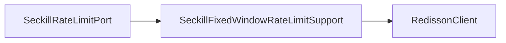

# 秒杀限流端口内部支撑拆分

## 背景

`ISeckillRateLimitPort` 是秒杀入口限流端口，接口只暴露 `tryAcquire`，领域语义稳定，不需要拆领域端口。但基础设施实现 `SeckillRateLimitPort` 同时承担了活动/用户/IP 三维限流策略、配置读取、Redis Key 规则、固定窗口计算、Redisson 调用和 Lua 脚本。

三维限流策略属于秒杀入口适配器职责，可以留在端口门面；Redis 固定窗口执行细节应下沉到支撑组件，避免端口直接绑定 Redisson 和 Lua。

## 规格

- 保持 `ISeckillRateLimitPort` 不变。
- `SeckillRateLimitPort` 保留启停开关、活动/用户/IP 三维配置和维度顺序。
- 拆出 `SeckillFixedWindowRateLimitSupport`：
  - 负责 Redis Key 前缀和窗口 ID。
  - 负责固定窗口 Lua 计数脚本。
  - 负责 Redisson `RScript` 调用。
- 增加架构测试，防止 Redisson、Lua、Key 前缀和窗口计数细节回流到 `SeckillRateLimitPort`。
- 增加纯单元测试覆盖限流关闭、活动维度短路、用户维度短路和三维全部放行。

## 设计



## 验收

- `SeckillRateLimitPort` 不再直接依赖 `RedissonClient`、`RScript`、`StringCodec`、`Arrays`。
- `SeckillRateLimitPort` 不再直接出现 `RATE_LIMIT_KEY_PREFIX`、`redis.call`、`pexpire`、`getScript`。
- JDK 1.8 下营销 app 编译通过。
- `DomainPurityTest` 通过。
- `SeckillRateLimitPortUnitTest` 通过。

## 实现记录

- 新增 `SeckillFixedWindowRateLimitSupport`，负责 Redis Key、窗口 ID、固定窗口 Lua 和 Redisson `RScript` 调用。
- `SeckillRateLimitPort` 保留限流开关、活动/用户/IP 三维配置、维度顺序和异常日志。
- 新增 `SeckillRateLimitPortUnitTest`，覆盖限流关闭、活动维度短路、用户维度短路和空用户/IP 归一化。
- `DomainPurityTest` 增加 `seckillRateLimitPortShouldDelegateRedisFixedWindowDetails`，防止 Redisson/Lua 细节回流。

## 验证结果

```powershell
cd E:\java\qsyy-ecommerce-platform\group-buy-market-master
$env:JAVA_HOME='C:\Program Files\Eclipse Adoptium\jdk-8.0.492.9-hotspot'
$env:Path="$env:JAVA_HOME\bin;E:\java\qsyy-ecommerce-platform\.tools\apache-maven-3.8.8\bin;$env:Path"
..\.tools\apache-maven-3.8.8\bin\mvn.cmd -q -pl group-buy-market-app -am -DskipTests compile
..\.tools\apache-maven-3.8.8\bin\mvn.cmd -q -pl group-buy-market-app -am -DskipTests=false -DfailIfNoTests=false "-Dtest=DomainPurityTest,cn.bugstack.test.infrastructure.seckill.SeckillRateLimitPortUnitTest" test
```

- 编译：通过。
- `DomainPurityTest`：41 个测试通过。
- `SeckillRateLimitPortUnitTest`：4 个测试通过。

## 面试表述

秒杀入口限流我没有拆领域接口，因为上层只关心是否允许进入锁单链路。但基础设施里把三维限流策略和 Redis 固定窗口执行拆开：端口负责活动、用户、IP 的限流顺序和配置，支撑组件负责 Redis Key、Lua 和窗口计数。这样后续要从固定窗口换成滑动窗口或令牌桶，只需要替换支撑组件。
