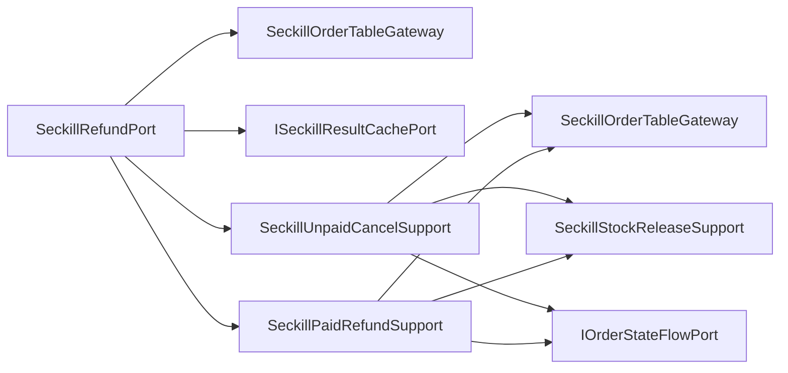

# 秒杀退款端口内部状态支撑拆分

## 背景

`ISeckillRefundPort` 的领域语义是“处理秒杀退单”，接口只暴露 `refundSeckillOrder`，不需要继续拆领域端口。但基础设施实现 `SeckillRefundPort` 里同时处理未支付取消、已支付退款、库存释放、状态流水和结果缓存，后续如果继续加入三方退款、部分退款、履约后退款，端口门面会重新变成状态分支大类。

## 规格

- 保持 `ISeckillRefundPort` 不变。
- `SeckillRefundPort` 保留 `@Transactional` 事务门面、订单查询、幂等终态判断和状态路由。
- 拆出两个基础设施支撑组件：
  - `SeckillUnpaidCancelSupport`：处理 `CREATE -> CLOSE`，释放未支付占位库存并记录取消流水。
  - `SeckillPaidRefundSupport`：处理 `COMPLETE -> REFUND`，恢复已支付库存并记录退款流水。
- 结果缓存由端口门面统一写入，避免两个状态分支重复维护返回语义。
- 增加架构测试，防止状态更新、库存恢复和状态流水细节回流到 `SeckillRefundPort`。

## 设计



## 验收

- `SeckillRefundPort` 不再直接依赖 `IOrderStateFlowPort`、`SeckillStockReleaseSupport`、`SeckillStockFlowEntity`、`OrderStateTransitionEntity`、`MDC`。
- `SeckillRefundPort` 不再直接调用 `closeUnpaid`、`refundPaid`、`releaseByOrder`。
- JDK 1.8 下营销 app 编译通过。
- `DomainPurityTest` 通过。

## 实现记录

- 新增 `SeckillUnpaidCancelSupport`，负责未支付秒杀订单取消、释放占位库存、记录库存流水和状态流水。
- 新增 `SeckillPaidRefundSupport`，负责已支付秒杀订单退款、恢复库存、记录库存流水和状态流水。
- `SeckillRefundPort` 保留事务边界、订单查询、终态幂等判断、状态路由和统一结果缓存。
- `DomainPurityTest` 增加 `seckillRefundPortShouldDelegateStateSpecificDetails`，防止状态更新、库存释放和状态流水细节回流。

## 验证结果

```powershell
cd E:\java\group_buy_market\group-buy-market-master
$env:JAVA_HOME='C:\Program Files\Eclipse Adoptium\jdk-8.0.492.9-hotspot'
$env:Path="$env:JAVA_HOME\bin;E:\java\group_buy_market\.tools\apache-maven-3.8.8\bin;$env:Path"
..\.tools\apache-maven-3.8.8\bin\mvn.cmd -q -pl group-buy-market-app -am -DskipTests compile
..\.tools\apache-maven-3.8.8\bin\mvn.cmd -q -pl group-buy-market-app -am -DskipTests=false -DfailIfNoTests=false "-Dtest=DomainPurityTest" test
..\.tools\apache-maven-3.8.8\bin\mvn.cmd -q -pl group-buy-market-app -am -DskipTests=false -DfailIfNoTests=false "-Dtest=cn.bugstack.test.infrastructure.seckill.SeckillOrderLockPortUnitTest" test
```

- 编译：通过。
- `DomainPurityTest`：33 个测试通过。
- `SeckillOrderLockPortUnitTest`：7 个测试通过。

## 面试表述

秒杀退单没有拆成多个领域端口，因为对上层来说它仍然是同一个“退单”能力；但基础设施里按订单状态拆成未支付取消和已支付退款两个支撑组件。这样状态机分支、库存恢复和流水记录独立演进，端口门面只保留查询、幂等和路由职责。
