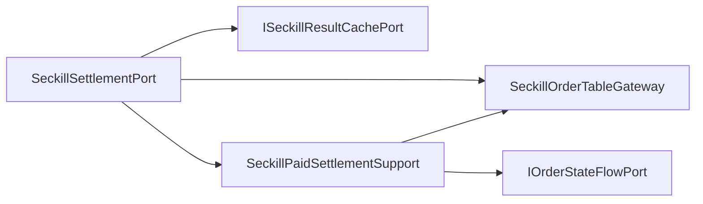

# 秒杀结算端口内部支撑拆分

## 背景

秒杀订单生命周期已经拆成创建、结算和退款三个领域端口。`ISeckillSettlementPort` 的接口语义稳定，不需要继续拆。但基础设施实现 `SeckillSettlementPort` 仍然直接承担支付成功状态更新、并发更新兜底、状态流水记录和分片表回查。

这部分是“支付成功结算”的基础设施细节，应当从端口门面中移出，让端口只保留订单查询、状态校验和结果缓存。

## 规格

- 保持 `ISeckillSettlementPort` 不变。
- `SeckillSettlementPort` 保留 `@Transactional` 事务门面、订单查询、状态合法性校验和结果缓存。
- 拆出 `SeckillPaidSettlementSupport`：
  - 执行 `CREATE -> COMPLETE` 条件更新。
  - 处理并发重复结算下的最新订单回查兜底。
  - 记录秒杀订单支付成功状态流水。
  - 返回最新已结算订单 PO。
- 不新增新的领域端口，避免过度拆分。
- 增加架构测试，防止状态更新、状态流水和 trace 细节回流到 `SeckillSettlementPort`。

## 设计



## 验收

- `SeckillSettlementPort` 不再直接依赖 `IOrderStateFlowPort`、`OrderStateTransitionEntity`、`MDC`。
- `SeckillSettlementPort` 不再直接调用 `paySuccess`。
- JDK 1.8 下营销 app 编译通过。
- `DomainPurityTest` 通过。

## 实现记录

- 新增 `SeckillPaidSettlementSupport`，承接支付成功条件更新、并发重复结算回查兜底和支付成功状态流水。
- `SeckillSettlementPort` 保留事务边界、订单查询、状态合法性校验、幂等返回和结果缓存。
- 新增 `SeckillSettlementPortUnitTest`，用 fake gateway 覆盖正常结算、重复结算幂等和非法状态拒绝。
- `DomainPurityTest` 增加 `seckillSettlementPortShouldDelegatePaidStateDetails`，防止支付成功状态更新和状态流水细节回流。

## 验证结果

```powershell
cd E:\java\group_buy_market\group-buy-market-master
$env:JAVA_HOME='C:\Program Files\Eclipse Adoptium\jdk-8.0.492.9-hotspot'
$env:Path="$env:JAVA_HOME\bin;E:\java\group_buy_market\.tools\apache-maven-3.8.8\bin;$env:Path"
..\.tools\apache-maven-3.8.8\bin\mvn.cmd -q -pl group-buy-market-app -am -DskipTests compile
..\.tools\apache-maven-3.8.8\bin\mvn.cmd -q -pl group-buy-market-app -am -DskipTests=false -DfailIfNoTests=false "-Dtest=DomainPurityTest,cn.bugstack.test.infrastructure.seckill.SeckillSettlementPortUnitTest" test
```

- 编译：通过。
- `DomainPurityTest`：36 个测试通过。
- `SeckillSettlementPortUnitTest`：3 个测试通过。

## 面试表述

秒杀结算端口对领域服务仍然是一个稳定能力：把已创建的秒杀订单结算为支付成功。但基础设施里我把状态更新和状态流水拆到 `SeckillPaidSettlementSupport`，端口只做查询、状态校验、幂等返回和结果缓存。这样订单创建、支付结算、退款三个生命周期端口的内部结构保持一致。
