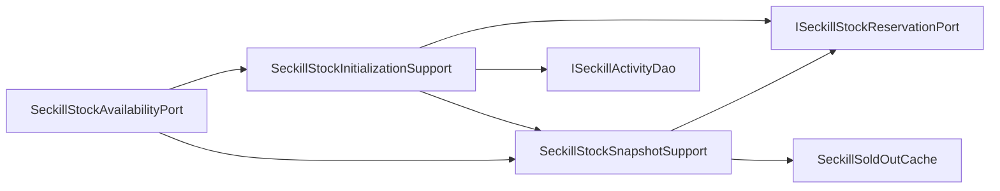

# 秒杀库存可用性端口内部支撑拆分

## 背景

`ISeckillStockAvailabilityPort` 的领域语义是“查询秒杀活动可用库存”，接口保持一个方法是合理的。但基础设施实现 `SeckillStockAvailabilityPort` 同时承担了：

- 本地售罄短缓存命中判断。
- Redis 库存桶是否初始化判断。
- Redis 库存快照查询和售罄缓存刷新。
- 初始化锁竞争、等待失败兜底和释放。
- DB 回源查询活动库存并初始化 Redis 库存桶。

这属于高并发入口的库存冷启动链路。继续放在端口门面里会让可用性查询和库存初始化细节耦合，后续接活动预热、分片库存或降级策略时容易膨胀。

## 规格

- 保持 `ISeckillStockAvailabilityPort` 不变。
- `SeckillStockAvailabilityPort` 保留配置读取和对外门面。
- 拆出两个基础设施支撑组件：
  - `SeckillStockSnapshotSupport`：负责售罄短缓存命中、已初始化库存快照查询和售罄缓存刷新。
  - `SeckillStockInitializationSupport`：负责初始化锁竞争、DB 回源、Redis 库存初始化和锁释放。
- 不新增新的领域端口，避免把一个库存可用性查询拆成多个领域接口。
- 增加架构测试，防止 DAO、初始化锁和售罄缓存细节回流到 `SeckillStockAvailabilityPort`。
- 增加纯单元测试覆盖已初始化、售罄、未初始化 DB 回源和活动不存在异常。

## 设计



## 验收

- `SeckillStockAvailabilityPort` 不再直接依赖 `ISeckillActivityDao`、`ISeckillStockReservationPort`、`SeckillSoldOutCache`、`SeckillActivity`。
- `SeckillStockAvailabilityPort` 不再直接出现 `tryAcquireInitializationLock`、`releaseInitializationLock`、`initializeStock`、`isSoldOut`、`markSoldOut`、`clear`、`InterruptedException`。
- JDK 1.8 下营销 app 编译通过。
- `DomainPurityTest` 通过。
- `SeckillStockAvailabilityPortUnitTest` 通过。

## 实现记录

- 新增 `SeckillStockSnapshotSupport`，负责售罄短缓存命中、已初始化库存快照查询和售罄缓存刷新。
- 新增 `SeckillStockInitializationSupport`，负责初始化锁竞争、DB 回源、Redis 库存初始化和锁释放。
- `SeckillStockAvailabilityPort` 只保留 `stockInitLockWaitMillis` 配置和门面委托。
- 新增 `SeckillStockAvailabilityPortUnitTest`，覆盖已初始化库存、售罄缓存、未初始化 DB 回源和活动不存在异常。
- `DomainPurityTest` 增加 `seckillStockAvailabilityPortShouldDelegateSnapshotAndInitializationDetails`，防止库存初始化细节回流。

## 验证结果

```powershell
cd E:\java\qsyy-ecommerce-platform\group-buy-market-master
$env:JAVA_HOME='C:\Program Files\Eclipse Adoptium\jdk-8.0.492.9-hotspot'
$env:Path="$env:JAVA_HOME\bin;E:\java\qsyy-ecommerce-platform\.tools\apache-maven-3.8.8\bin;$env:Path"
..\.tools\apache-maven-3.8.8\bin\mvn.cmd -q -pl group-buy-market-app -am -DskipTests compile
..\.tools\apache-maven-3.8.8\bin\mvn.cmd -q -pl group-buy-market-app -am -DskipTests=false -DfailIfNoTests=false "-Dtest=DomainPurityTest,cn.bugstack.test.infrastructure.seckill.SeckillStockAvailabilityPortUnitTest" test
```

- 编译：通过。
- `DomainPurityTest`：38 个测试通过。
- `SeckillStockAvailabilityPortUnitTest`：4 个测试通过。

## 面试表述

秒杀库存可用性端口没有拆领域接口，因为上层只需要知道“活动还有没有库存”。但基础设施里我把库存快照和库存初始化拆开：快照组件走 Redis 和售罄短缓存，初始化组件负责拿初始化锁、DB 回源并写 Redis 库存桶。这样冷启动、预热和高并发查询边界更清楚，后续接分片库存或降级策略时不会污染端口门面。
