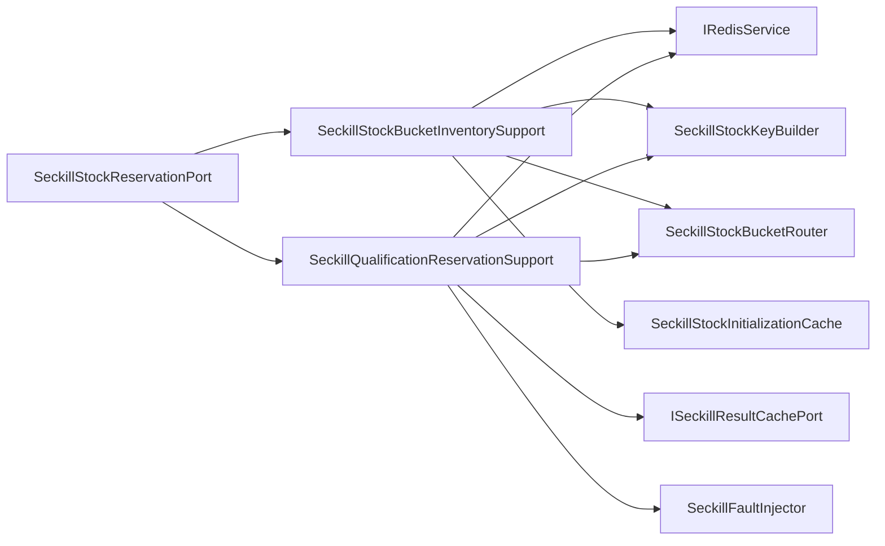

# 秒杀库存预扣端口内部支撑拆分

## 背景

`ISeckillStockReservationPort` 是秒杀高并发主链路里的关键端口，负责 Redis 库存桶、用户占位、Lua 预扣、库存释放和活动库存初始化。前序治理已经把 Key 构建、桶路由和初始化短缓存拆出，但 `SeckillStockReservationPort` 仍然同时承担两类基础设施流程：

- 库存桶初始化和查询：初始化锁、库存桶均分、跨桶库存汇总。
- 资格预扣和释放：Lua 原子预扣、用户防重、结果缓存、回滚/释放库存。

这两类流程都属于 Redis 库存适配实现，不需要新增领域端口；但继续堆在一个类里，会让高并发主链路难以定位风险点，后续引入库存服务或 Redis Cluster 脚本治理时也不利于替换。

## 规格

- 保持 `ISeckillStockReservationPort` 不变。
- `SeckillStockReservationPort` 只保留端口门面委托。
- 拆出两个基础设施支撑组件：
  - `SeckillStockBucketInventorySupport`：负责库存是否初始化、初始化锁、库存桶初始化和库存汇总查询。
  - `SeckillQualificationReservationSupport`：负责资格预扣、重复参与判断、库存不足判断、回滚和释放用户占位。
- 复用已有 `SeckillStockKeyBuilder`、`SeckillStockBucketRouter`、`SeckillStockInitializationCache`。
- 增加架构守护测试，防止 Redis API、Lua 预扣、JSON 序列化和库存桶循环细节回流到 `SeckillStockReservationPort`。

## 设计



## 验收

- `SeckillStockReservationPort` 不再直接依赖 `IRedisService`、`ISeckillResultCachePort`、`SeckillFaultInjector`、`SeckillStockKeyBuilder`、`SeckillStockBucketRouter`、`SeckillStockInitializationCache`。
- `SeckillStockReservationPort` 不再直接出现 `reserveSeckillQualification`、`JSON.toJSONString`、`RLock`、`setAtomicLong`、`getAtomicLong`、`incr`、`remove`、`for (int i = 0`。
- JDK 1.8 下营销 app 编译通过。
- `DomainPurityTest` 通过。

## 实现记录

- 新增 `SeckillStockBucketInventorySupport`，承接库存初始化检查、初始化锁、库存桶初始化和库存汇总查询。
- 新增 `SeckillQualificationReservationSupport`，承接 Lua 资格预扣、重复参与/库存不足判断、回滚库存和释放用户占位。
- `SeckillStockReservationPort` 保留 `ISeckillStockReservationPort` 门面委托，领域端口不变。
- `DomainPurityTest` 扩展库存预扣端口守护，防止 Redis API、Lua 预扣、JSON 序列化、库存桶循环和结果缓存细节回流。

## 验证结果

```powershell
$env:JAVA_HOME='C:\Program Files\Eclipse Adoptium\jdk-8.0.492.9-hotspot'
..\.tools\apache-maven-3.8.8\bin\mvn.cmd -q -pl group-buy-market-app -am -DskipTests compile
```

结果：通过。

```powershell
..\.tools\apache-maven-3.8.8\bin\mvn.cmd -q -pl group-buy-market-app -am -DskipTests=false -DfailIfNoTests=false "-Dtest=DomainPurityTest" test
```

结果：`DomainPurityTest` 31 个测试通过。

```powershell
..\.tools\apache-maven-3.8.8\bin\mvn.cmd -q -pl group-buy-market-app -am -DskipTests=false -DfailIfNoTests=false "-Dtest=cn.bugstack.test.infrastructure.seckill.SeckillOrderLockPortUnitTest" test
```

结果：`SeckillOrderLockPortUnitTest` 7 个测试通过。

## 面试表述

秒杀库存预扣端口我保留为一个领域端口，因为业务上就是“库存资格预扣和释放”。但实现上把库存桶初始化/查询和用户资格预扣/释放拆开，避免 Redis 脚本、防重、初始化锁和桶汇总全堆在一个类里。这样后续替换库存服务或调整桶策略，不需要影响领域服务。
