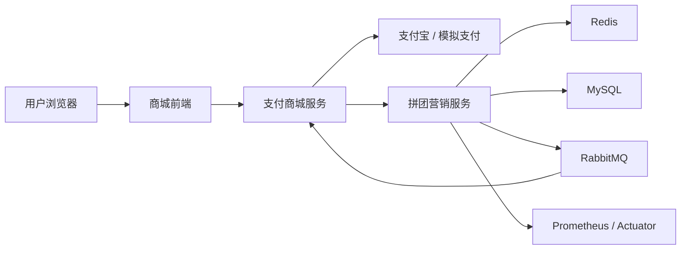
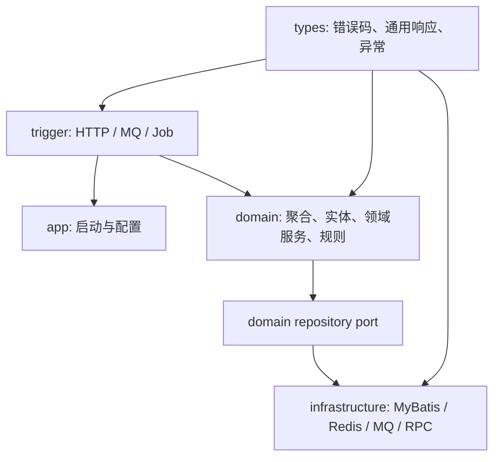
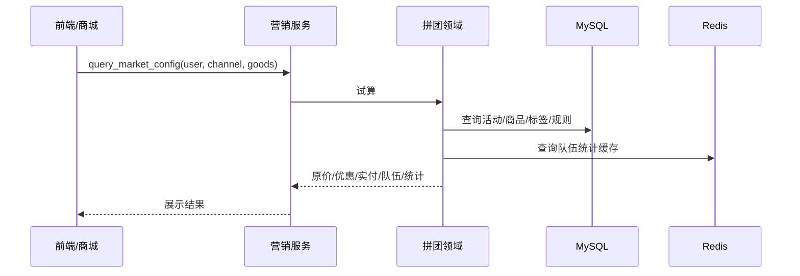
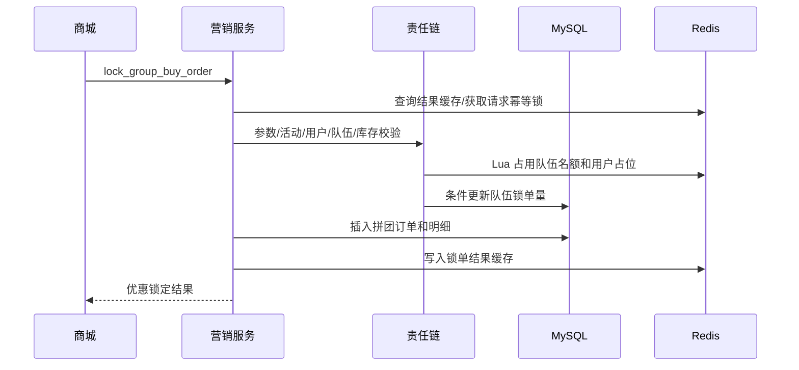
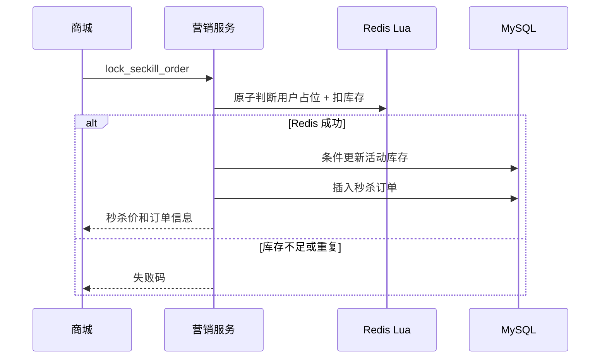
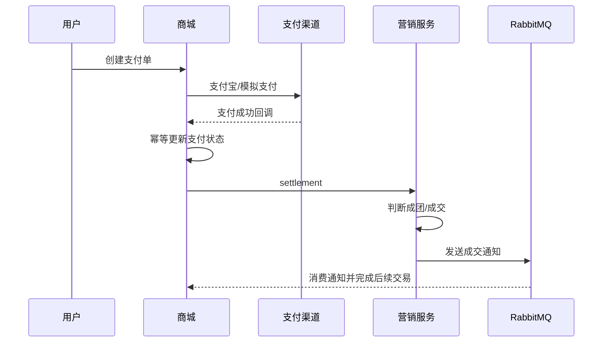
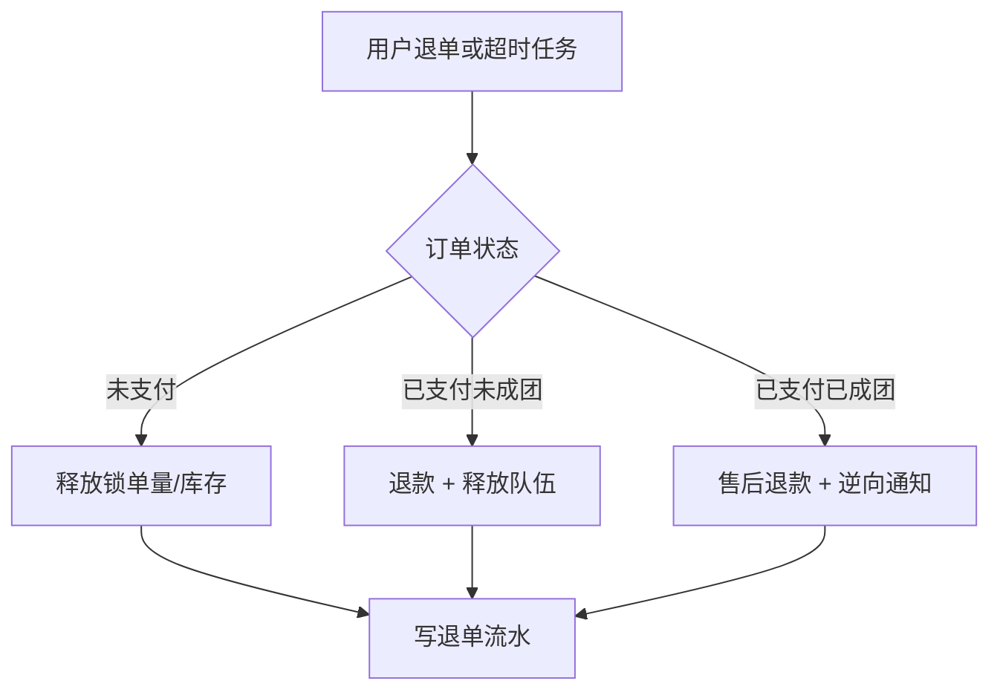

# 架构规格

## 总体架构

系统采用两个业务服务：

- 支付商城服务：商品页、支付单、支付渠道、支付回调、订单列表。
- 拼团营销服务：拼团活动、秒杀活动、营销锁单、结算、退单、通知。

DDD 拆分原则：

- 全系统统一 DDD 方法论，但不共享一套大一统 domain 模型。
- 每个服务内部维护自己的 `api/app/trigger/domain/infrastructure/types` 分层。
- 拼团和秒杀当前同属营销交易上下文，先作为营销服务内部两个子域。
- 当秒杀的流量规模、发布节奏、资源隔离和团队归属独立后，再拆出独立秒杀服务。

## DDD 分层

分层约束：

- `trigger` 只做协议转换、参数校验和调用编排。
- `domain` 表达业务规则，包含试算模板、责任链、策略、聚合行为。
- `infrastructure` 只适配 DB、Redis、MQ、外部接口，不写业务决策。
- `types` 放通用异常、响应码和值对象。

## 领域边界

### 拼团域

负责试算、活动可见性、人群过滤、队伍统计、锁单、结算、退单。核心聚合是拼团队伍和拼团订单。拼团锁单不是简单插入订单，而是对活动、队伍、用户参与关系和库存的一次聚合变更。

### 秒杀域

负责秒杀活动、秒杀价格、秒杀库存、用户限购、秒杀锁单。秒杀链路的热点在库存和重复提交，必须使用 Redis 原子预扣削峰，同时保留 DB 条件更新兜底。

### 支付域

负责支付单创建、支付渠道、支付回调、支付状态流转。支付成功是商城域事件，拼团成团或秒杀成交是营销域事件，两者不能混成一个本地事务。

### 通知与补偿域

负责 MQ 通知、定时扫描、退单补偿、对账任务。它不改变核心领域事实，只负责推动状态最终收敛。

## 核心流程

### 首页试算

### 拼团锁单

### 秒杀锁单

### 支付结算

### 退单退款

## 中间件职责

- Redis：热点活动缓存、秒杀库存桶、用户占位、分布式锁、活动/用户/IP 限流计数。
- MySQL：活动、订单、队伍、流水和最终一致性约束。
- RabbitMQ：结算通知、成团通知、退单补偿、DLQ。
- Redis Stream：秒杀订单创建削峰、pending-list 接管和人工补偿 Stream。
- Prometheus：指标采集、压测前后对比、容量评估。
- Docker：本地开发环境，保证 MySQL/Redis/RabbitMQ 可重复启动。
