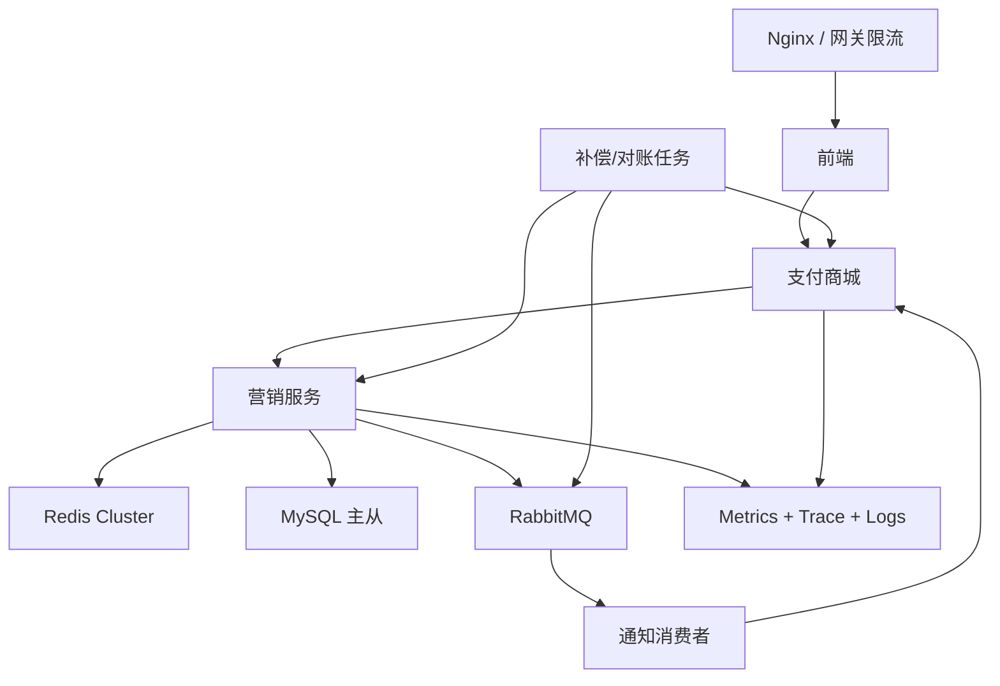

# 大厂对齐路线图

这份路线图用于回答“这个项目如何从课程项目升级成互联网交易系统”。目标不是把系统做复杂，而是让每个复杂度都有明确收益。

## 当前评分

当前架构按 10 分制评估为 **8.8 分**。

已经具备：

- DDD 多模块分层。
- 拼团试算、锁单、结算、退单主链路。
- 秒杀活动、秒杀前端、商城支付接入。
- Redis + DB 双层库存防线。
- RabbitMQ、Prometheus、Docker 本地环境。
- 模拟支付渠道和基础压测脚本。
- 秒杀 Redis Stream 分片、pending-list 回收、失败隔离和人工补偿 Stream。
- 秒杀订单批量落库、可配置分片表、库存流水和故障注入开关。
- 拼团锁单请求幂等锁、结果缓存、用户维度 Redis 占位和 DB 唯一索引兜底。
- 本地 OpenTelemetry Java agent + Jaeger 链路追踪启动方案。

主要差距：

- 拼团已补齐队伍名额 + 用户维度 Redis 原子占位和库存流水审计，但压测覆盖仍弱于秒杀。
- 支付、营销、MQ 三类幂等已有各自模型，还需要抽象成统一事件幂等规范。
- 本地已接入 OpenTelemetry Java agent + Jaeger，但生产还需要 Collector、采样策略、Trace 存储和告警联动。
- 对账任务已有基础形态，还需要形成日报、差错单和人工处理台账。
- 压测报告重点覆盖秒杀，还需要覆盖拼团、支付、MQ 消费全链路。
- 生产容量还需独立 Linux 环境压测验证，不能用 Windows + Docker Desktop 结果替代。

## 满分目标架构

满分不是所有服务都拆成微服务，而是满足以下能力：

- 高并发入口能削峰。
- 核心库存不超卖。
- 写链路可幂等重试。
- MQ 消息不丢、不重处理、失败可见。
- 跨服务状态最终一致。
- 问题能通过日志、指标、trace 和对账定位。

## 秒杀对齐

当前已完成 Redis Lua 原子预扣、活动预热、活动/用户/IP 三维限流、Stream 分片削峰、pending 失败隔离、批量落库、订单表分片、库存流水和入口业务指标。下一步对齐方向：

- 请求校验前置：活动不存在、时间未到、渠道不匹配直接在缓存层失败。
- 热点隔离：秒杀锁单线程池独立，避免拖垮拼团和普通支付。
- 分级限流：已补活动、用户、IP 三维限流；全局限流和动态配置中心化仍可继续增强。
- 排队下单：极端活动可把锁单改为 Stream 排队，前端轮询结果。
- 库存校验：压测后自动校验 Redis 库存、DB 库存和订单数。

## 拼团对齐

拼团不是秒杀的简单变体。它的复杂点在队伍状态和成团结算：

- 试算链路缓存活动、商品、规则和队伍统计。
- 锁单链路用责任链表达活动、用户、队伍、库存规则。
- 队伍名额用 Redis Lua 做原子扣减和用户占位，同一 `userId + outTradeNo` 通过短 TTL 幂等锁防止重复进入临界区。
- 锁单结果写入 Redis 结果缓存，重复请求先返回稳定结果；结算和退单仍查 DB，避免缓存状态滞后影响状态机。
- DB 条件更新队伍锁单量，防止缓存异常导致超卖。
- 支付成功和成团分离，成团通过领域事件和 MQ 通知商城。
- 退单按状态策略处理，避免大量 `if else`。

## 支付对齐

- 支付单创建要有 `outTradeNo` 唯一索引。
- 支付回调先验签，再写支付流水，再幂等更新订单。
- 模拟支付保留为本地开发渠道，不参与生产配置。
- 支付成功后调用营销结算，失败进入补偿任务。
- 支付渠道结果、商城订单、营销订单必须能对账。

## MQ 对齐

当前已具备 RabbitMQ DLQ 配置、消息记录表，以及秒杀 Redis Stream 的 pending 失败隔离。继续对齐四件事：

- 生产可靠：publisher confirm + return callback + 发送失败表要形成统一治理。
- 消费幂等：`eventId + consumerGroup` 唯一索引要覆盖全部消费者。
- 失败隔离：RabbitMQ DLQ 与 Redis Stream 人工补偿 Stream 要有统一处理台账。
- 可观测：队列积压、消费失败、DLQ 数量、Stream lag 和 pending 已有告警雏形，还要补仪表盘。

## 可观测性对齐

每条核心链路至少要能回答：

- 这个请求是谁发起的。
- 走到了哪个服务。
- 用的是哪个活动、商品、队伍、订单。
- 失败在哪个规则或哪个下游。
- 当时的库存、队伍状态、支付状态是什么。
- 是否进入 MQ、补偿或 DLQ。

建议字段：

- `traceId`
- `userId`
- `activityId`
- `teamId`
- `goodsId`
- `outTradeNo`
- `eventId`
- `errorCode`
- `costMs`

## 分阶段执行

### P0 已完成

- 本地环境跑通。
- 拼团、秒杀、订单前端合并。
- 模拟支付接入。
- 秒杀接入商城支付链路。
- 秒杀 Redis Lua 原子预扣。

### P1 下一批代码

- 统一事件幂等模型。
- RabbitMQ DLQ 人工处理台账。
- 秒杀故障演练脚本和报告。
- 拼团/支付/MQ 全链路压测。

### P2 第二批代码

- 支付回调幂等流水。
- 对账任务。
- 退单补偿任务执行记录。
- 全局限流和动态限流配置中心化。

### P3 压测和面试材料

- 秒杀 100/500/1000 并发压测。
- 拼团试算和锁单压测。
- MQ 消费堆积压测。
- 故障演练：Redis 失败、MQ 失败、营销服务失败、重复支付回调。
- 输出面试问答：为什么这么设计、替代方案是什么、瓶颈在哪里。
