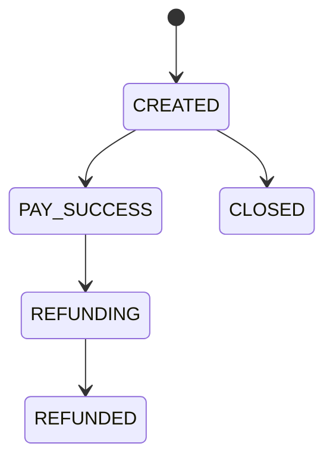
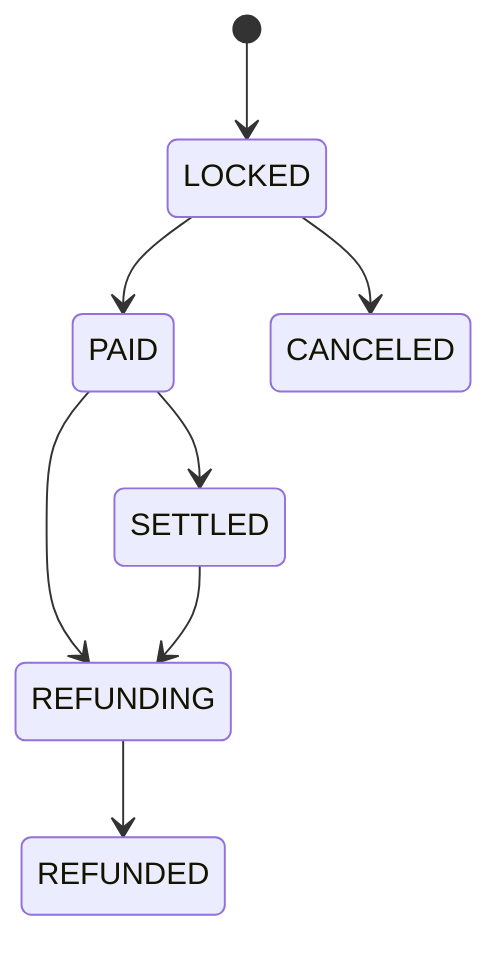

# 数据模型规格

## 聚合模型

### 拼团活动聚合

- 聚合根：拼团活动。
- 实体：活动商品、优惠规则、人群标签、拼团队伍、拼团订单。
- 值对象：渠道、来源、活动时间、折扣表达式、队伍目标人数。
- 领域行为：试算、开团、参团、锁单、结算、退单。

### 秒杀活动聚合

- 聚合根：秒杀活动。
- 实体：秒杀订单、库存流水。
- 值对象：秒杀价格、库存、限购、活动窗口。
- 领域行为：查询活动、初始化库存、原子预扣、锁单、异步落库、释放库存、审计补偿。

### 支付订单聚合

- 聚合根：支付单。
- 实体：商城订单、支付流水。
- 值对象：支付渠道、支付金额、支付状态、外部交易单。
- 领域行为：创建支付单、支付成功、支付关闭、支付回调幂等。

## MySQL 约束

### seckill_activity

关键字段：

- `activity_id`
- `goods_id`
- `seckill_price`
- `total_count`
- `available_count`
- `lock_count`
- `take_limit_count`
- `status`
- `start_time`
- `end_time`

约束：

- `available_count >= 0`
- `lock_count >= 0`
- `available_count + lock_count <= total_count`
- 更新库存必须使用 `where available_count > 0 and now() between start_time and end_time`。

### seckill_order

关键字段：

- `user_id`
- `activity_id`
- `order_id`
- `out_trade_no`
- `status`

索引建议：

- `uk_out_trade_no(out_trade_no)`：外部交易单幂等。
- `uk_user_activity(user_id, activity_id)`：用户活动限购。
- `idx_activity_status(activity_id, status)`：活动订单查询。

分片策略：

- 开发环境默认 `order-shard-count=1`，写单表 `seckill_order`。
- 生产环境可配置 `order-shard-count=16`，按 `hash(userId + outTradeNo)` 写入 `seckill_order_00` 到 `seckill_order_15`。
- 每个物理表保留 `order_id`、`user_id + out_trade_no`、`user_id + activity_id` 唯一索引，保证消费重放幂等。

### seckill_stock_flow

关键字段：

- `flow_no`
- `user_id`
- `activity_id`
- `order_id`
- `out_trade_no`
- `stock_bucket`
- `change_type`
- `change_count`
- `message`

约束：

- `flow_no` 全局唯一，格式为 `activityId:userId:outTradeNo:changeType`。
- `change_type=RESERVE` 表示资格占用成功并落库，`change_count=-1`。
- `change_type=ROLLBACK` 表示资格释放或异常回滚，`change_count=1`。

### MQ 消费幂等表

建议新增 `mq_consume_record`：

- `event_id`
- `consumer_group`
- `event_type`
- `biz_key`
- `status`
- `retry_count`
- `error_message`
- `create_time`
- `update_time`

唯一索引：

- `uk_event_consumer(event_id, consumer_group)`

## Redis Key

### 拼团请求幂等锁

`group_buy_market_locking_key_{userId}_{outTradeNo}`

含义：保护同步锁单临界区，同一用户同一外部单号并发重试时只有一个请求能进入试算和落单流程。

### 拼团锁单结果缓存

`group_buy_market_lock_result_key_{userId}_{outTradeNo}`

含义：锁单入口幂等结果缓存。仅服务锁单入口；结算和退单仍查 DB，避免缓存状态滞后影响状态机。

### 拼团队伍名额

`group_buy_market_team_stock_key_{activityId}_{teamId}`

含义：参团队伍名额占用计数。Lua 内结合恢复量和目标人数判断是否还能占位。

### 拼团队伍用户占位

`group_buy_market_team_user_key_{activityId}_{teamId}_{userId}`

含义：同一用户同一队伍只能占用一个名额，防止不同外部单号并发重复参团。

### 秒杀库存

`seckill:stock:{activityId}`

含义：活动可售库存。活动首次查询时从 DB 初始化，锁单时通过 Lua 原子扣减。

### 秒杀用户占位

`seckill:user:lock:{activityId}:{userId}`

含义：用户在活动内已经占位。TTL 当前为 24 小时，DB 唯一索引仍是最终防线。

### 秒杀初始化锁

`seckill:stock:init:{activityId}`

含义：防止多个实例同时初始化热点库存。

### 秒杀落库 Stream

`seckill:order:create:stream:{shardIndex}`

含义：秒杀资格抢占成功后的异步落库消息。开发环境默认 4 个分片，生产环境建议 16 个或按压测结果扩展。

### 秒杀人工补偿 Stream

`seckill:order:create:manual`

含义：pending 重试超过阈值后的隔离消息。人工补偿或补偿任务可读取该 Stream 做订单一致性修复。

### 拼团队伍库存

`group_buy:team:stock:{teamId}`

含义：队伍剩余可参与名额。后续需要按 Lua 改造成原子扣减和用户占位。

## 状态机

### 支付单状态

### 营销订单状态

## 对账模型

对账任务按 `outTradeNo` 比对三方事实：

- 商城订单：是否支付成功。
- 营销订单：是否锁单、结算、退单。
- 支付渠道：是否支付成功或退款成功。

发现不一致时写入 `reconcile_task`，由补偿任务重试或人工处理。
