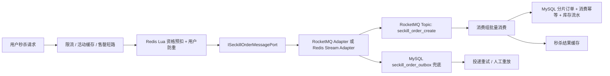

# 秒杀消息队列演进方案

## 背景

当前秒杀入口使用 Redis Lua 抢资格，抢到资格后通过 `ISeckillOrderMessagePort` 发布秒杀订单创建消息。基础设施默认仍使用 Redis Stream 分片队列，也支持 RabbitMQ、Redis Queue 和本地队列模式。

这套方案适合本机环境和课程项目演示，因为 Redis 已经承担库存预扣、用户防重和短期结果缓存，接入 Redis Stream 的链路短，pending-list、XAUTOCLAIM 和人工补偿 Stream 可以覆盖基本可靠消费。但它不应该被包装成无限扩展的大促最终方案。

## 当前职责边界

```text
Redis：
  秒杀库存预扣、用户防重、售罄短路、短期结果缓存、当前本机 Redis Stream 削峰。

RabbitMQ：
  拼团成团通知、退单通知、普通跨服务业务通知。

MySQL：
  秒杀订单、库存流水、消费幂等、对账差错、后续 RocketMQ outbox 兜底。

ISeckillOrderMessagePort：
  秒杀领域侧只表达“发布订单创建消息”，不绑定 Redis Stream、RabbitMQ 或 RocketMQ。
```

## 选型结论

生产演进目标选择 **RocketMQ** 承担秒杀订单创建消息。Redis Stream 保留为本机压测和轻量演示方案，RabbitMQ 保留为拼团成团、退单这类跨服务业务通知。

选择 RocketMQ 的原因：

- 秒杀订单创建是交易型消息，RocketMQ 的消费组、重试、DLQ、延迟消息、顺序/分区路由和事务消息能力更贴近订单流。
- 相比 RabbitMQ，RocketMQ 更适合高吞吐订单创建、堆积恢复和按 key 路由到队列。
- 相比 Kafka，RocketMQ 的交易消息、延迟消息、失败重试和 Java 交易系统表达更直接。
- Pulsar 适合更复杂的多租户、跨地域和云原生消息场景，但当前项目引入成本过高。
- Redis 应收敛为库存资格预扣、用户防重和短期结果缓存，不长期承担大促订单消息队列职责。

## MQ 对比

| 方案 | 适合场景 | 优点 | 本项目边界 |
| --- | --- | --- | --- |
| Redis Stream | 本机演示、小规模削峰、贴近 Redis 库存链路 | 接入简单，有 consumer group、pending-list | Redis 同时承担库存/缓存/队列会资源争抢，缺少成熟分区副本和堆积治理 |
| RabbitMQ | 跨服务业务通知、可靠投递、路由灵活 | ACK、DLQ、路由模型成熟 | 高吞吐订单创建和大堆积恢复不是最优 |
| RocketMQ | 交易订单流、秒杀异步下单、延迟关闭、重试/DLQ | 交易消息、延迟消息、消费组、重试和 DLQ 更贴近订单业务 | 需要引入 broker、namesrv、监控和运维 |
| Kafka | 日志流、行为流、超高吞吐、数据管道 | 分区吞吐高、生态成熟 | 交易重试、延迟消息和业务 DLQ 需要更多封装 |
| Pulsar | 多租户、跨地域、云原生大规模消息 | 存算分离、租户隔离、跨地域能力强 | 运维复杂度超过当前项目需求 |

## 目标架构



## 消息模型

秒杀订单创建消息必须有稳定 schema，避免后续 MQ 替换时改业务字段。当前已落地 `SeckillOrderCreateMessageEntity`，发布端统一发送 Envelope JSON，消费端再转换回订单实体复用原有落库端口。

```json
{
  "schemaVersion": "1.0",
  "eventType": "SECKILL_ORDER_CREATE",
  "messageId": "activityId:userId:outTradeNo",
  "routeKey": "activityId:userId:outTradeNo",
  "activityId": 100001,
  "userId": "u10001",
  "outTradeNo": "mall-order-10001",
  "orderId": "202605301001",
  "source": "s01",
  "channel": "c01",
  "goodsId": "10001",
  "traceId": "trace-id",
  "occurredAt": "2026-05-30T16:20:00+08:00"
}
```

字段约束：

- `messageId`：全局幂等键，建议使用 `activityId:userId:outTradeNo`。
- `routeKey`：分区/队列路由键，同一用户同一外部订单稳定路由。
- `schemaVersion`：消息兼容演进版本。
- `traceId`：串联入口、MQ、消费落库和补偿台。
- `activityId + userId + outTradeNo`：消费幂等、结果查询和补偿重放的核心业务键。

## 路由策略

当前 Redis Stream 分片和后续 RocketMQ 队列都使用相同路由语义：

```text
routeKey = activityId + ":" + userId + ":" + outTradeNo
queueIndex = hash(routeKey) % queueCount
```

这样做的原因：

- 只按 `activityId` 会让单个热点活动打到固定队列。
- 加上 `userId + outTradeNo` 可以把同一活动的流量分散到多个队列。
- 同一笔订单的重试、补偿和查询仍然能稳定落到同一路由键。

## Outbox 兜底

SQL 已准备 `docs/sql/2026-05-29-state-flow-stock-audit-rocketmq.sql` 中的 `seckill_order_outbox` 表，用于后续 RocketMQ 投递失败兜底。

建议状态机：

```text
INIT -> SENT -> CONFIRMED
INIT -> FAILED -> INIT
FAILED -> DEAD
DEAD -> INIT
```

最小字段：

- `message_id`：唯一键，防止重复投递。
- `route_key`：MQ 分区/队列路由。
- `topic`：目标 Topic。
- `message_body`：完整消息体。
- `status`：INIT/SENT/FAILED/DEAD。
- `retry_count`：重试次数。
- `next_retry_time`：下次重试时间。
- `trace_id`：链路追踪。

## 迁移步骤

第一阶段：当前状态，保留 Redis Stream。

- `ISeckillOrderMessagePort` 已抽象出来。
- Redis Stream 继续承担本机削峰、pending 接管和人工补偿。
- 架构测试守住锁单适配器不回退到直接绑定中间件。

第二阶段：引入 Outbox 投递兜底。当前已完成。

- 抢到 Redis 资格后生成订单创建消息。
- 先写 `seckill_order_outbox`，再由后台投递器投递 MQ。
- 投递失败按 `retry_count + next_retry_time` 重试。
- 入口线程仍不等待 broker confirm。
- 人工接口 `retry_seckill_order_outbox` 可重放 `INIT/FAILED/DEAD` 记录。

第三阶段：新增 RocketMQ Adapter。

- 新增 `RocketMqSeckillOrderMessagePort` 或通过 Spring profile 替换当前 `SeckillOrderMessagePort`。
- Topic：`seckill_order_create`。
- Tag：`create`。
- Key：`messageId`。
- Queue selector：使用 `routeKey`。
- 消费端继续复用 `ISeckillOrderCreatePort.createSeckillOrders(...)` 批量落库。

第四阶段：灰度双写和影子消费。

- Redis Stream 和 RocketMQ 同时投递，但只让一个消费端真实落库。
- 影子消费端只校验消息体、路由键、延迟和堆积，不落订单表。
- 对比 Redis Stream 消费量、RocketMQ 消费量、outbox 成功量和订单落库量。

第五阶段：切换主通道。

- 秒杀下单消息主通道切到 RocketMQ。
- Redis Stream 保留一段时间作为回滚通道。
- 监控重点切到 RocketMQ lag、重试次数、DLQ、消费耗时和批量落库耗时。

第六阶段：回滚方案。

- 如果 RocketMQ broker 不可用，`ISeckillOrderMessagePort` 返回失败，锁单端口回滚 Redis 资格。
- 如果 RocketMQ 投递失败但 outbox 成功，由 outbox 定时重试。
- 如果 RocketMQ 消费失败，进入 MQ 重试和 DLQ，人工补偿台按 `messageId` 重放。
- 如果整体切换失败，Spring profile 回切 Redis Stream Adapter。

## 本机可验证项

本机没有云服务器，不能证明生产容量，但可以验证架构闭环：

- JDK 1.8 编译通过。
- `DomainPurityTest` 确认 domain 不依赖具体 MQ。
- `DomainPurityTest` 确认 `SeckillOrderLockPort` 不直接绑定消息中间件。
- Redis Stream 模式压测验证库存不变量。
- Docker Compose 可启动 RocketMQ 基础组件：`docs/dev-ops/docker-compose-rocketmq.yml`。
- SQL 已准备 `seckill_order_outbox` 表结构。
- `SeckillOrderCreateMessageContractTest` 已覆盖 Envelope schema、messageId、routeKey、JSON round trip 和历史裸订单 JSON 兼容。

## 当前最小可切换边界审计

2026-05-31 对当前代码复核后，结论是：锁单主流程已经具备可切换基础，但专业 MQ 还没有真正落地。

已具备：

- `ISeckillOrderMessagePort` 隔离了锁单主流程和具体消息中间件。
- `SeckillOrderLockPort` 不直接依赖 `EventPublisher`、`SeckillOrderCreateBuffer`、routing key 或 JSON 序列化。
- Redis Stream、Redis Queue、本地队列和 RabbitMQ 的投递选择集中在基础设施 adapter。
- `SeckillOrderCreateMessageEntity` 已提供独立消息 Envelope，消费端兼容历史裸订单 JSON。
- `SeckillOrderCreateMessageContractTest` 已验证 schema、messageId、routeKey 和序列化兼容性。
- `seckill_order_outbox` 已落地代码端口、DAO、自动重试任务和人工重放入口。
- `SeckillOrderOutboxRetrySupportUnitTest` 已验证投递成功、转 dead 和人工重放 dead 记录。

未具备：

- 没有 RocketMQ/Kafka/Pulsar 客户端依赖和 adapter。
- 没有 RocketMQ consumer group、DLQ、lag、重试和消费幂等契约测试。

因此，下一步不应直接宣称“专业 MQ 已完成”。Envelope 和 Outbox 已经完成，后续应先补 producer/consumer adapter 契约和消费幂等测试，再决定是否接入 RocketMQ/Kafka adapter。

## 面试说法

当前项目本地仍使用 Redis Stream，是因为单机演示环境下它能覆盖可靠削峰和 pending 补偿。生产大促场景下，我会把 Redis 的职责收敛到库存资格预扣、用户防重和短期结果缓存，把订单创建消息迁移到 RocketMQ。为避免以后替换 MQ 改动锁单主流程，我已经把下单消息投递抽成 `ISeckillOrderMessagePort`，并用架构测试防止锁单适配器重新依赖具体中间件。RabbitMQ 不下线，继续负责拼团成团和退单这类业务通知；RocketMQ 专注秒杀订单创建、延迟关闭、重试和 DLQ。
