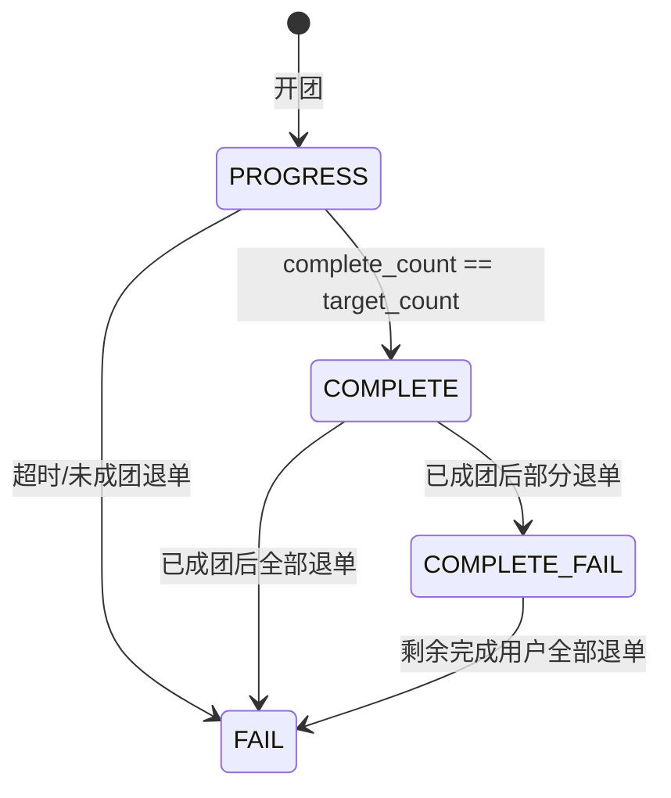
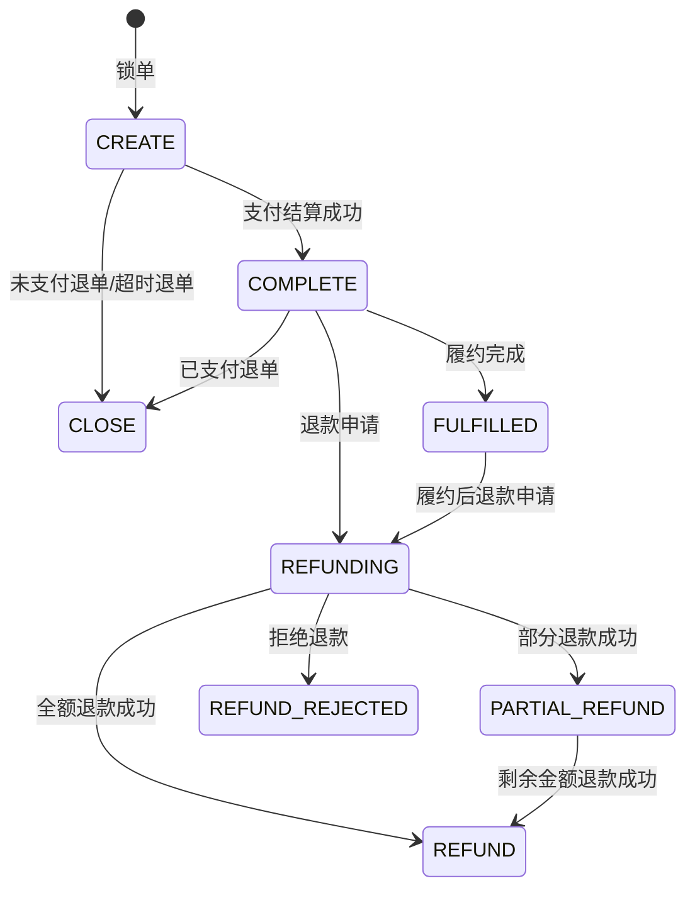
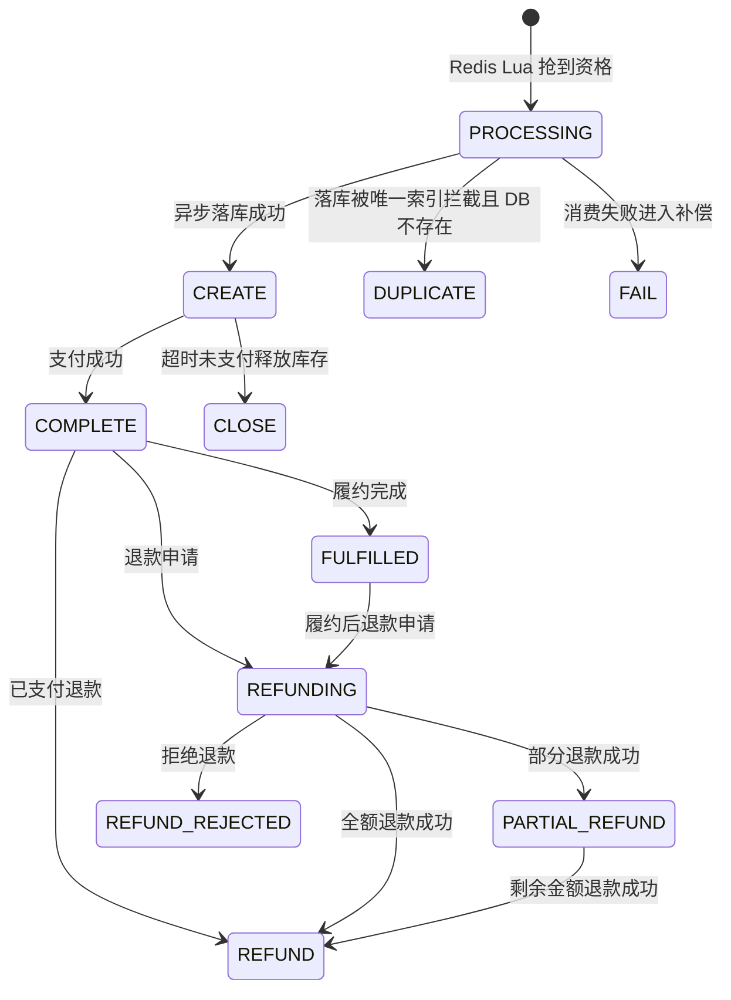

# 拼团与秒杀订单状态机

## 拼团队伍状态

状态语义：

- `PROGRESS(0)`：拼单中，可继续参团。
- `COMPLETE(1)`：已成团，不允许继续参团。
- `FAIL(2)`：拼团失败，不允许继续参团。
- `COMPLETE_FAIL(3)`：已成团但发生退单，不允许继续参团。

代码约束：

- 是否允许参团只通过 `GroupBuyOrderEnumVO#canJoin` 判断。
- 新增 `OrderStateMachine` 统一校验状态迁移，非法迁移直接失败。
- 新增 `order_state_flow` 记录 `biz_type/biz_id/from_status/to_status/event/trace_id/source_message_id`。
- 参团 DB 更新必须带 `status = 0`、`lock_count < target_count`、`valid_end_time > now()`。
- 退单通过策略区分未支付、已支付未成团、已支付已成团三类行为。

## 拼团明细状态

状态语义：

- `CREATE(0)`：锁单成功，等待支付。
- `COMPLETE(1)`：支付完成，参与成团统计。
- `CLOSE(2)`：退单关闭。
- `FULFILLED`：已履约，仍可进入售后申请。
- `REFUNDING`：退款处理中。
- `PARTIAL_REFUND`：部分退款成功。
- `REFUND_REJECTED`：退款被拒绝。
- `REFUND`：售后全额退款成功。

## 秒杀订单状态

状态语义：

- `PROCESSING` 是结果缓存状态，表示抢到资格但订单还在异步创建。
- `CREATE(0)` 是 DB 订单状态，表示订单已创建但未支付。
- `COMPLETE(1)` 预留给支付成功后的秒杀订单状态。
- `CLOSE(2)` 表示超时未支付或取消关闭，释放库存。
- `REFUND(3)` 预留给已支付退款后释放库存。
- `FULFILLED` 表示订单已履约，仍可以按售后规则发起退款申请。
- `REFUNDING` 表示退款申请处理中。
- `PARTIAL_REFUND` 表示部分退款成功，不能重复走全额退款以外的非法迁移。
- `REFUND_REJECTED` 表示退款被拒绝，不能直接变成退款成功。
- `DUPLICATE/FAIL/NOT_FOUND` 是接口结果状态，不直接作为 DB 主状态。

售后非法迁移：

- `CREATE -> REFUNDING` 不允许，未支付订单应走关闭或释放库存。
- `CLOSE -> REFUNDING` 不允许，已关闭订单不能再发起售后。
- `REFUND -> REFUND` with `REFUND_SUCCESS` 不允许，用于拦截重复退款。
- `REFUND_REJECTED -> REFUND` 不允许，拒绝后不能直接退款成功。

## 库存流水

- 秒杀使用 `seckill_stock_flow` 记录 `RESERVE/ROLLBACK/ROLLBACK_TIMEOUT`。
- 拼团使用 `group_buy_stock_flow` 记录 `RESERVE/ROLLBACK_UNPAID/ROLLBACK_PAID_UNFORMED/ROLLBACK_PAID_FORMED`。
- 所有流水使用唯一 `flow_no` 做幂等，异常恢复时按 `activity_id/team_id/order_id/out_trade_no` 追踪。
- 流水新增 `stock_before/stock_after/biz_event/trace_id/source_message_id`，支持从库存变化追溯到请求链路和消息来源。
